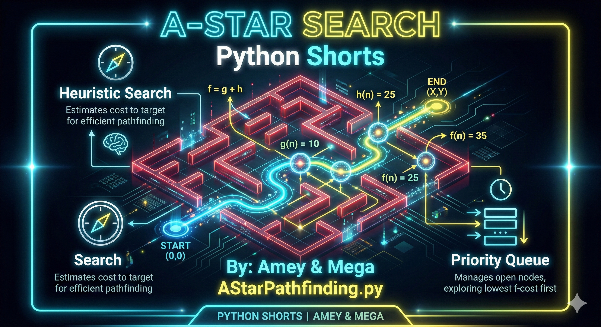
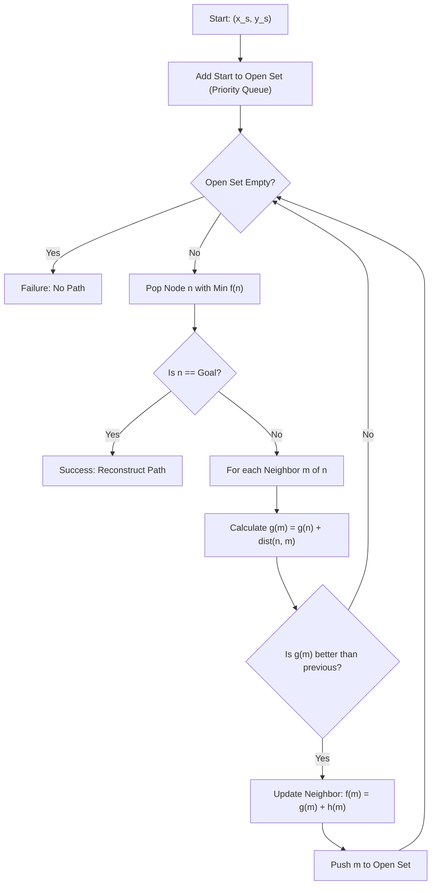
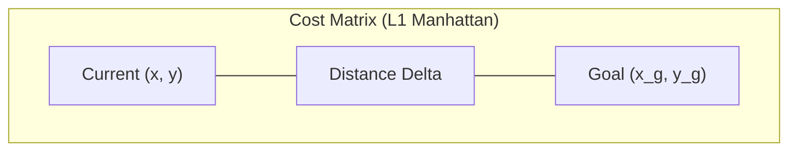

# A* Pathfinding (Heuristic Search & Grid Optimization)

**Authors:**
- [Amey Thakur](https://github.com/Amey-Thakur) ([ORCID: 0000-0001-5644-1575](https://orcid.org/0000-0001-5644-1575))
- [Mega Satish](https://github.com/msatmod) ([ORCID: 0000-0002-1844-9557](https://orcid.org/0000-0002-1844-9557))

**Release Date:** January 9, 2022  
**License:** MIT License

---

## Quick Start
To execute this implementation, ensure you have Python 3.x installed and follow these steps:
```bash
python AStarPathfinding.py
```

## 1. Definition
**A* (A-Star)** is an informed search algorithm that finds the shortest path between a starting node and a goal node. It is widely used in pathfinding and graph traversal, the process of plotting an efficiently traversable path between multiple points, called nodes.

## 2. Mathematical Explanation
A* uses a cost function $f(n)$ to select the next node to explore:

$$
f(n) = g(n) + h(n)
$$

Where:
- $g(n)$: The cost of the path from the start node to node $n$.
- $h(n)$: A heuristic that estimates the cost of the cheapest path from $n$ to the goal.

For grid-based movement where only horizontal and vertical steps are allowed, the **Manhattan Distance** is an admissible heuristic:

$$
h(n) = |x_{goal} - x_n| + |y_{goal} - y_n|
$$

## 3. Computer Science Theory
- **Priority Queue (Min-Heap)**: Efficiently retrieves the node with the minimum $f(n)$ score, ensuring $O(\log N)$ exploration overhead.
- **Admissibility**: A heuristic is admissible if it never overestimates the actual cost to reach the goal. A* is guaranteed to find the optimal path if $h(n)$ is admissible.
- **State Space Search**: The algorithm explores nodes in a frontier, maintaining a closed set of visited nodes to avoid cyclic loops.

## 4. Python Implementation Logic
- **Service Pattern**: `AStarService` encapsulates the search logic and heuristic computations.
- **Heapq Integration**: Uses Python's `heapq` for priority queue management.
- **Path Reconstruction**: Backtracks from the goal to the start using a mapping of parent nodes.
- **Grid Visualization**: Standardized terminal output showing Walls (#), Start (S), Goal (G), and Path (*).

## 5. Visual Representation

### Informed Search & Path Reconstruction





