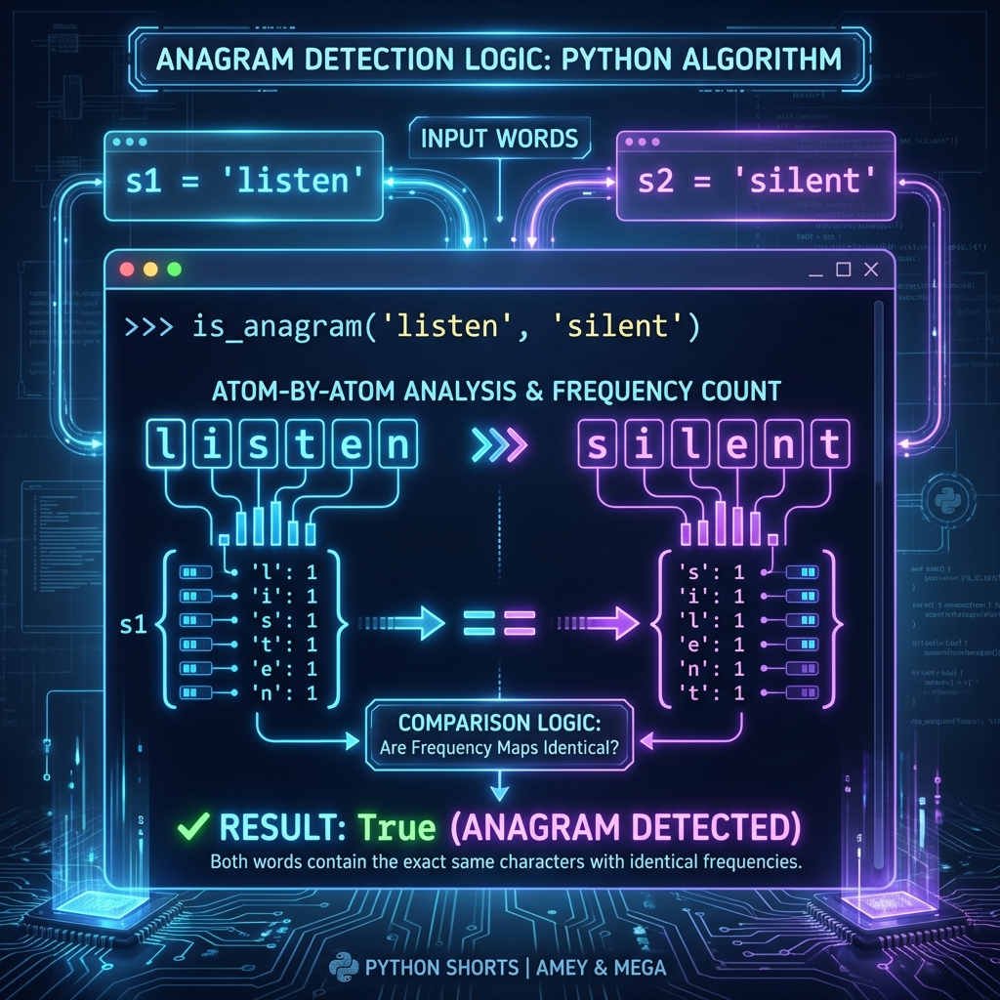

# Anagram Detection Utility

**Authors:**
- [Amey Thakur](https://github.com/Amey-Thakur) ([ORCID: 0000-0001-5644-1575](https://orcid.org/0000-0001-5644-1575))
- [Mega Satish](https://github.com/msatmod) ([ORCID: 0000-0002-1844-9557](https://orcid.org/0000-0002-1844-9557))

**Release Date:** January 9, 2022  
**License:** MIT License

---

## Quick Start
To execute this implementation, ensure you have Python 3.x installed and follow these steps:
```bash
pip install -r requirements.txt
python Anagram.py
```

## 1. Definition
An Anagram is a word or phrase formed by rearranging the letters of a different word or phrase, typically using all the original letters exactly once. From a computational perspective, two strings are anagrams if they are permutations of each other.

## 2. Mathematical Explanation
Let $S_1$ and $S_2$ be two strings of length $n$. They are anagrams if and only if:
$$ \forall c \in \Sigma, \text{count}(c, S_1) = \text{count}(c, S_2) $$
where $\Sigma$ is the alphabet set and $\text{count}(c, S)$ is the frequency of character $c$ in string $S$. Alternatively, if we treat strings as multi-sets of characters $M_1$ and $M_2$, the condition for an anagram is $M_1 = M_2$.

## 3. Computer Science Theory
- **Algorithmic Logic**: This implementation utilizes a frequency-counting approach (Hash Map) to track character occurrences. By comparing counts rather than sorting, the algorithm achieves optimal performance for large datasets.
- **Time Complexity**: $O(n)$, where $n$ is the length of the string. The algorithm iterates through each string exactly once to build frequency maps.
- **Space Complexity**: $O(k)$, where $k$ is the number of unique characters in the alphabet (e.g., 26 for lowercase English).

## 4. Python Implementation Logic
- **Initialization**: The module ensures input strings are normalized (case-insensitive and whitespace-handled).
- **Core Process**: It utilizes `collections.Counter` or a standard dictionary to increment/decrement counts for each character encountered.
- **Validation**: If the final frequency maps are identical, the strings are confirmed as anagrams.

## 5. Visual Representation

