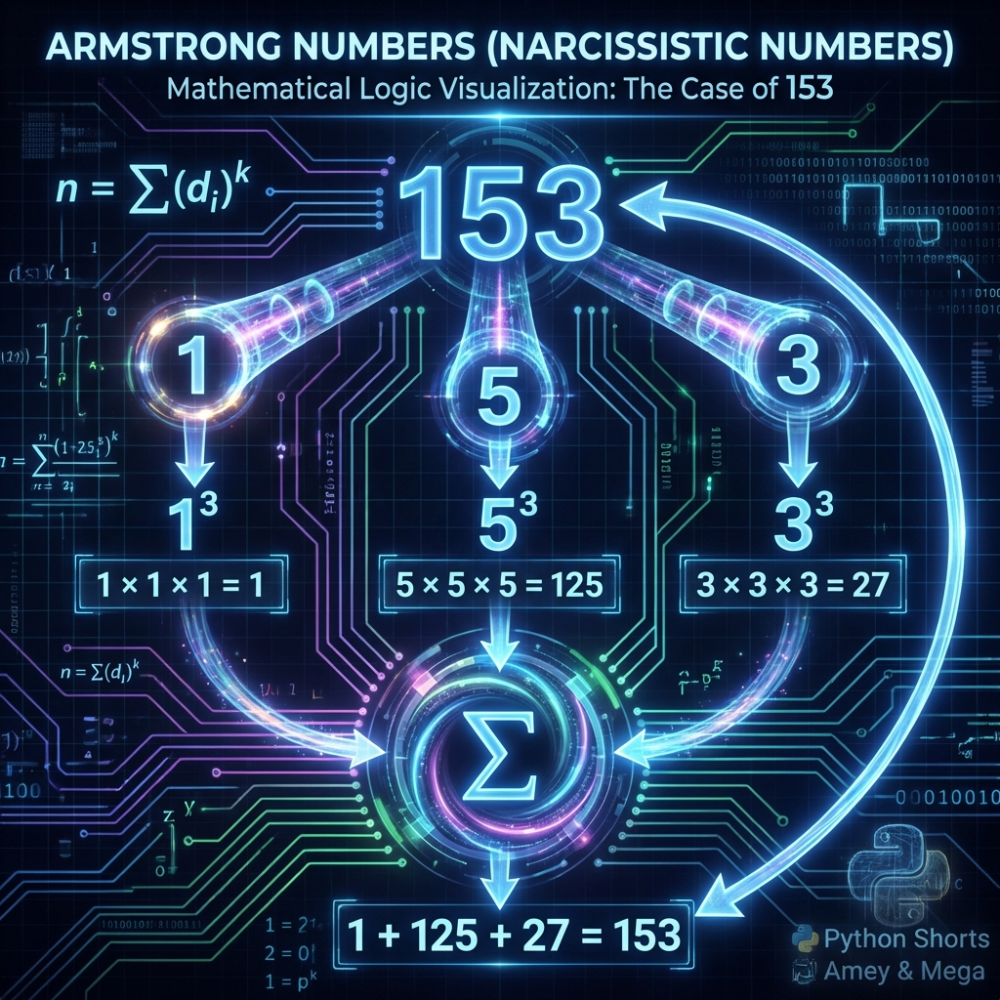

# Armstrong Number Detection Utility

**Authors:**
- [Amey Thakur](https://github.com/Amey-Thakur) ([ORCID: 0000-0001-5644-1575](https://orcid.org/0000-0001-5644-1575))
- [Mega Satish](https://github.com/msatmod) ([ORCID: 0000-0002-1844-9557](https://orcid.org/0000-0002-1844-9557))

**Release Date:** January 9, 2022  
**License:** MIT License

---

## Quick Start
To execute this implementation, ensure you have Python 3.x installed and follow these steps:
```bash
pip install -r requirements.txt
python ArmstrongNumber.py
```

## 1. Definition
An Armstrong number (also known as a narcissistic number, pluperfect digital invariant, or plus-perfect number) is a number that is the sum of its own digits each raised to the power of the number of digits. 

## 2. Mathematical Explanation
A natural number $N$ in a given number base $b$ is an Armstrong number if it satisfies the following condition:

$$ N = \sum_{i=1}^{k} d_i^k $$

where $k$ is the number of digits of $N$ in base $b$, and $d_i$ are the individual digits. 

For example, $153$ is a 3-digit number. The calculation is:

$$ 1^3 + 5^3 + 3^3 = 1 + 125 + 27 = 153 $$

Thus, $153$ is an Armstrong number.

## 3. Computer Science Theory
- **Algorithmic Logic**: The implementation follows a sequential extraction process. It first determines the number of digits (order) of the integer. It then iteratively extracts each digit using the modulo operator, raises it to the calculated power, and accumulates the sum. Finally, it performs a boolean comparison between the sum and the original value.
- **Time Complexity**: $O(\log_{10} N)$, where $N$ is the value of the number. The number of iterations is proportional to the number of digits in the integer.
- **Space Complexity**: $O(1)$ constant space, as the algorithm only requires a few auxiliary variables regardless of the input size.

## 4. Python Implementation Logic
- **Digit Counting**: Utilizes string conversion or logarithmic calculation to find the power $k$.
- **Parity Accumulation**: Employs a `while` loop with integer division (`//`) and modulo (`%`) to process digits without additional list allocation.
- **Exception Handling**: Ensures that only non-negative integers are processed to maintain numerical validity.

## 5. Visual Representation

