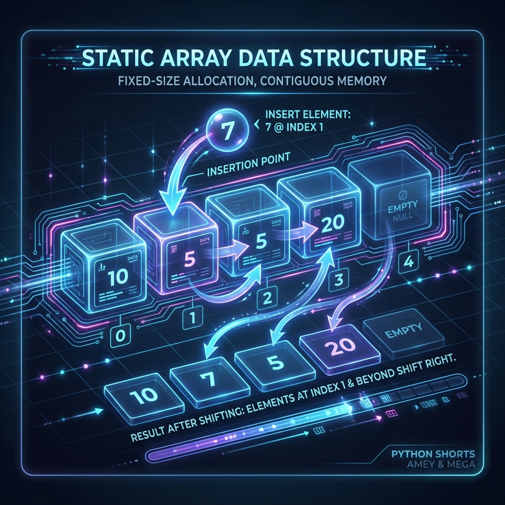
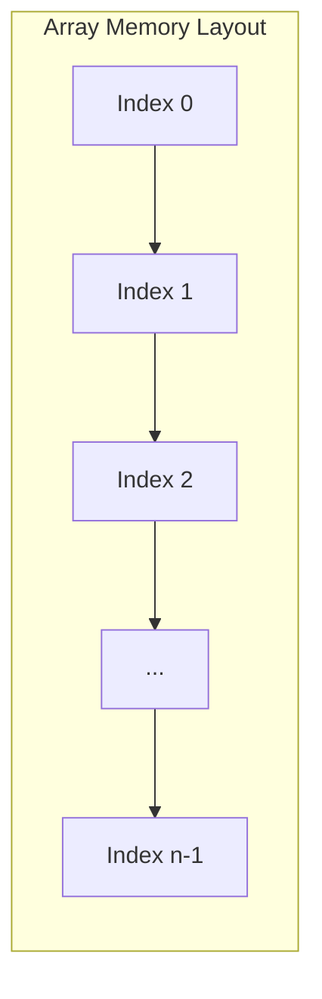
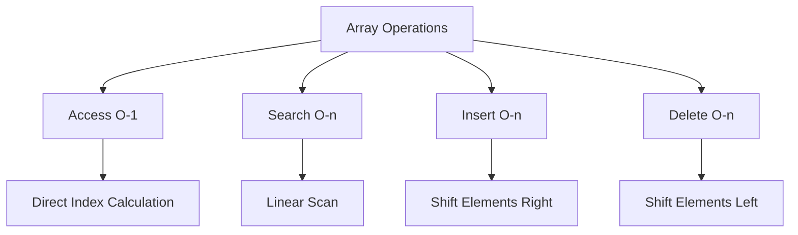

# Array Data Structure

**Authors:**
- [Amey Thakur](https://github.com/Amey-Thakur) ([ORCID: 0000-0001-5644-1575](https://orcid.org/0000-0001-5644-1575))
- [Mega Satish](https://github.com/msatmod) ([ORCID: 0000-0002-1844-9557](https://orcid.org/0000-0002-1844-9557))

**Release Date:** January 9, 2022  
**License:** MIT License

---

## Quick Start
To execute this implementation, ensure you have Python 3.x installed and follow these steps:
```bash
pip install -r requirements.txt
python Array.py
```

## 1. Definition
An Array is a fundamental data structure consisting of a collection of elements (values or variables), each identified by at least one array index or key. In Computer Science, an array is stored such that the position of each element can be computed from its index tuple by a mathematical formula.

## 2. Mathematical Explanation
The location of an element in a one-dimensional array is defined by the following linear mapping:

$$ \text{Address}(A[i]) = B + (i \times S) $$

where:
- $B$ is the base address of the array.
- $i$ is the index of the element.
- $S$ is the size of each element in memory units.

For an array starting at index $0$ with $n$ elements, the indexing set $I$ is defined as:

$$ I = \{i \in \mathbb{Z} \mid 0 \le i < n \} $$

## 3. Computer Science Theory
- **Algorithmic Logic**: Arrays provide contiguous memory allocation, which allows for $O(1)$ random access. This implementation demonstrates basic operations such as indexing, slicing, and iteration, which are the building blocks of more complex data structures like Vectors and Matrices.
- **Time Complexity**:
    - **Access**: $O(1)$ due to direct memory addressing.
    - **Search**: $O(n)$ for unsorted arrays.
    - **Insertion/Deletion**: $O(n)$ in the worst case (requiring shifts).
- **Space Complexity**: $O(n)$, where $n$ is the number of elements allocated.

## 4. Python Implementation Logic
- **Memory Management**: While Python lists are dynamic arrays, this module illustrates the behavior of static-like sequences to emphasize index-based manipulation.
- **Addressing**: Demonstrates how specific offsets are used to retrieve values.
- **Safety**: Includes boundary checks to prevent overflow/underflow errors during index computation.

## 5. Visual Representation





