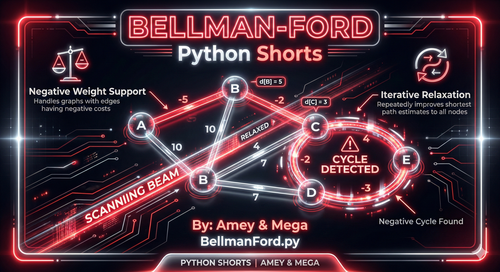
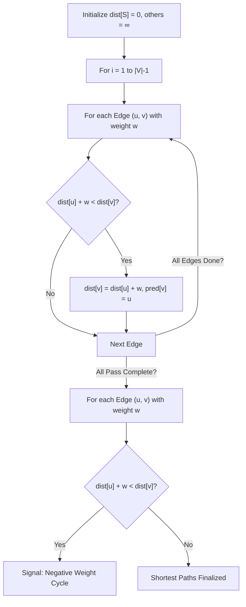
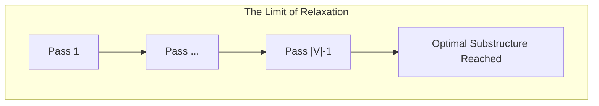

# Bellman-Ford Algorithm (Single-Source Shortest Path)

**Authors:**
- [Amey Thakur](https://github.com/Amey-Thakur) ([ORCID: 0000-0001-5644-1575](https://orcid.org/0000-0001-5644-1575))
- [Mega Satish](https://github.com/msatmod) ([ORCID: 0000-0002-1844-9557](https://orcid.org/0000-0002-1844-9557))

**Release Date:** January 9, 2022  
**License:** MIT License

---

## Quick Start
To execute this implementation, ensure you have Python 3.x installed and follow these steps:
```bash
python BellmanFord.py
```

## 1. Definition
The **Bellman-Ford Algorithm** is a graph search algorithm that computes shortest paths from a single source vertex to all other vertices in a weighted directed graph. Unlike Dijkstra's algorithm, Bellman-Ford is capable of handling graphs in which some of the edge weights are negative numbers.

## 2. Mathematical Explanation
The algorithm works by overestimating the length of the shortest path from the source to each vertex. It then iteratively relaxes those estimates. The core relaxation step for an edge $(u, v)$ with weight $w$ is:

$$
d[v] = \min(d[v], d[u] + w)
$$

The algorithm performs this relaxation precisely $|V| - 1$ times, where $|V|$ is the number of vertices. If after these iterations, another relaxation is possible:

$$
\exists (u, v) \in E \text{ s.t. } d[u] + w < d[v] \implies \text{Negative Cycle Detected}
$$

## 3. Computer Science Theory
- **Negative Edge Weights**: Necessary for certain applications like arbitrage in financial markets or network flow optimization.
- **Cycle Detection**: A critical feature that prevents infinite loops in pathfinding when cumulative weights decrease indefinitely.
- **Dynamic Programming Influence**: The algorithm can be viewed as a DP approach where we calculate paths of increasing length (in terms of number of edges).
- **Complexity**: $O(V \times E)$, which is slower than Dijkstra's $O(E \log V)$ but more robust for diverse edge types.

## 4. Python Implementation Logic
- **Service Pattern**: `BellmanFordService` manages edge storage and iterative relaxation logic.
- **Iteration Limit**: Strictly enforces $|V| - 1$ passes to ensure convergence in the absence of cycles.
- **Result Schema**: Returns a comprehensive dictionary containing finalized distances, predecessors, and a boolean flag for negative cycle detection.
- **Path Reconstruction**: Backtracks through the predecessor map to generate human-readable path strings.

## 5. Visual Representation

### Iterative Relaxation & Cycle Verification





