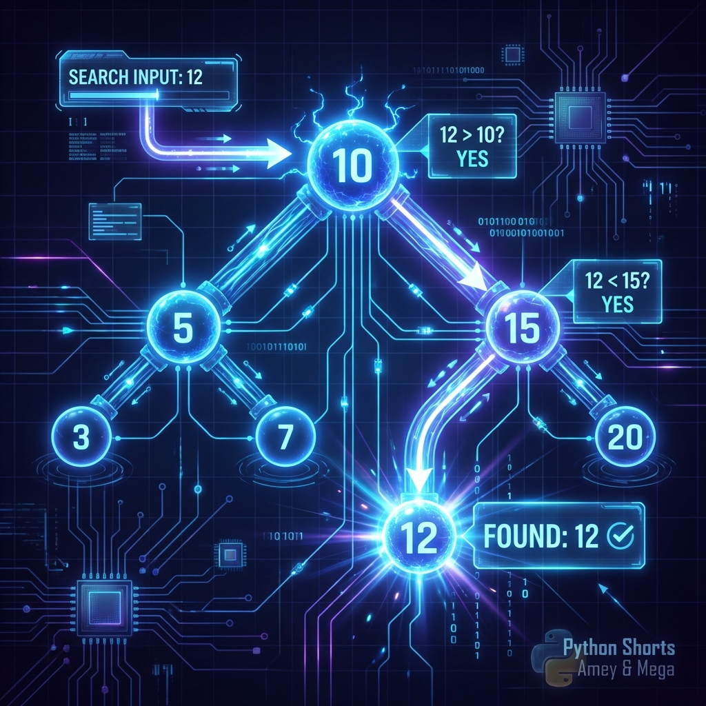

# Binary Search Tree (BST)

**Authors:**
- [Amey Thakur](https://github.com/Amey-Thakur) ([ORCID: 0000-0001-5644-1575](https://orcid.org/0000-0001-5644-1575))
- [Mega Satish](https://github.com/msatmod) ([ORCID: 0000-0002-1844-9557](https://orcid.org/0000-0002-1844-9557))

**Release Date:** January 9, 2022  
**License:** MIT License

---

## Quick Start
To execute this implementation, ensure you have Python 3.x installed and follow these steps:
```bash
pip install -r requirements.txt
python BinarySearchTree.py
```

## 1. Definition
A Binary Search Tree (BST) is a rooted binary tree data structure whose internal nodes each store a key greater than all the keys in the node's left subtree and less than those in its right subtree.

## 2. Mathematical Explanation
For any node $u$ in a Binary Search Tree, let $L(u)$ be the left subtree of $u$ and $R(u)$ be the right subtree of $u$. The BST property is formally defined as:

$$ \forall v \in L(u), \text{key}(v) < \text{key}(u) $$

$$ \forall v \in R(u), \text{key}(v) > \text{key}(u) $$

This hierarchical ordering ensures that an in-order traversal of the tree yields a sorted sequence of the keys.

## 3. Computer Science Theory
- **Algorithmic Logic**: BSTs are designed for fast lookup, addition, and removal of items. They can be used to implement dynamic sets and lookup tables. The efficiency depends on the height of the tree.
- **Time Complexity**:
    - **Search/Insert/Delete**: $O(h)$, where $h$ is the height of the tree.
    - **Average Case**: $O(\log n)$ for a balanced tree.
    - **Worst Case**: $O(n)$ for a skewed tree (essentially a linked list).
- **Space Complexity**: $O(n)$ to store $n$ nodes.

## 4. Python Implementation Logic
- **Node Structure**: Employs a `Node` class with `left`, `right`, and `val` attributes.
- **Recursive Operations**: Utilizes recursive methods for insertion and searching, adhering to the fundamental BST constraints.
- **Traversal**: Implements in-order, pre-order, or post-order traversals to demonstrate tree navigation.

## 5. Visual Representation

