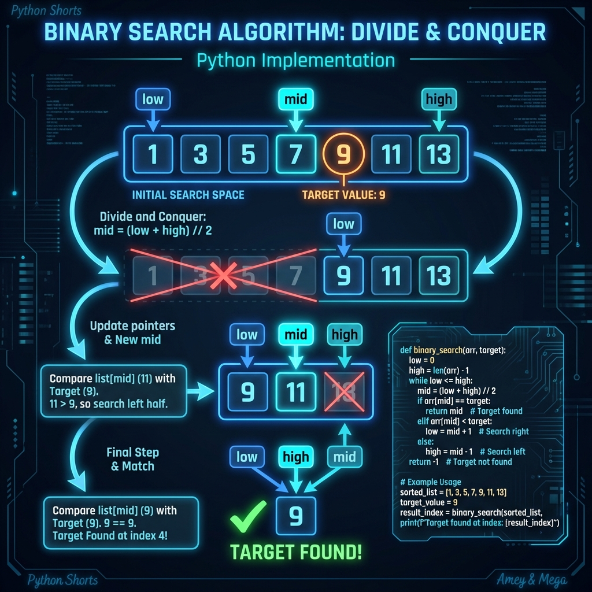
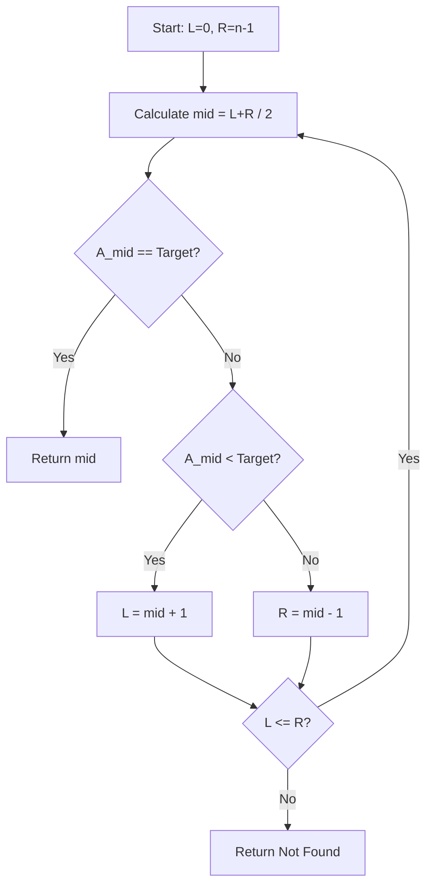

# Binary Search Algorithm

**Authors:**
- [Amey Thakur](https://github.com/Amey-Thakur) ([ORCID: 0000-0001-5644-1575](https://orcid.org/0000-0001-5644-1575))
- [Mega Satish](https://github.com/msatmod) ([ORCID: 0000-0002-1844-9557](https://orcid.org/0000-0002-1844-9557))

**Release Date:** January 9, 2022  
**License:** MIT License

---

## Quick Start
To execute this implementation, ensure you have Python 3.x installed and follow these steps:
```bash
pip install -r requirements.txt
python BinarySearch.py
```

## 1. Definition
Binary Search is an efficient algorithm for finding an item from a sorted list of items. It works by repeatedly dividing in half the portion of the list that could contain the item, until you've narrowed down the possible locations to just one.

## 2. Mathematical Explanation
Given a sorted array $A$ of $n$ elements with values $A_0, A_1, \dots, A_{n-1}$, and a target value $T$, the algorithm searches for $T$ in $A$.

The search range is defined by two indices, $L$ (left) and $R$ (right), initially $L = 0$ and $R = n-1$. In each step, the midpoint $m$ is calculated:

$$ m = \lfloor \frac{L + R}{2} \rfloor $$

The algorithm then compares $A_m$ with $T$:
- If $A_m < T$, the new range is $L = m + 1, R = R$.
- If $A_m > T$, the new range is $L = L, R = m - 1$.
- If $A_m = T$, the search terminates and returns $m$.

## 3. Computer Science Theory
- **Algorithmic Logic**: Binary search follows the **Divide and Conquer** paradigm. It leverages the sorted property of the input to eliminate half of the remaining elements in each iteration.
- **Time Complexity**:
    - **Best Case**: $O(1)$ (target found at the first midpoint).
    - **Average/Worst Case**: $O(\log n)$, where $n$ is the number of elements in the array.
- **Space Complexity**: 
    - **Iterative**: $O(1)$ constant space.
    - **Recursive**: $O(\log n)$ due to recursion stack depth.

## 4. Python Implementation Logic
- **Iterative Approach**: Uses a `while` loop to adjust the bounds $L$ and $R$ until the target is found or the range becomes empty.
- **Midpoint Calculation**: Employs integer division (`//`) to find the median index.
- **Comparison Branching**: Uses conditional statements to determine which half of the list to discard.

## 5. Visual Representation



