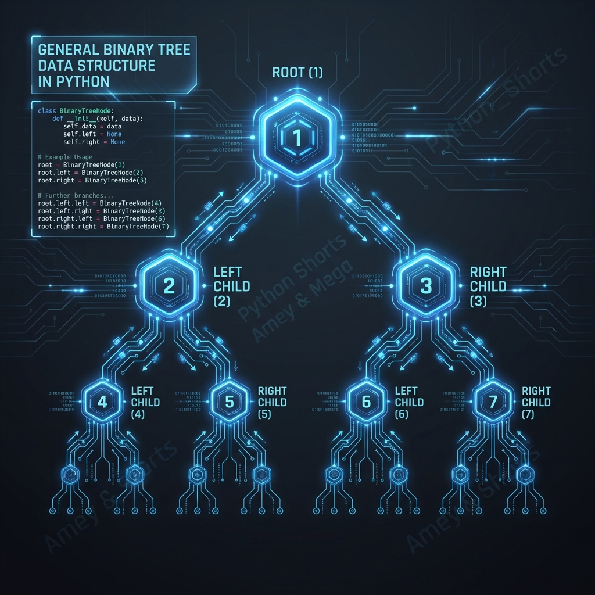
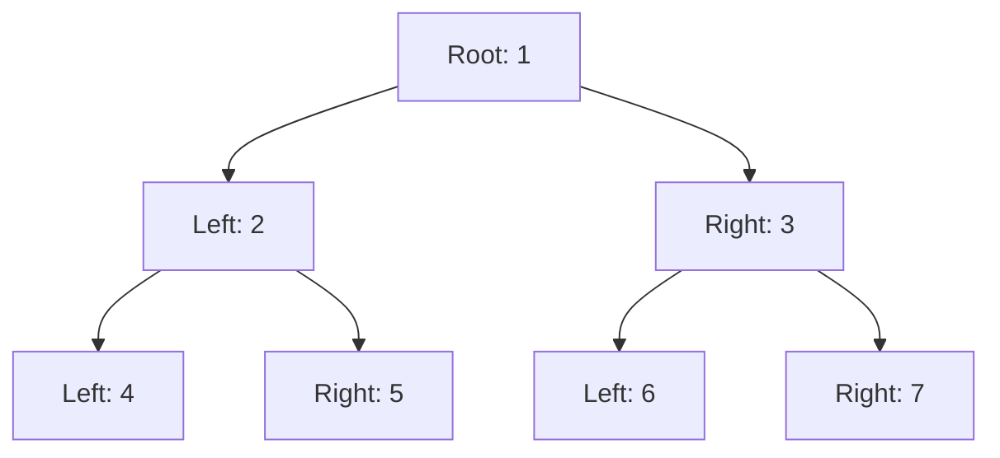
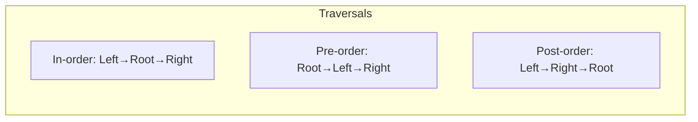

# Binary Tree Data Structure

**Authors:**
- [Amey Thakur](https://github.com/Amey-Thakur) ([ORCID: 0000-0001-5644-1575](https://orcid.org/0000-0001-5644-1575))
- [Mega Satish](https://github.com/msatmod) ([ORCID: 0000-0002-1844-9557](https://orcid.org/0000-0002-1844-9557))

**Release Date:** January 9, 2022  
**License:** MIT License

---

## Quick Start
To execute this implementation, ensure you have Python 3.x installed and follow these steps:
```bash
pip install -r requirements.txt
python BinaryTree.py
```

## 1. Definition
A Binary Tree is a hierarchical data structure in which each node has at most two children, referred to as the left child and the right child. Unlike linear data structures (Arrays, Linked Lists), trees represent a nonlinear, branching relationship.

## 2. Mathematical Explanation
A Binary Tree $T$ can be defined as a set of nodes such that:
1. $T$ is empty (null), or
2. $T$ consists of a root node $r$ and two disjoint binary trees $T_L$ and $T_R$ (the left and right subtrees).

The maximum number of nodes $N$ in a binary tree of height $h$ is given by:

$$ N = 2^{h+1} - 1 $$

where the height of a single root node is $h = 0$.

Furthermore, for any non-empty binary tree, if $n_0$ is the number of leaf nodes and $n_2$ is the number of nodes with two children, the following property holds:

$$ n_0 = n_2 + 1 $$

## 3. Computer Science Theory
- **Algorithmic Logic**: Binary trees serve as the foundation for more specialized structures like Binary Search Trees, Heaps, and AVL trees. They are particularly useful for representing hierarchical data like file systems or expression trees.
- **Time Complexity**:
    - **Traversal (In-order, Pre-order, Post-order)**: $O(n)$, as every node must be visited exactly once.
- **Space Complexity**: $O(n)$ to store $n$ nodes. The recursion stack for traversals takes $O(h)$ space.

## 4. Python Implementation Logic
- **Object-Oriented Design**: Defines a `Node` class containing pointers to the `left` and `right` children and a `data` value.
- **Structural Construction**: Demonstrates how nodes are linked to form the branching architecture.
- **Traversal Mechanics**: Implements recursive methods to navigate the tree structure in different sequences (Depth-First Search).

## 5. Visual Representation





