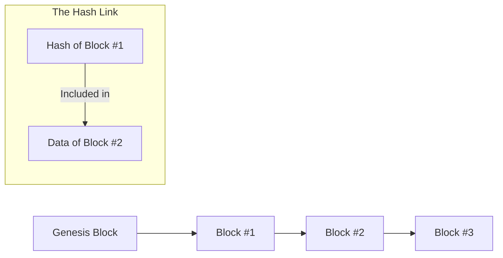
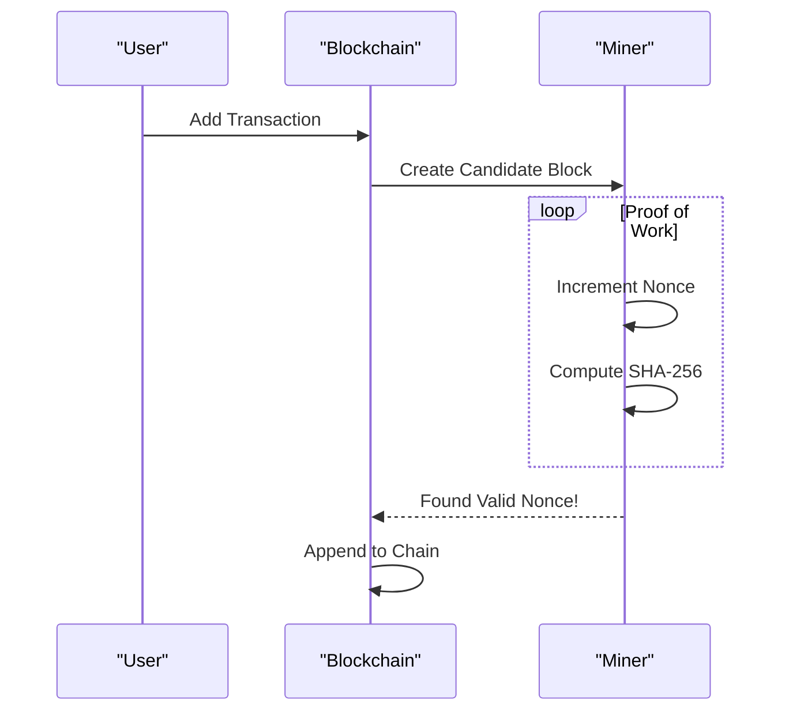

# Blockchain Basic (Distributed Ledgers & Cryptographic Integrity)

**Authors:**
- [Amey Thakur](https://github.com/Amey-Thakur) ([ORCID: 0000-0001-5644-1575](https://orcid.org/0000-0001-5644-1575))
- [Mega Satish](https://github.com/msatmod) ([ORCID: 0000-0002-1844-9557](https://orcid.org/0000-0002-1844-9557))

**Release Date:** January 9, 2022  
**License:** MIT License

---

## Quick Start
To execute this implementation, ensure you have Python 3.x installed and follow these steps:
```bash
python BlockchainBasic.py
```

## 1. Definition
A **Blockchain** is a distributed, decentralized, public ledger that records transactions across many computers so that the record cannot be altered retroactively without the alteration of all subsequent blocks and the consensus of the network. It relies on cryptographic chaining to ensure immutability.

## 2. Mathematical Explanation
The security of a blockchain is predicated on **SHA-256 Cryptographic Hashing**. A hash function $H(M)$ maps any message $M$ to a 256-bit characteristic string such that it is computationally infeasible to find $M$ given $H(M)$, or to find $M_1, M_2$ such that $H(M_1) = H(M_2)$.

### The Mining Condition:
To add a block, a node must solve for a **Nonce** ($n$) such that the hash of the block $B$ satisfies a difficulty constraint $d$:

$$
H(B + n) < T
$$

where $T$ is a threshold value proportional to the difficulty. In our implementation, this is simplified to:
$$
\text{Hash}(B+n) \text{ starts with } '0' \times d
$$

## 3. Computer Science Theory
- **Immutability**: Since each block $B_i$ contains the hash of $B_{i-1}$, any modification to $B_{i-1}$ changes its hash, which invalidates $B_i$'s `previous_hash` field, creating a cascading failure in the chain.
- **Genesis Block**: The first block in a blockchain, which has no precursor and is hardcoded into the system.
- **Proof-of-Work (PoW)**: A consensus algorithm that requires computational effort to deter denial-of-service attacks and other service abuses such as spam or tampering.
- **Cryptographic Chaining**: A structural pattern where data items are linked using their cryptographic digests.

## 4. Python Implementation Logic
- **`Block` Class**: Represents the data unit, storing the `index`, `data`, `nonce`, and `previous_hash`.
- **Proof-of-Work Loop**: Iteratively increments the `nonce` and re-hashes until the difficulty requirement (leading zeros) is met.
- **Integrity Validation**: Re-calculates hashes for all blocks and compares them with stored hashes and cross-references them with the `previous_hash` of the next block.
- **JSON Serialization**: Uses `json.dumps` with `sort_keys=True` to ensure deterministic hashing of block objects.

## 5. Visual Representation

### Cryptographic Chaining & Distributed Integrity





