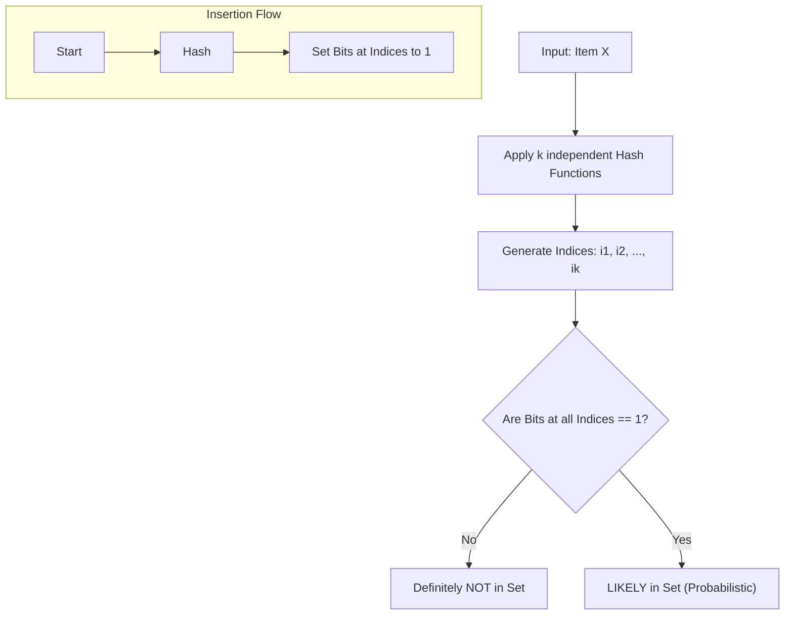
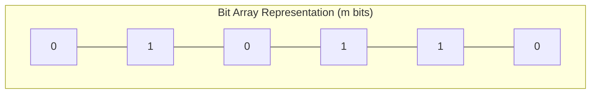

# Bloom Filter (Probabilistic Data Structures & Hash Optimization)

**Authors:**
- [Amey Thakur](https://github.com/Amey-Thakur) ([ORCID: 0000-0001-5644-1575](https://orcid.org/0000-0001-5644-1575))
- [Mega Satish](https://github.com/msatmod) ([ORCID: 0000-0002-1844-9557](https://orcid.org/0000-0002-1844-9557))

**Release Date:** January 9, 2022  
**License:** MIT License

---

## Quick Start
To execute this implementation, ensure you have Python 3.x installed and follow these steps:
```bash
python BloomFilter.py
```

## 1. Definition
A **Bloom Filter** is a space-efficient probabilistic data structure, conceived by Burton Howard Bloom in 1970, that is used to test whether an element is a member of a set. It is famous for allowing **False Positives** but strictly guaranteeing **Zero False Negatives**.

## 2. Mathematical Explanation
The efficiency of a Bloom filter is determined by the relationship between the number of inserted items ($n$), the size of the bit array ($m$), and the number of hash functions ($k$).

The probability of a false positive ($p$) is approximated by:

$$
p \approx (1 - e^{-kn/m})^k
$$

To minimize $p$ for a given $m$ and $n$, the optimal number of hash functions is:

$$
k = \ln(2) \cdot \frac{m}{n}
$$

The required size $m$ for a desired $p$ and $n$ is:

$$
m = -\frac{n \ln(p)}{(\ln(2))^2}
$$

## 3. Computer Science Theory
- **Probabilistic Membership**: Instead of storing the items themselves, the filter stores "traces" via hashed bit positions.
- **Independence of Hashes**: The algorithm assumes hash functions are independent and uniformly distributed to minimize collisions.
- **Space-Time Tradeoff**: Specifically designed for high-performance systems where memory is constrained (e.g., database indexing, malicious URL filtering).
- **Immutability (Deletion)**: Standard Bloom filters do not support deletion because multiple items may share the same hashed bits. Deleting one item could inadvertently "delete" parts of another.

## 4. Python Implementation Logic
- **`BloomFilterService`**: Automatically calculates optimal parameters ($m, k$) based on user-defined accuracy requirements.
- **Multi-Salt Hashing**: Simulates $k$ independent hash functions by appending an integer salt to the item before processing with `hashlib.sha256`.
- **Bit Array Visualization**: Tracks set membership through a localized list of integers (simulating a bit field).
- **Membership Logic**: Only returns `True` if **all** $k$ bits associated with an item's hashes are set to $1$.

## 5. Visual Representation

### Probabilistic Set Intersection & Hash Mapping





