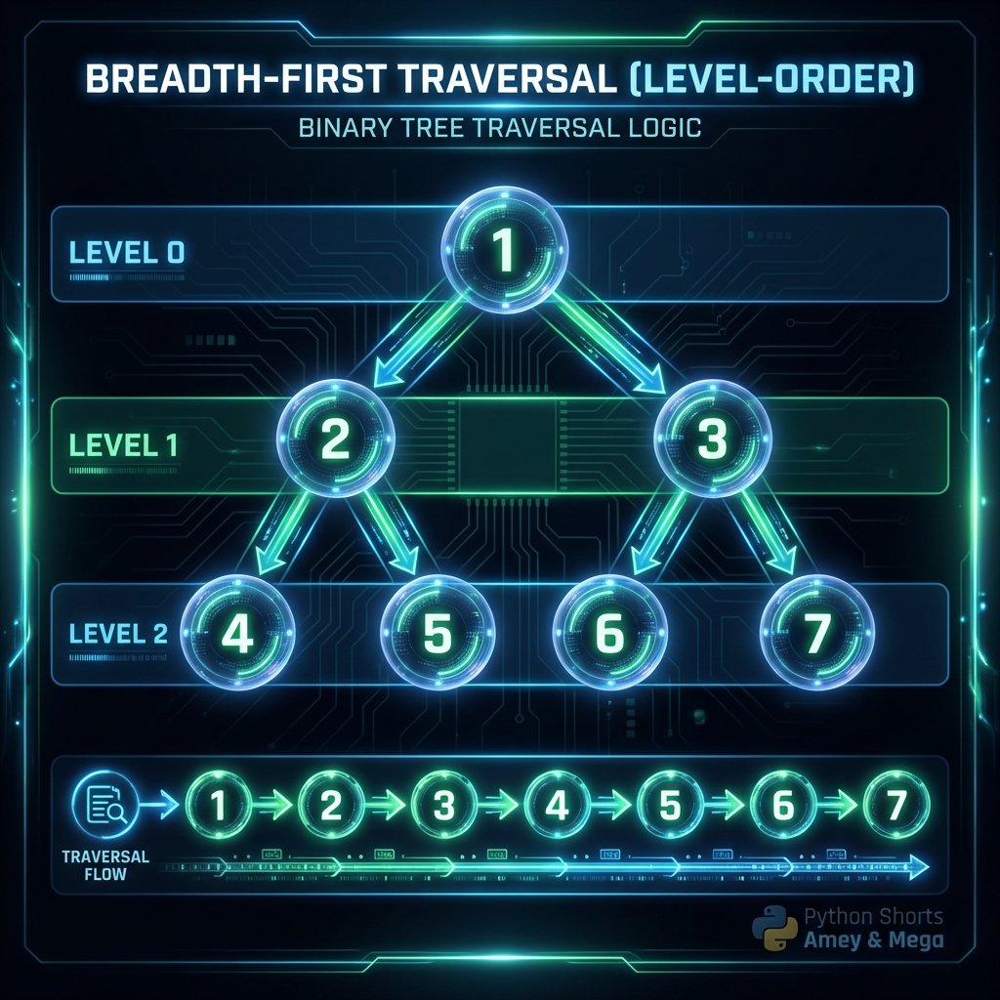
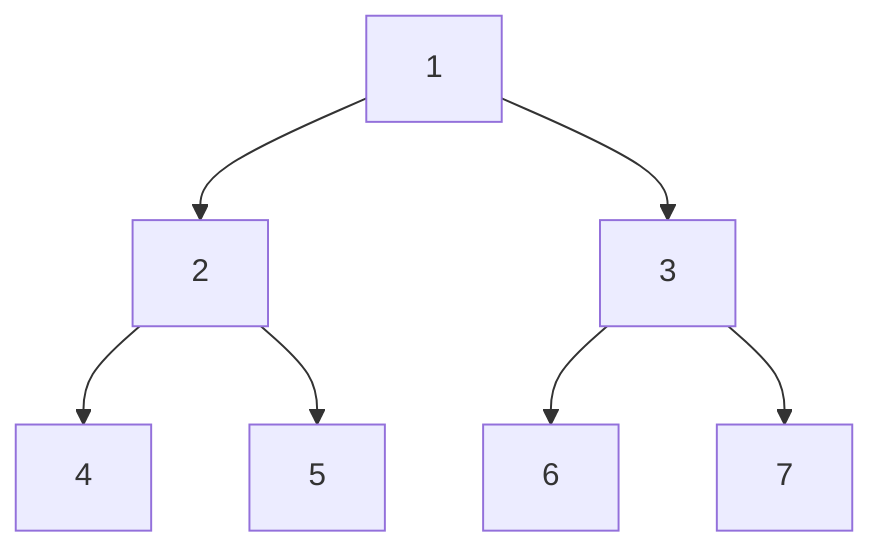
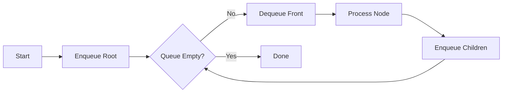

# Breadth-First Traversal (BFS)

**Authors:**
- [Amey Thakur](https://github.com/Amey-Thakur) ([ORCID: 0000-0001-5644-1575](https://orcid.org/0000-0001-5644-1575))
- [Mega Satish](https://github.com/msatmod) ([ORCID: 0000-0002-1844-9557](https://orcid.org/0000-0002-1844-9557))

**Release Date:** January 9, 2022  
**License:** MIT License

---

## Quick Start
To execute this implementation, ensure you have Python 3.x installed and follow these steps:
```bash
pip install -r requirements.txt
python BreadthFirstTraversal.py
```

## 1. Definition
Breadth-First Traversal (or Breadth-First Search) is an algorithm for traversing or searching tree or graph data structures. It starts at the tree root (or some arbitrary node of a graph, sometimes referred to as a 'search key') and explores all of the neighbor nodes at the present depth prior to moving on to the nodes at the next depth level.

## 2. Mathematical Explanation
In a Graph $G = (V, E)$, BFS explores nodes in layers. Let $s$ be the source node. The distance $\delta(s, v)$ between two vertices $s$ and $v$ is the minimum number of edges in any path from $s$ to $v$. 

The set of vertices at distance $k$ from $s$, denoted by $V_k$, is defined as:

$$ V_k = \{ v \in V \mid \delta(s, v) = k \} $$

BFS explores vertices in the order $V_0, V_1, V_2, \dots$ until all reachable vertices are visited. In the context of a tree, this is equivalent to a level-order traversal.

## 3. Computer Science Theory
- **Algorithmic Logic**: BFS uses a **First-In-First-Out (FIFO) Queue** to keep track of the vertices to be explored next. New nodes are appended to the rear of the queue, while the node to be explored is removed from the front.
- **Time Complexity**: $O(V + E)$ for a graph with $V$ vertices and $E$ edges. For a tree with $n$ nodes, the complexity is $O(n)$.
- **Space Complexity**: $O(V)$ in the worst case, as the queue may store up to $V$ vertices (e.g., in a star graph). For a tree, the space complexity is $O(w)$, where $w$ is the maximum width of the tree.

## 4. Python Implementation Logic
- **Queue Management**: Utilizes `collections.deque` for efficient $O(1)$ pop from the left and append to the right.
- **Level-Order Discovery**: Iteratively dequeues a node, processes its value, and enqueues its children (or unvisited neighbors).
- **Termination**: The algorithm terminates when the queue is empty, ensuring every reachable node is processed exactly once.

## 5. Visual Representation





