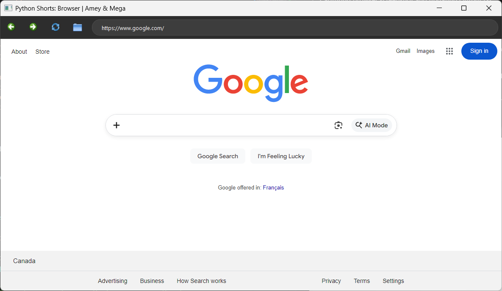
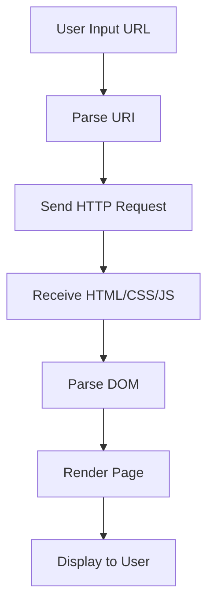
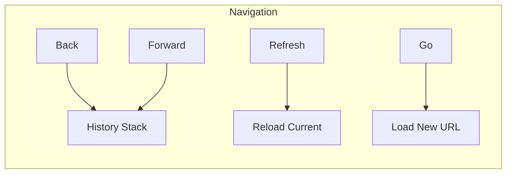

# Lightweight Web Browser Implementation

**Authors:**
- [Amey Thakur](https://github.com/Amey-Thakur) ([ORCID: 0000-0001-5644-1575](https://orcid.org/0000-0001-5644-1575))
- [Mega Satish](https://github.com/msatmod) ([ORCID: 0000-0002-1844-9557](https://orcid.org/0000-0002-1844-9557))

**Release Date:** January 9, 2022  
**License:** MIT License

---

## Quick Start
To execute this implementation, ensure you have Python 3.x and the required dependencies installed:
```bash
pip install -r requirements.txt
python Browser.py
```

## 1. Definition
A Web Browser is a software application for accessing information on the World Wide Web. When a user requests a web page from a particular website, the web browser retrieves the necessary content from a web server and then displays the page on the user's device.

## 2. Mathematical Explanation
URI (Uniform Resource Identifier) parsing is a fundamental component of browser logic. A URI can be formally modeled as a tuple $U$ satisfying the hierarchical structure defined in RFC 3986:

$$ U = (scheme, authority, path, query, fragment) $$

The resolution of a relative URI $R$ against a base URI $B$ involves a transformation function $T(B, R)$ that yields an absolute URI. This process ensures that hypertext links correctly point to their intended resources regardless of the current document's depth.

## 3. Computer Science Theory
- **Algorithmic Logic**: Browsers operate using a specialized **Rendering Engine** (such as Blink or WebKit) that parses HTML/CSS into a Document Object Model (DOM). This implementation leverages the **PyQtWebEngine** framework, which provides a high-level wrapper around the Chromium engine.
- **Event Loop Integration**: The browser maintains a responsive UI through an event-driven loop. Each user action (navigation, refresh, back/forward) triggers asynchronous requests that update the viewport without blocking the main execution thread.
- **State Management**: Navigation history is maintained using a **Stack** data structure, enabling linear traversal through the user's browsing odyssey.

## 4. Python Implementation Logic
- **GUI Framework**: Utilizes `PyQt5.QtWidgets` for the windowing system and `PyQt5.QtWebEngineWidgets` for the browser core.
- **Signal-Slot Architecture**: Connects UI components (address bar, buttons) to functional logic (load URL, navigate back) using PyQt's robust signal-slot mechanism.
- **Modular Components**: Separates the navigation toolbar from the central web view component for enhanced maintainability.

## 5. Visual Representation





