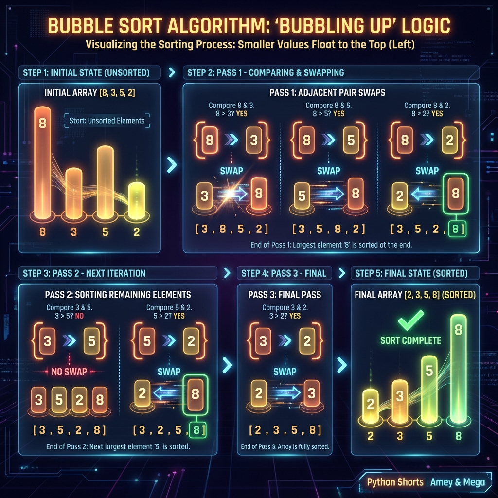

# Bubble Sort Algorithm

**Authors:**
- [Amey Thakur](https://github.com/Amey-Thakur) ([ORCID: 0000-0001-5644-1575](https://orcid.org/0000-0001-5644-1575))
- [Mega Satish](https://github.com/msatmod) ([ORCID: 0000-0002-1844-9557](https://orcid.org/0000-0002-1844-9557))

**Release Date:** January 9, 2022  
**License:** MIT License

---

## Quick Start
To execute this implementation, ensure you have Python 3.x installed and follow these steps:
```bash
pip install -r requirements.txt
python BubbleSort.py
```

## 1. Definition
Bubble Sort, sometimes referred to as sinking sort, is a simple comparison-based sorting algorithm that repeatedly steps through the list, compares adjacent elements, and swaps them if they are in the wrong order. This process is repeated until the list is sorted.

## 2. Mathematical Explanation
Given an array $A$ of $n$ elements, Bubble Sort performs a sequence of passes. In each pass, it ensures that the largest unsorted element "bubbles up" to its correct position. The fundamental operation is the conditional exchange of adjacent elements $A[j]$ and $A[j+1]$:

$$ \text{if } A[j] > A[j+1] \text{ then swap}(A[j], A[j+1]) $$

The total number of comparisons $C$ in the worst-case scenario for an array of size $n$ is given by the arithmetic series:

$$ C = \sum_{i=1}^{n-1} i = \frac{n(n-1)}{2} $$

After $k$ passes, the $k$ largest elements are guaranteed to be in their final sorted positions at the end of the array.

## 3. Computer Science Theory
- **Algorithmic Logic**: Bubble Sort is an **Exchange Sort**. It is stable (preserves the relative order of equal elements) and in-place (requires only $O(1)$ auxiliary space).
- **Time Complexity**:
    - **Best Case (Sorted Array)**: $O(n)$ with an early-exit optimization.
    - **Average/Worst Case**: $O(n^2)$, making it inefficient for large datasets.
- **Space Complexity**: $O(1)$ constant auxiliary space.

## 4. Python Implementation Logic
- **Nested Iteration**: Uses an outer loop to track the number of passes and an inner loop to perform adjacent comparisons.
- **Early Exit Optimization**: Employs a boolean flag to detect if any swaps occurred during a pass. If no swaps occur, the list is already sorted, and the algorithm terminates.
- **In-Place Swapping**: Utilizes Python's tuple unpacking (`a, b = b, a`) for efficient element exchange without an explicit temporary variable.

## 5. Visual Representation

