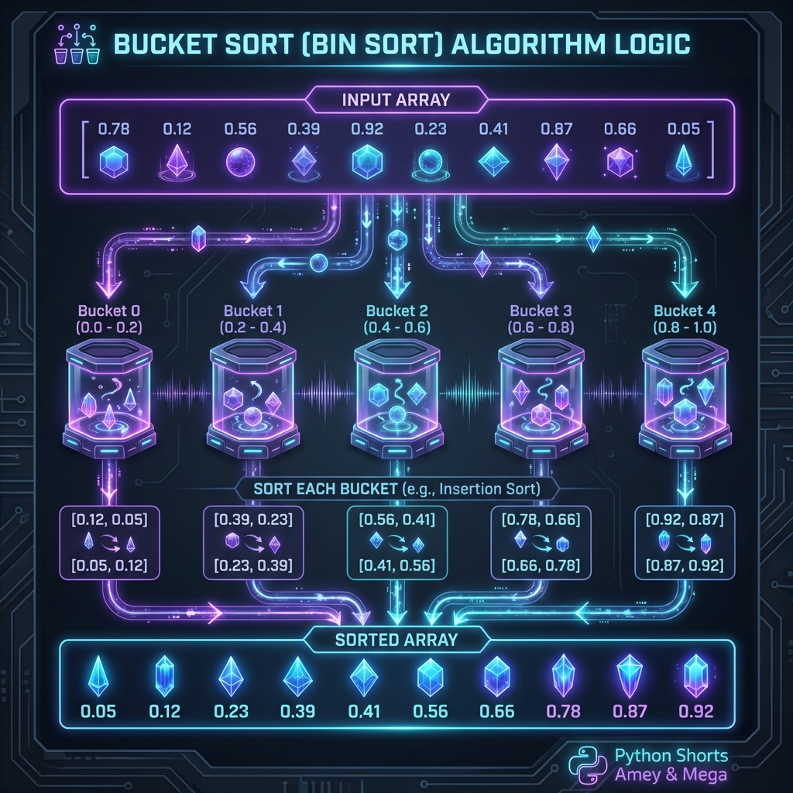
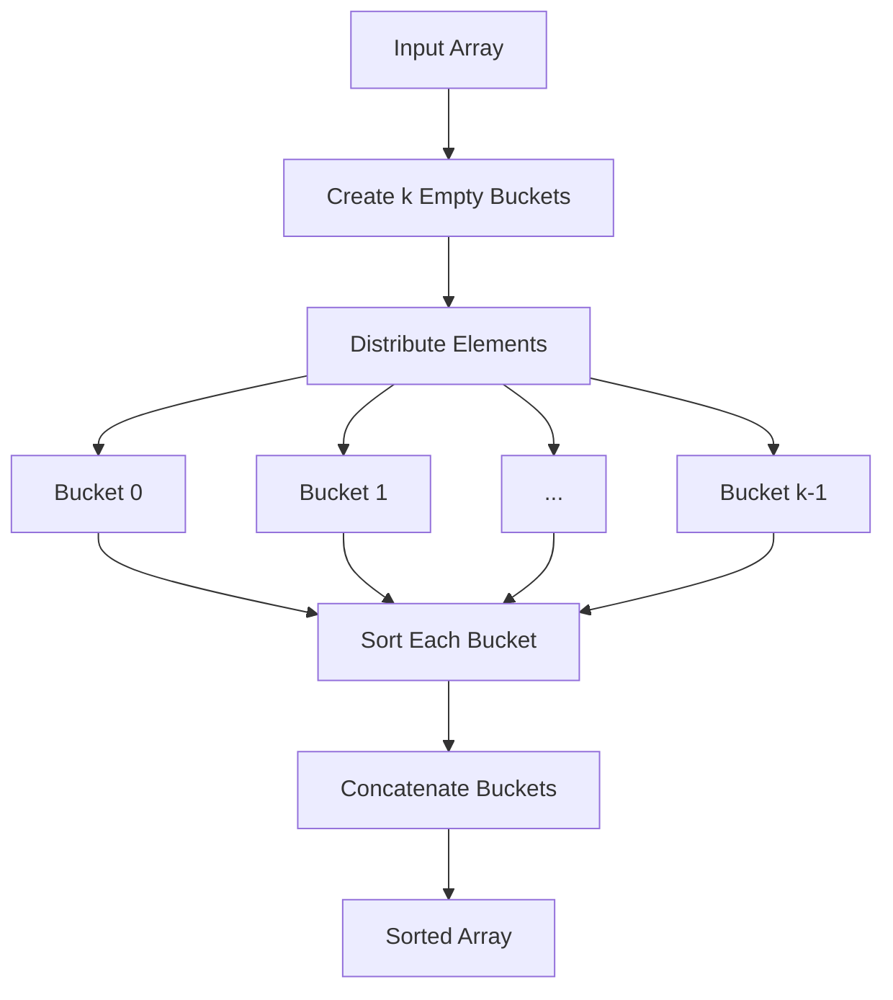

# Bucket Sort Algorithm

**Authors:**
- [Amey Thakur](https://github.com/Amey-Thakur) ([ORCID: 0000-0001-5644-1575](https://orcid.org/0000-0001-5644-1575))
- [Mega Satish](https://github.com/msatmod) ([ORCID: 0000-0002-1844-9557](https://orcid.org/0000-0002-1844-9557))

**Release Date:** January 9, 2022  
**License:** MIT License

---

## Quick Start
To execute this implementation, ensure you have Python 3.x installed and follow these steps:
```bash
pip install -r requirements.txt
python BucketSort.py
```

## 1. Definition
Bucket Sort, or bin sort, is a distribution-based sorting algorithm that works by partitioning an array into a number of buckets. Each bucket is then sorted individually, either using a different sorting algorithm or by recursively applying the bucket sort algorithm.

## 2. Mathematical Explanation
Given an input array $A$ of $n$ elements, the algorithm distributes the elements into $k$ buckets. For an element $x \in A$, the bucket index $i$ is typically determined by a mapping function $f(x)$:

$$ i = \lfloor \frac{x - \min(A)}{\max(A) - \min(A)} \times (k - 1) \rfloor $$

The final sorted sequence is obtained by concatenating the sorted contents of each bucket:

$$ \text{Sorted}(A) = B_0 \cup B_1 \cup \dots \cup B_{k-1} $$

where $B_j$ represents the sorted elements in the $j$-th bucket.

## 3. Computer Science Theory
- **Algorithmic Logic**: Bucket Sort is a **Distribution Sort**. It is particularly effective when the input is uniformly distributed over a range. It generalizes the counting sort by using buckets to store ranges of values rather than single values.
- **Time Complexity**:
    - **Average Case**: $O(n + k)$, assuming uniform distribution and $O(1)$ bucket sorting (or linear total across buckets).
    - **Worst Case**: $O(n^2)$, occurring when all elements are placed into a single bucket.
- **Space Complexity**: $O(n + k)$ auxiliary space to store the buckets and their elements.

## 4. Python Implementation Logic
- **Bucket Initialization**: Creates a list of empty lists (buckets).
- **Element Distribution**: Iterates through the input array and appends each element to its corresponding bucket based on the mapping function.
- **Individual Sorting**: Sorts each non-empty bucket using Python's built-in Timsort (`list.sort()`).
- **Concatenation**: Reassembles the input array by flattening the list of buckets back into a single sequence.

## 5. Visual Representation



