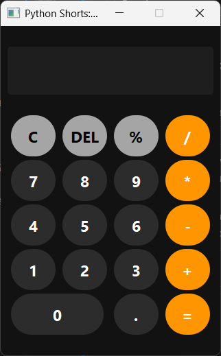

# Arithmetic Calculator Implementation

**Authors:**
- [Amey Thakur](https://github.com/Amey-Thakur) ([ORCID: 0000-0001-5644-1575](https://orcid.org/0000-0001-5644-1575))
- [Mega Satish](https://github.com/msatmod) ([ORCID: 0000-0002-1844-9557](https://orcid.org/0000-0002-1844-9557))

**Release Date:** January 9, 2022  
**License:** MIT License

---

## Quick Start
To execute this implementation, ensure you have Python 3.x installed and follow these steps:
```bash
pip install -r requirements.txt
python Calculator.py
```

## 1. Definition
A Calculator is a computational device or software application that performs mathematical operations on numbers. Basic software calculators implement the four fundamental arithmetic operations: addition, subtraction, multiplication, and division.

## 2. Mathematical Explanation
Basic arithmetic is governed by the field properties of real numbers. Given two operands $a$ and $b$ and an operator $\circ \in \{+, -, \times, \div\}$, the calculator evaluates the expression:

$$ y = a \circ b $$

For division, the operation $y = a \div b$ is defined only if the divisor satisfies:
$$ b \neq 0 $$

The implementation also respects the order of operations, ensuring that binary expressions are evaluated according to standard algebraic precedence.

## 3. Computer Science Theory
- **Algorithmic Logic**: The implementation follows a **Functional Breakdown** approach, where each mathematical operation is encapsulated within a dedicated function. This modular design enhances testability and maintainability.
- **Input Parsing**: Handles user input as strings, which are then cast to appropriate numeric types (integers or floating-point numbers) for computation.
- **Exception Architecture**: Incorporates robust error handling for common computational pitfalls, such as `ZeroDivisionError` and `ValueError` (for invalid numeric inputs).

## 4. Python Implementation Logic
- **Control Flow**: Uses conditional branching (`if-elif-else`) to map user-selected operators to their corresponding mathematical logic.
- **Type Conversion**: Employs Python's dynamic typing to handle both whole numbers and precision decimals.
- **Validation**: Includes pre-computation checks to ensure operands are within valid domains for the requested operations.

## 5. Visual Representation

