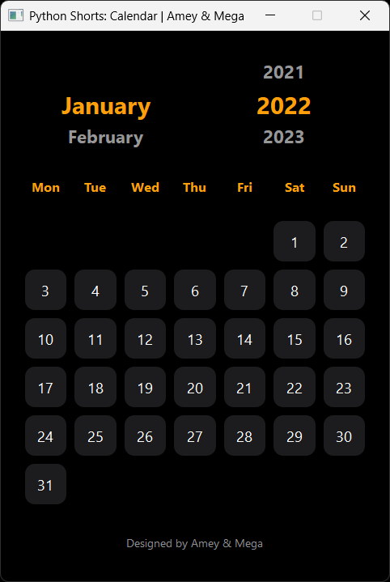
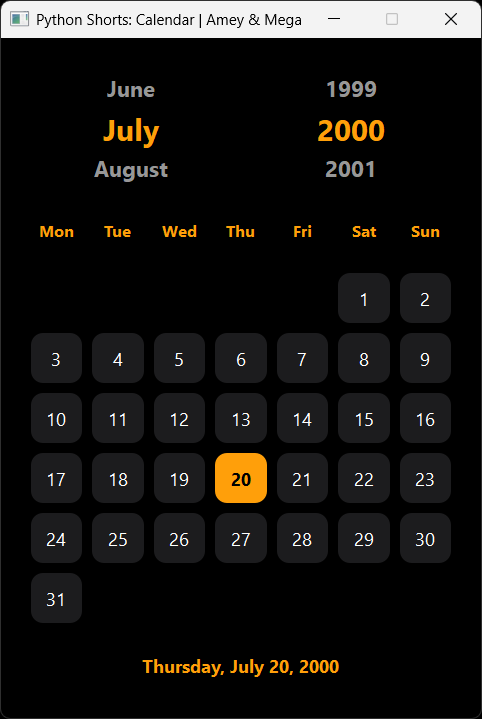
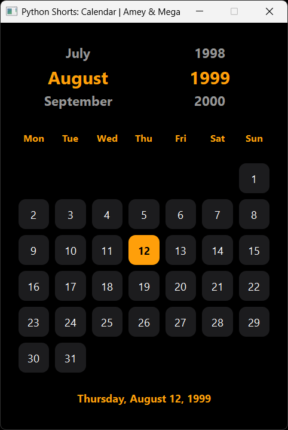
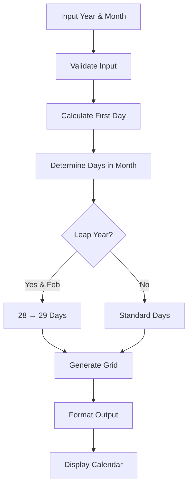

# Calendar Utility

**Authors:**
- [Amey Thakur](https://github.com/Amey-Thakur) ([ORCID: 0000-0001-5644-1575](https://orcid.org/0000-0001-5644-1575))
- [Mega Satish](https://github.com/msatmod) ([ORCID: 0000-0002-1844-9557](https://orcid.org/0000-0002-1844-9557))

**Release Date:** January 9, 2022  
**License:** MIT License

---

## Quick Start
To execute this implementation, ensure you have Python 3.x installed and follow these steps:
```bash
pip install -r requirements.txt
python Calendar.py
```

## 1. Definition
A Calendar is a system for organizing days for social, religious, commercial, or administrative purposes. This implementation provides a programmatic way to generate and display the monthly calendar for any given year and month in the Gregorian calendar system.

## 2. Mathematical Explanation
The calculation of the day of the week for any date can be performed using **Zeller's congruence**. The formula for the Gregorian calendar is:

$$ h = \left( q + \lfloor \frac{13(m+1)}{5} \rfloor + K + \lfloor \frac{K}{4} \rfloor + \lfloor \frac{J}{4} \rfloor - 2J \right) \mod 7 $$

where:
- $h$ is the day of the week (0 = Saturday, 1 = Sunday, 2 = Monday, ..., 6 = Friday).
- $q$ is the day of the month.
- $m$ is the month (3 = March, 4 = April, \dots, 12 = December; January and February are counted as months 13 and 14 of the previous year).
- $K$ is the year of the century ($year \pmod{100}$).
- $J$ is the zero-based century ($\lfloor year/100 \rfloor$).

## 3. Computer Science Theory
- **Algorithmic Logic**: The implementation uses the standard Python `calendar` module, which leverages the Gregorian calendar's properties. It handles leap year calculations and the varying number of days in each month.
- **Leap Year Rule**: A year is a leap year if it is divisible by 4, except for century years, which must be divisible by 400.
- **Modulo Arithmetic**: The algorithm relies heavily on modulo operations to determine offsets from a known reference date (e.g., January 1, 1 AD).

## 4. Python Implementation Logic
- **Library Integration**: Uses the built-in `calendar.month(year, month)` function to generate a pre-formatted string representation of the calendar.
- **Form Formatting**: Demonstrates how to handle console output for tabular data.
- **Input Handling**: Accepts year and month as integers to allow for historical or future date inspection.

## 5. Visual Representation

### Calendar Interface


### Date Selection Examples
| Amey's Birthday | Mega's Birthday |
|:---:|:---:|
|  |  |


