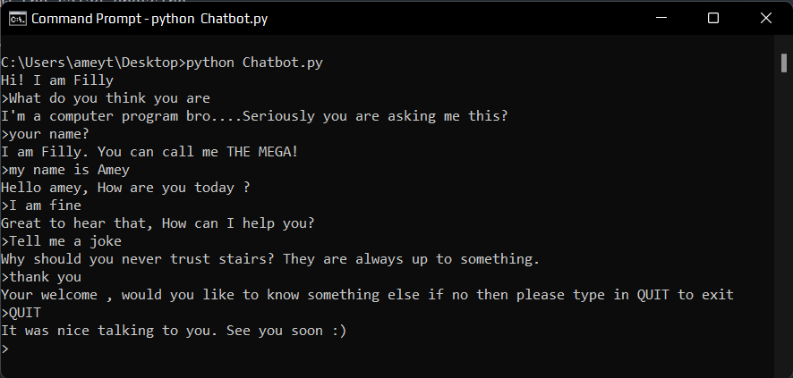
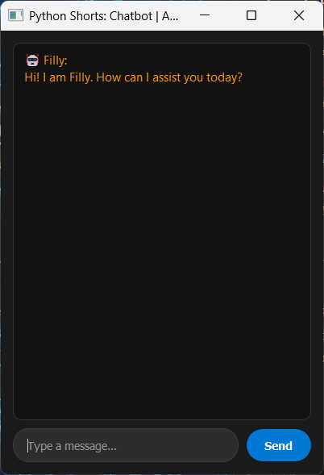
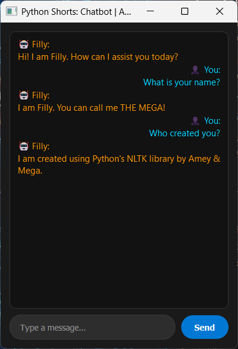
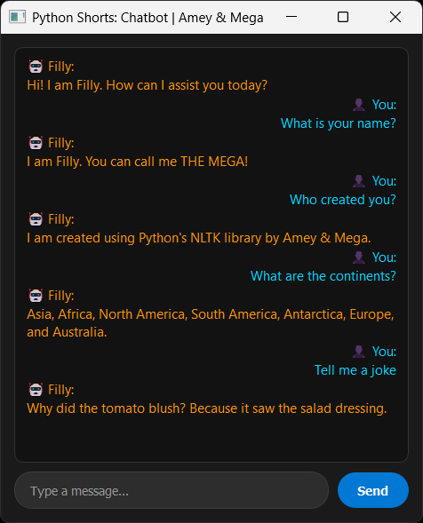

# Chatbot Assistant

**Authors:**
- [Amey Thakur](https://github.com/Amey-Thakur) ([ORCID: 0000-0001-5644-1575](https://orcid.org/0000-0001-5644-1575))
- [Mega Satish](https://github.com/msatmod) ([ORCID: 0000-0002-1844-9557](https://orcid.org/0000-0002-1844-9557))

**Release Date:** January 9, 2022  
**License:** MIT License

---

## Quick Start
To execute this implementation, ensure you have Python 3.x installed and follow these steps:
```bash
pip install -r requirements.txt
python Chatbot.py
```

## 1. Definition
A **Chatbot** is a software application designed to simulate human conversation through text or voice interactions. This implementation is a rule-based system that utilizes pattern matching and keyword recognition to provide relevant responses in a controlled conversational environment.

## 2. Mathematical Explanation
The core logic of this chatbot relies on **String Similarity Metrics** and **Keyword Matching Functions**. For a given user input $S$ and a set of predefined keywords $K = \{k_1, k_2, \dots, k_n\}$, the matching function $M(S, K)$ is defined as:

$$
M(S, K) = 
\begin{cases} 
R(k_i) & \text{if } \exists k_i \in K \text{ such that } k_i \subseteq \text{normalize}(S) \\
R_{default} & \text{otherwise}
\end{cases}
$$

where:
- $\text{normalize}(S)$ transforms the input string to a canonical form (e.g., lowercase, stripped of whitespace).
- $R(k_i)$ is the response mapped to keyword $k_i$.
- $k_i \subseteq S'$ denotes that $k_i$ is a substring of $S'$.

## 3. Computer Science Theory
- **Lexical Normalization**: The process of converting text into a standard format to improve matching accuracy.
- **Pattern Matching**: The algorithm iterates through a hash map of keywords, achieving $O(K \times L)$ average time complexity for checking presence, where $K$ is the number of keys and $L$ is the length of the longest key.
- **Finite State Logic**: The system acts as a simple stateless automaton that transitions to a response state based on the current trigger.

## 4. Python Implementation Logic
- **PyQt5 Framework**: Utilizes a robust signal-slot architecture to handle user input events asynchronously.
- **Layout Management**: Uses `QVBoxLayout` and `QHBoxLayout` to create a responsive, centered chat interface.
- **Rich Text Rendering**: Employs HTML/CSS within `QTextEdit` for premium message formatting, including emojis and color-coded persona headers.
- **Efficiency**: Uses a Python dictionary for $O(1)$ average case response lookups after keyword detection.

## 5. Visual Representation

### Conversational Flow


### Desktop GUI


### Interaction States
| Identity Authentication | Conversational Flow & Jokes |
| :---: | :---: |
|  |  |
