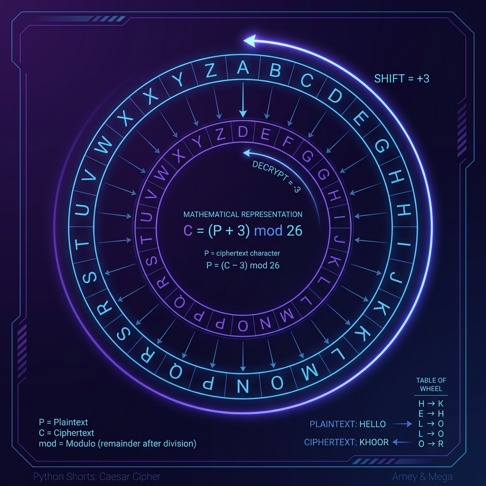

# Cipher Text (Caesar Cipher)

**Authors:**
- [Amey Thakur](https://github.com/Amey-Thakur) ([ORCID: 0000-0001-5644-1575](https://orcid.org/0000-0001-5644-1575))
- [Mega Satish](https://github.com/msatmod) ([ORCID: 0000-0002-1844-9557](https://orcid.org/0000-0002-1844-9557))

**Release Date:** January 9, 2022  
**License:** MIT License

---

## Quick Start
To execute this implementation, ensure you have Python 3.x installed and follow these steps:
```bash
python CipherText.py
```

## 1. Definition
The **Caesar Cipher** (or Shift Cipher) is one of the oldest and simplest methods of encryption. It is a type of **substitution cipher** where each letter in the plaintext is replaced by a letter some fixed number of positions down the alphabet. In modern cryptography, it serves as a foundational example of symmetric-key monoalphabetic substitution.

## 2. Mathematical Explanation
The Caesar Cipher is defined mathematically as an operation over the **additive group of integers modulo 26** ($\mathbb{Z}_{26}$).

Given a character $x$ representing its numerical position in the alphabet ($A=0, B=1, \dots, Z=25$) and a key (shift) $k$, the functions for encryption ($E$) and decryption ($D$) are:

$$ E_k(x) = (x + k) \pmod{26} $$
$$ D_k(x) = (x - k) \pmod{26} $$

### Properties
- **Symmetry**: The same algorithm is used for both encryption and decryption, with the key negated for decryption.
- **Group Action**: Applying a shift of $k_1$ followed by $k_2$ is equivalent to a single shift of $(k_1 + k_2) \pmod{26}$.

## 3. Computer Science Theory
- **Charset Normalization**: The implementation maps ASCII values to a normalized range $[0, 25]$ before applying modular arithmetic.
- **Time Complexity**: $O(n)$, where $n$ is the length of the message, as it requires a single pass over the string.
- **Space Complexity**: $O(n)$ to store the resulting character array before joining.
- **Security**: With only 25 possible keys (excluding the trivial $k=0$ shift), this cipher is highly vulnerable to brute-force attacks and frequency analysis.

## 4. Python Implementation Logic
- **ASCII Offsets**: Leverages `ord()` and `chr()` with base offsets (65 for 'A', 97 for 'a') to maintain character case.
- **Modulo Operator**: Uses Python's `%` operator, which correctly handles negative numbers in modular arithmetic (e.g., `-1 % 26 = 25`), simplifying the decryption logic.
- **Non-Alpha Preservation**: Implements an identity mapping for non-alphabetic characters (numbers, spaces, symbols) to preserve message formatting.

## 5. Visual Representation

### Logic & Performance Output

