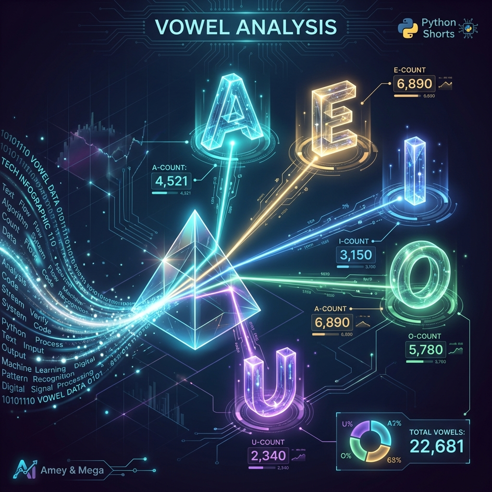

# Count Vowels (Lexical Frequency Analysis)

**Authors:**
- [Amey Thakur](https://github.com/Amey-Thakur) ([ORCID: 0000-0001-5644-1575](https://orcid.org/0000-0001-5644-1575))
- [Mega Satish](https://github.com/msatmod) ([ORCID: 0000-0002-1844-9557](https://orcid.org/0000-0002-1844-9557))

**Release Date:** January 9, 2022  
**License:** MIT License

---

## Quick Start
To execute this implementation, ensure you have Python 3.x installed and follow these steps:
```bash
python CountVowels.py
```

## 1. Definition
The **Count Vowels** utility is a lexicographical tool used to determine the frequency of vowels within a given string. In computer science, this is a basic form of **Frequency Analysis**, used as a precursor to more complex Natural Language Processing (NLP) tasks or data compression algorithms (like Huffman Coding).

## 2. Mathematical Explanation
From the perspective of **Set Theory**, given an input string $S$ (treated as a multiset of characters), and a fixed set of vowels $V = \{a, e, i, o, u\}$, the total vowel count $C$ is the cardinality of the intersection between $S$ and $V$, where $S$ is normalized to its lowercase equivalent $S_{low}$:

$$
C = | \{ x \in S_{low} : x \in V \} |
$$

The frequency mapping $f: V \to \mathbb{N}$ is defined for each $v \in V$ as:

$$
f(v) = | \{ x \in S_{low} : x = v \} |
$$

## 3. Computer Science Theory
- **String Traversal**: The algorithm employs a linear scan, ensuring high efficiency for large text processing.
- **Time Complexity**: $O(n)$, where $n$ is the length of the input string. Each character is visited exactly once.
- **Space Complexity**: $O(1)$. Although a dictionary is used for the frequency map, its size is bounded by the constant number of vowels (5), making it independent of input size.
- **Normalization**: Case-insensitivity is achieved through lexical normalization (mapping all characters to a canonical lowercase form).

## 4. Python Implementation Logic
- **Hash Map Membership**: Uses a Python dictionary for near $O(1)$ lookups to check character membership in the vowel set.
- **Iterative Aggregation**: Accumulates both a total scalar value and a vector of individual occurrences during the single-pass traversal.
- **Type Safety**: Utilizes Python's `typing` module to define strict return signatures for tuples and dictionaries.

## 5. Visual Representation

### Logic & Performance Output

