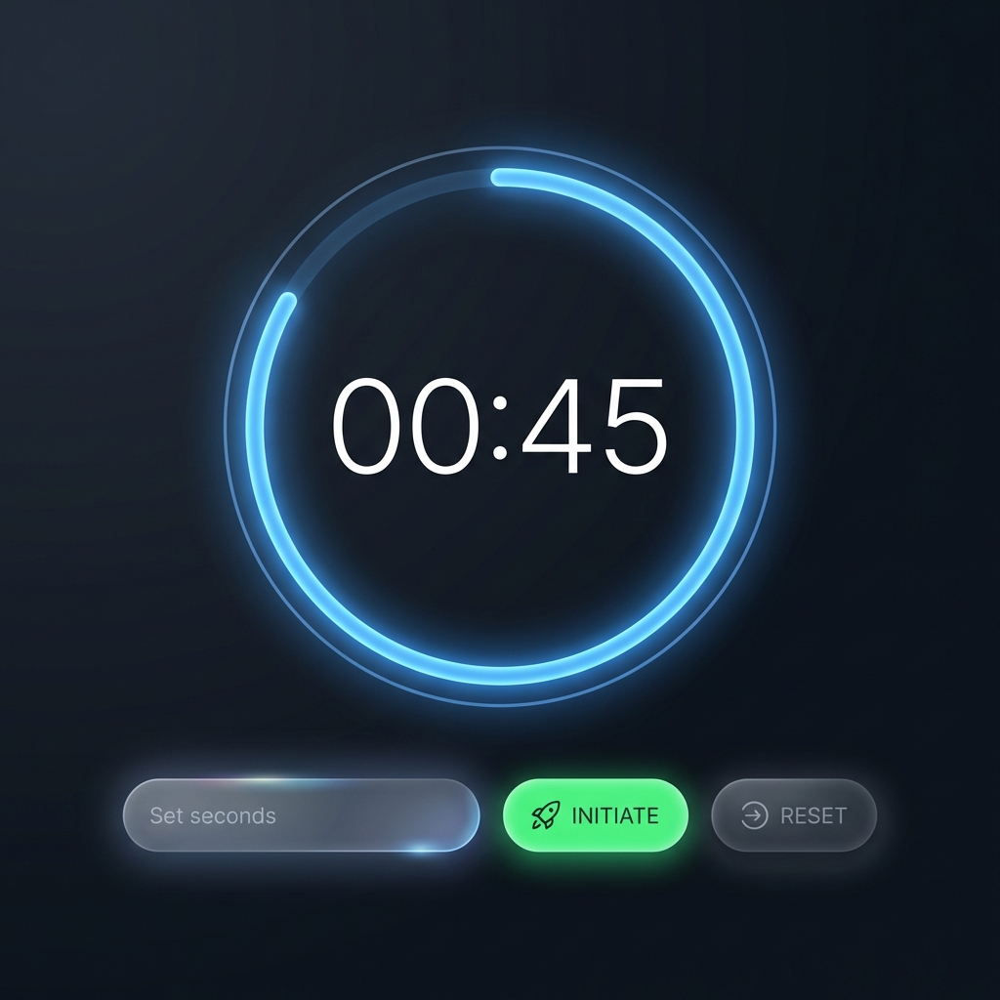

# Countdown Timer (Temporal Discretization)

**Authors:**
- [Amey Thakur](https://github.com/Amey-Thakur) ([ORCID: 0000-0001-5644-1575](https://orcid.org/0000-0001-5644-1575))
- [Mega Satish](https://github.com/msatmod) ([ORCID: 0000-0002-1844-9557](https://orcid.org/0000-0002-1844-9557))

**Release Date:** January 9, 2022  
**License:** MIT License

---

## Quick Start
To execute this implementation, ensure you have Python 3.x installed and follow these steps:
```bash
pip install -r requirements.txt
python Countdowntimer.py
```

## 1. Definition
The **Countdown Timer** is a time-tracking utility designed to decrement a specified temporal value towards zero. In computer architecture and operating systems, such timers are crucial for task scheduling, interrupt handling, and synchronization in distributed systems.

## 2. Mathematical Explanation
This implementation models time as a **Discrete Variable** $T$ that changes at regular intervals $\Delta t$.

Given an initial time value $T_0$, the state of the timer at any step $k$ is given by the recursive relation:

$$
T_{k} = T_{k-1} - \Delta t, \quad \text{for } k \in \{1, 2, \dots, T_0/\Delta t\}
$$

Where:
- $T_0$ is the start duration in seconds.
- $\Delta t = 1$ second (sampling rate of 1 Hz).
- The process terminates at $k_{final}$ such that $T_{k_{final}} = 0$.

## 3. Computer Science Theory
- **Event-Driven Programming**: The GUI utilizes an event loop provided by the Qt framework, where a `QTimer` object triggers a `timeout` signal to update the state.
- **Precision & Accuracy**: While software timers like `QTimer` are not hard real-time, they provide sufficient precision for user-interface applications by synchronizing with the system clock.
- **Complexity**:
    - **Time Complexity**: $O(T_0)$, where $T_0$ is the number of discrete steps.
    - **Space Complexity**: $O(1)$ constant overhead for the GUI elements and state management.

## 4. Python Implementation Logic
- **PyQt5 Framework**: Chosen for its robust event handling and advanced rendering capabilities.
- **Custom Painting**: Implements a `QPainter` based circular progress indicator with anti-aliasing for smooth visual updates.
- **Glassmorphic Aesthetics**: Utilizes translucent backgrounds, vibrant glow effects, and soft drop shadows to create a sophisticated, state-of-the-art user experience.
- **Precision Synchronization**: Uses `QTimer` to ensures exact 1Hz discretization of the temporal state.

## 5. Visual Representation

### High-fidelity Chronometer Interface

