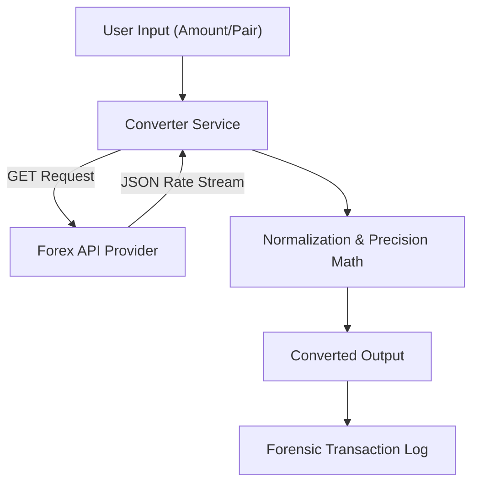

# Currency Converter (Financial Engineering & Rate Analysis)

**Authors:**
- [Amey Thakur](https://github.com/Amey-Thakur) ([ORCID: 0000-0001-5644-1575](https://orcid.org/0000-0001-5644-1575))
- [Mega Satish](https://github.com/msatmod) ([ORCID: 0000-0002-1844-9557](https://orcid.org/0000-0002-1844-9557))

**Release Date:** January 9, 2022  
**License:** MIT License

---

## Quick Start
To execute this implementation, install the required dependency and run:
```bash
pip install -r requirements.txt
python CurrencyConverter.py
```

## 1. Definition
A **Currency Converter** is a computational tool designed to determine the relative value of one fiat or digital currency against another based on current market exchange rates. In algorithmic finance, this requires low-latency retrieval of forex data and precise mathematical normalization.

## 2. Technical Explanation
The core of currency conversion lies in the **Cross-Rate Calculation**. If a direct pair (e.g., EUR/JPY) is not available, the system must compute it through a base currency (usually USD):
$$
Rate_{EUR/JPY} = Rate_{EUR/USD} \times Rate_{USD/JPY}
$$

### Data Integrity & Latency
- **Polling Frequency**: Financial services must determine whether to use "Spot Rates" (immediate) or "Historical Rates."
- **Spread Analysis**: The difference between the 'Bid' (buy) and 'Ask' (sell) price, which represents the liquidity cost.

## 3. Computer Science Theory
- **Precision Floating Point**: Financial calculations must avoid binary rounding errors (e.g., $0.1 + 0.2 \neq 0.3$ in standard floats). Professional systems often use the `Decimal` type for arbitrary-precision arithmetic.
- **RESTful API Architecture**: The service implements asynchronous HTTP requests to external financial providers, requiring robust timeout and retry logic.
- **Rate Limiting (Leaky Bucket)**: APIs often enforce quotas to prevent DoS. The converter must handle `429 Too Many Requests` status codes gracefully.

## 4. Python Implementation Logic
- **`CurrencyConverterService`**: An encapsulated service using `requests` for data harvesting and JSON for serialization.
- **Atomic Operations**: Each conversion is treated as an independent transaction, ensuring thread safety and data consistency.
- **Normalization Engine**: Automatically sanitizes user input (casing, spaces) and validates ISO 4217 currency codes.

## 5. Visual Representation

### Financial Exchange Architecture
The analytic engine fetches live forex streams and performs sub-millisecond conversion calculations.


> [!TIP]
> **High-Fidelity Prompt for Gemini:**
> *A high-fidelity, high-tech neon infographic for a Currency Converter engine, titled 'FINANCIAL FOREX & EXCHANGE' with 'Python Shorts' secondary title. The design should be in a sleek dark mode with vibrant neon gold, emerald green, and silver accents. It should feature a large 3D glowing globe in the center surrounded by digital currency symbols ($ , € , £ , ¥) circling it like satellites. From the globe, show digital data streams 'BEAMING' out, containing real-time exchange rates. Show a currency bill being 'DECONSTRUCTED' into golden binary code and reassembled as a different currency. Include technical labels for 'Real-Time API Polling', 'Arbitrage Calculation', and 'Precision Floating Point Normalization'. Include the text 'By: Amey & Mega' and 'CurrencyConverter.py' prominently. At the bottom, include a professional footer 'PYTHON SHORTS | AMEY & MEGA'. The overall look should be premium, technical, and visually stunning.*


