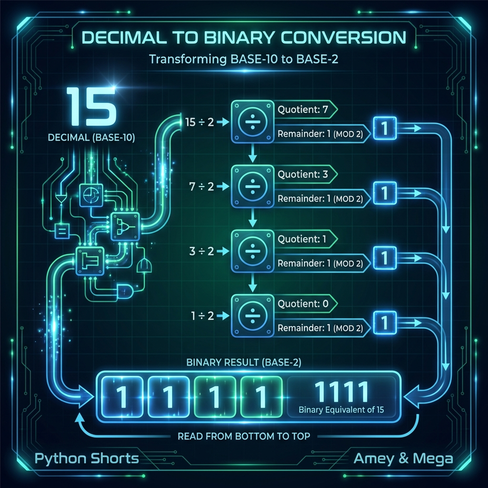

# Decimal to Binary Converter (Positional Notation)

**Authors:**
- [Amey Thakur](https://github.com/Amey-Thakur) ([ORCID: 0000-0001-5644-1575](https://orcid.org/0000-0001-5644-1575))
- [Mega Satish](https://github.com/msatmod) ([ORCID: 0000-0002-1844-9557](https://orcid.org/0000-0002-1844-9557))

**Release Date:** January 9, 2022  
**License:** MIT License

---

## Quick Start
To execute this implementation, ensure you have Python 3.x installed and follow these steps:
```bash
python DecimalToBinary.py
```

## 1. Definition
The **Decimal to Binary** utility is a fundamental computational tool used to convert numbers from the **Decimal System** (Base-10) to the **Binary System** (Base-2). In computer science, binary is the fundamental representation of data at the hardware level, where each digit (bit) represents a power of 2.

## 2. Mathematical Explanation
Any non-negative integer $N$ can be represented in base-2 using the **Positional Notation** formula:

$$
N = \sum_{i=0}^{k} b_i \cdot 2^i
$$

Where:
- $b_i \in \{0, 1\}$ are the binary digits (bits).
- $k = \lfloor \log_2(n) \rfloor$ is the index of the most significant bit.

The algorithm calculates each bit $b_i$ by repeatedly evaluating:
1. $b_i = N \pmod{2}$
2. $N = \lfloor N / 2 \rfloor$

until $N = 0$.

## 3. Computer Science Theory
- **Numeral Systems**: Illustrates the concept of radices (bases) and the transformation between human-readable base-10 and machine-readable base-2.
- **Bitwise Logic**: Foundation for bitmasking, error detection (parity bits), and memory address calculation.
- **Complexity**:
    - **Time Complexity**: $O(\log n)$, as the number of divisions required is proportional to the number of bits in the integer.
    - **Space Complexity**: $O(\log n)$ to store the resulting character sequence.

## 4. Python Implementation Logic
- **Iterative Reduction**: Employs a `while` loop to diminish the decimal value through floor division while capturing remainders.
- **State Inversion**: Since remainders are generated from least-significant to most-significant, the result list is reversed before concatenation.
- **Robustness**: Implements strict type checking and custom exception handling to ensure mathematical validity of inputs.

## 5. Visual Representation

### Logic & Performance Output

