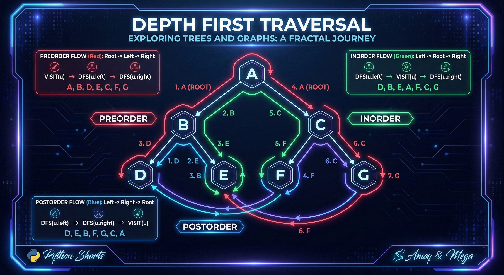

# Depth First Traversal (State Space Search)

**Authors:**
- [Amey Thakur](https://github.com/Amey-Thakur) ([ORCID: 0000-0001-5644-1575](https://orcid.org/0000-0001-5644-1575))
- [Mega Satish](https://github.com/msatmod) ([ORCID: 0000-0002-1844-9557](https://orcid.org/0000-0002-1844-9557))

**Release Date:** January 9, 2022  
**License:** MIT License

---

## Quick Start
To execute this implementation, ensure you have Python 3.x installed and follow these steps:
```bash
python DepthFirstTraversal.py
```

## 1. Definition
**Depth-First Search (DFS)** is an algorithm for traversing or searching tree or graph data structures. The algorithm starts at the root node (selecting some arbitrary node as the root node in the case of a graph) and explores as far as possible along each branch before backtracking.

## 2. Mathematical Explanation
In the context of a binary tree $T = (V, E)$, DFS can be categorized based on the visit sequence of the root $R$, left subtree $L$, and right subtree $R'$:

1. **Pre-order ($R, L, R'$)**: Visit $R$, then traverse $L$, then traverse $R'$.
2. **In-order ($L, R, R'$)**: Traverse $L$, then visit $R$, then traverse $R'$.
3. **Post-order ($L, R', R$)**: Traverse $L$, then traverse $R'$, then visit $R$.

The traversal follows a **Last-In, First-Out (LIFO)** strategy, naturally modeled by a stack or recursive calls.

## 3. Computer Science Theory
- **Algorithmic Logic**: Backtracking is a core component. When the search reaching a node with no unvisited neighbors (a leaf node), it "backtracks" to the previous node in the stack.
- **Applications**: Dependency resolution, topological sorting, solving puzzles (mazes), and cycle detection.
- **Complexity**:
    - **Time Complexity**: $O(|V| + |E|)$, where $V$ is the number of vertices and $E$ is the number of edges. For trees, this simplifies to $O(N)$ nodes.
    - **Space Complexity**: $O(H)$, where $H$ is the height of the tree, representing the maximum depth of the call stack.

## 4. Python Implementation Logic
- **Recursive Paradigm**: Utilizes the system call stack to maintain the state of traversal, providing a concise and mathematically intuitive implementation.
- **Iterative Paradigm**: Employs an explicit list-based stack to simulate recursion, which is more robust against recursion depth limits in large-scale data structures.
- **Type Interoperability**: Uses Python's `typing` module to ensure strict contract fulfillment between nodes and traversal methods.

## 5. Visual Representation

### Traversal Sequence & Logic Verification

