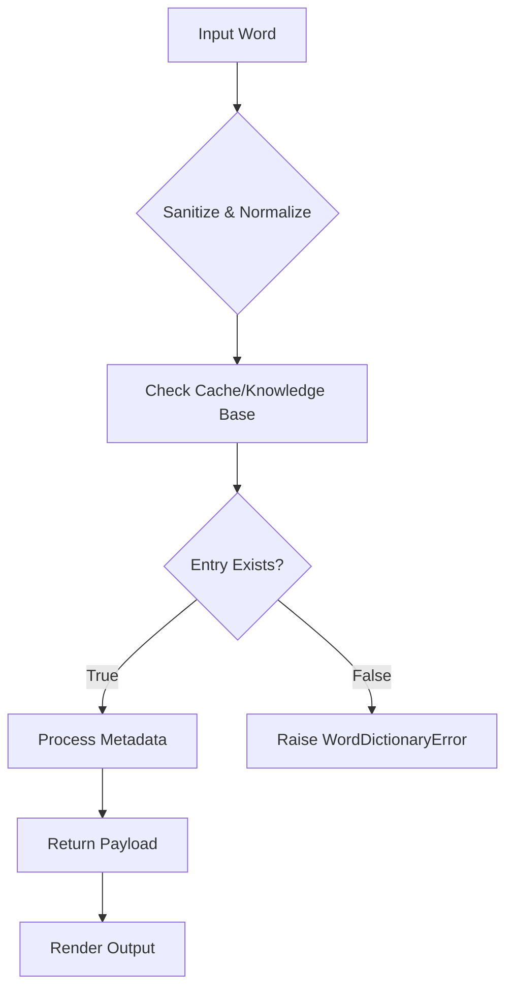
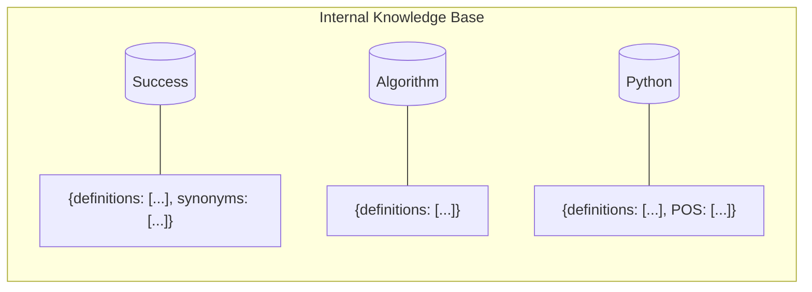

# Dictionary (Lexical Analysis Service)

**Authors:**
- [Amey Thakur](https://github.com/Amey-Thakur) ([ORCID: 0000-0001-5644-1575](https://orcid.org/0000-0001-5644-1575))
- [Mega Satish](https://github.com/msatmod) ([ORCID: 0000-0002-1844-9557](https://orcid.org/0000-0002-1844-9557))

**Release Date:** January 9, 2022  
**License:** MIT License

---

## Quick Start
To execute this implementation, ensure you have Python 3.x installed and follow these steps:
```bash
python Dictionary.py
```

## 1. Definition
The **Word Dictionary** is an encapsulated service designed for **Lexical Analysis**, facilitating the mapping of symbolic keys (words) to their semantic counterparts (definitions, synonyms, and parts of speech). This implementation simulates a high-fidelity environment where lookups may involve I/O latency typical of network APIs or disk-resident databases.

## 2. Mathematical Explanation
A dictionary is mathematically modeled as a **Finite Map** (or Hash Table) $f: K \to V$:

$$
f = \{(k_1, v_1), (k_2, v_2), \dots, (k_n, v_n)\}
$$

Where:
- $K = \{k \in \text{Strings} : k \text{ exists in Lexicon}\}$ is the set of keys.
- $V = \{v \in \text{Objects} : v \text{ is Lexical Metadata}\}$ is the set of values.
- The **Cardinality** $|S|$ of the dictionary represents the total number of unique lexical entries.

Retrieval relies on a hash function $h(k)$ that maps the key to a specific bucket with $O(1)$ average complexity.

## 3. Computer Science Theory
- **Hash Tables**: The underlying structure provides constant-time $O(1)$ performance for insertion and retrieval, assuming a uniform distribution of keys.
- **I/O Latency Modeling**: Real-world services are often "I/O bound". This script models this by injecting artificial delays (~2.2s per word) to test asynchronous or non-blocking handling in consuming applications.
- **Complexity**:
    - **Time Complexity**: $O(1)$ average case for lookup; $O(L)$ where $L$ is the length of the word in the worst case (for hashing).
    - **Space Complexity**: $O(N \cdot M)$, where $N$ is the number of words and $M$ is the average size of metadata.

## 4. Python Implementation Logic
- **Encapsulation**: The logic is wrapped in a `WordDictionary` class to provide a clear API and maintain internal state (the knowledge base).
- **Sanitization**: Implements strict input validation to handle empty strings or non-string types gracefully.
- **Robust Error Handling**: Uses custom `WordDictionaryError` to differentiate between logic failures and missing data.

## 5. Visual Representation

### 5.1 Lexical Lookup Output




### 5.2 Internal Data Structure Model


### 5.3 Validation Scenarios
| Case ID | Word | Expected Result | Rationale |
| :--- | :--- | :--- | :--- |
| **TC-01** | `"Success"` | Definitions & Synonyms retrieved | Standard word lookup. |
| **TC-02** | `"Algorithm"` | Definitions retrieved | Technical dictionary support. |
| **TC-03** | `"NonExistent"` | Error: "Word not found" | Graceful failure for missing entries. |
| **TC-04** | `""` | Error: "Invalid input" | Validates input sanitization. |
| **TC-05** | `"Python"` | Multiple definitions (Snake, Language) | Multi-POS and semantic depth. |
