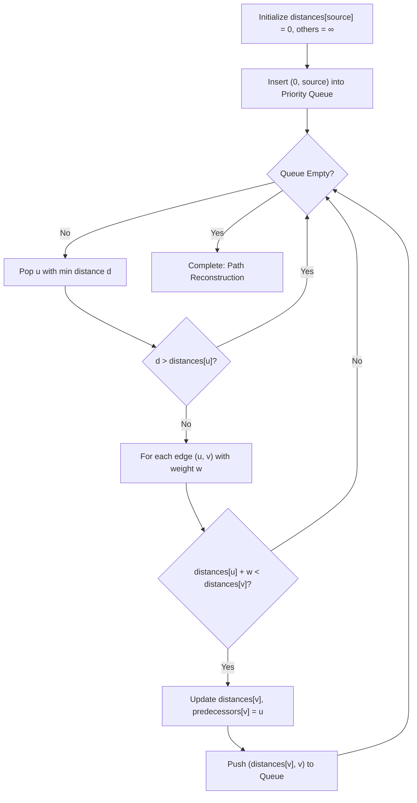
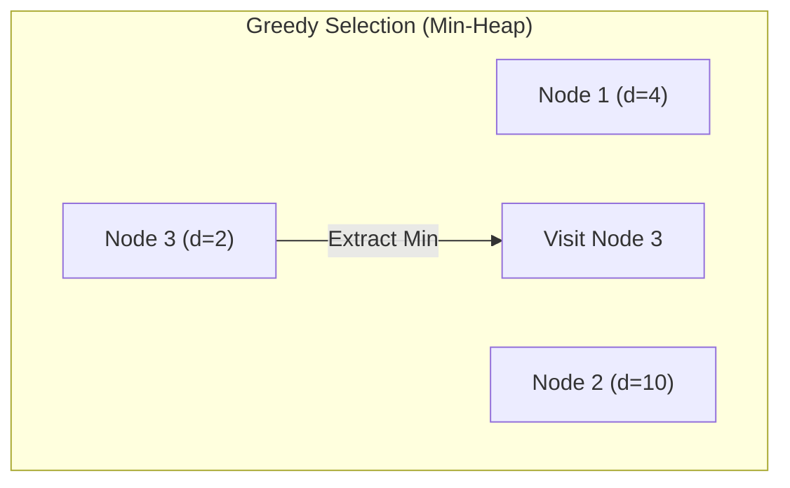

# Dijkstra's Algorithm (Single-Source Shortest Path)

**Authors:**
- [Amey Thakur](https://github.com/Amey-Thakur) ([ORCID: 0000-0001-5644-1575](https://orcid.org/0000-0001-5644-1575))
- [Mega Satish](https://github.com/msatmod) ([ORCID: 0000-0002-1844-9557](https://orcid.org/0000-0002-1844-9557))

**Release Date:** January 9, 2022  
**License:** MIT License

---

## Quick Start
To execute this implementation, ensure you have Python 3.x installed and follow these steps:
```bash
python DijkstraAlgorithm.py
```

## 1. Definition
**Dijkstra's Algorithm** is a fundamental graph algorithm used to find the shortest path between a specific source node and all other nodes in a weighted graph with non-negative edge weights. It is the basis for modern GPS routing and network protocol optimizations (like OSPF).

## 2. Mathematical Explanation
The algorithm maintains a set of "relaxed" distances $d(v)$ for each vertex $v$. For an edge $(u, v)$ with weight $w(u, v)$, the relaxation step is defined as:

$$
d(v) = \min(d(v), d(u) + w(u, v))
$$

The goal is to find a path $P = (v_0, v_1, ..., v_k)$ such that the sum of weights $\sum_{i=1}^k w(v_{i-1}, v_i)$ is minimized.

## 3. Computer Science Theory
- **Greedy Strategy**: At each step, the algorithm chooses the unvisited node with the smallest cumulative distance.
- **Priority Queue (Min-Heap)**: Efficiently retrieves the next node to explore in $O(\log V)$ time.
- **Edge Relaxation**: Iteratively improving the estimate of the shortest path to a vertex until the optimal is reached.
- **Non-negative Weights**: Dijkstra's algorithm relies on the fact that adding an edge can never decrease the total path cost (monotony).

## 4. Python Implementation Logic
- **Service Pattern**: `DijkstraService` manages the adjacency list and path computation.
- **Min-Heap Optimization**: Uses `heapq` to maintain the frontier of nodes to visit.
- **Path Reconstruction**: Uses a predecessor map to backtrack from the destination to the source.
- **Adjacency List**: Represents the graph as a dictionary mapping nodes to lists of (neighbor, weight) tuples.

## 5. Visual Representation

### Shortest Path Tree & Relaxation





