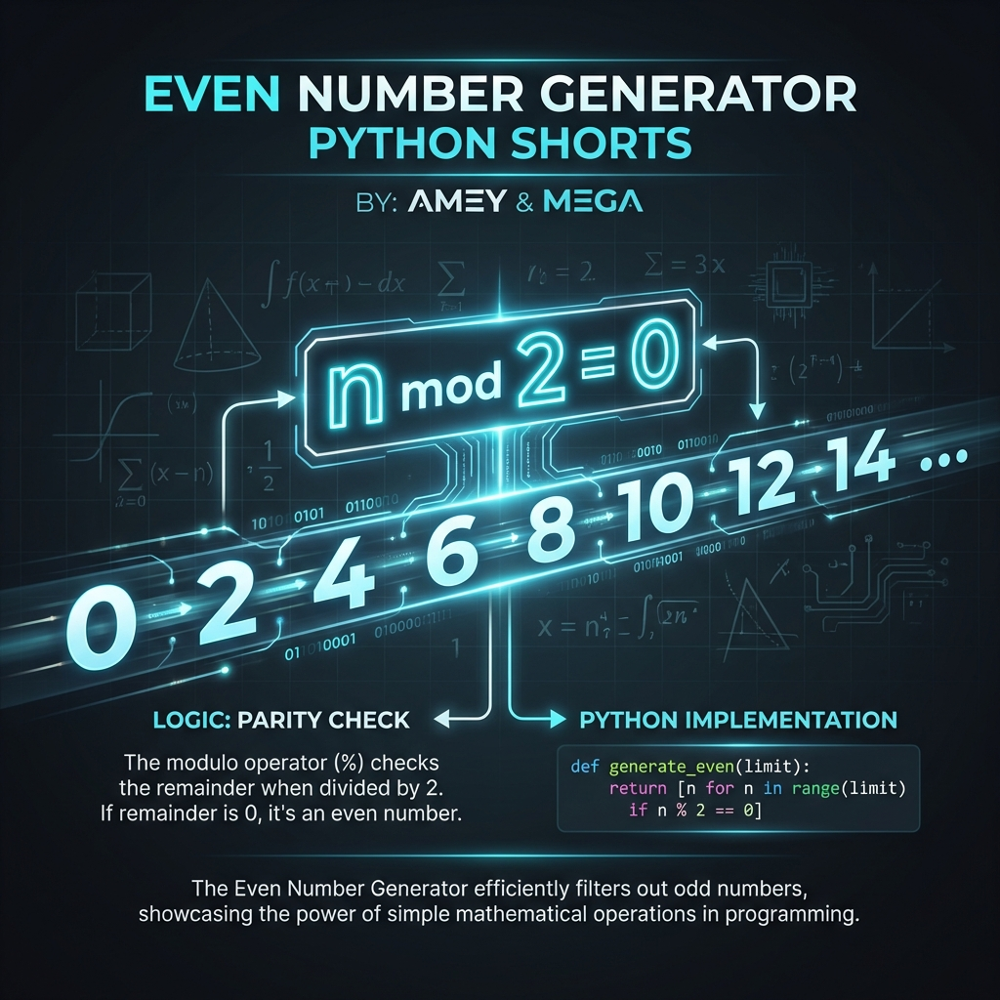

# Even Number Generator (Arithmetic Progression)

**Authors:**
- [Amey Thakur](https://github.com/Amey-Thakur) ([ORCID: 0000-0001-5644-1575](https://orcid.org/0000-0001-5644-1575))
- [Mega Satish](https://github.com/msatmod) ([ORCID: 0000-0002-1844-9557](https://orcid.org/0000-0002-1844-9557))

**Release Date:** January 9, 2022  
**License:** MIT License

---

## Quick Start
To execute this implementation, ensure you have Python 3.x installed and follow these steps:
```bash
python EvenNumberGenerator.py
```

## 1. Definition
The **Even Number Generator** is a specialized iterator designed to produce a sequence of even integers. By utilizing **Lazy Evaluation**, it avoids the overhead of pre-calculating and storing entire lists in memory, making it ideal for processing large-scale or infinite numerical series.

## 2. Mathematical Explanation
An integer $n$ belongs to the set of even numbers $E$ if it satisfies the property of **Parity**:

$$
n \equiv 0 \pmod{2}
$$

The generator produces an **Arithmetic Progression** $a_n$ with a common difference $d=2$:

$$
a_{k} = a_{k-1} + 2 = a_0 + 2k, \quad k \in \{0, 1, 2, \dots\}
$$

Where $a_0$ is the initial even seed derived from the starting input value.

## 3. Computer Science Theory
- **Generators & Iterators**: Employs Python's `yield` keyword, which pauses function execution and maintains state between calls, creating an **Infinite Sequence** handler with finite memory footprints.
- **Lazy Evaluation**: Postpones the computation of a value until it is explicitly requested by the consumer (e.g., in a `for` loop).
- **Complexity**:
    - **Time Complexity**: $O(1)$ per iteration, as each value is calculated in constant time.
    - **Space Complexity**: $O(1)$, as only the current state (`current`) is maintained regardless of the sequence length.

## 4. Python Implementation Logic
- **Parity Alignment**: Automatically corrects odd starting values by incrementing to the subsequent even integer, ensuring the sequence adheres to the mathematical definition.
- **Encapsulated Control**: Supports both **Finite Range** (with `limit`) and **Infinite Progression** (when `limit` is `None`), providing flexibility for different computational needs.
- **Robust Exception Handling**: Validates input types to prevent arithmetic errors during sequence generation.

## 5. Visual Representation

### Sequence Generation & Logic Verification

