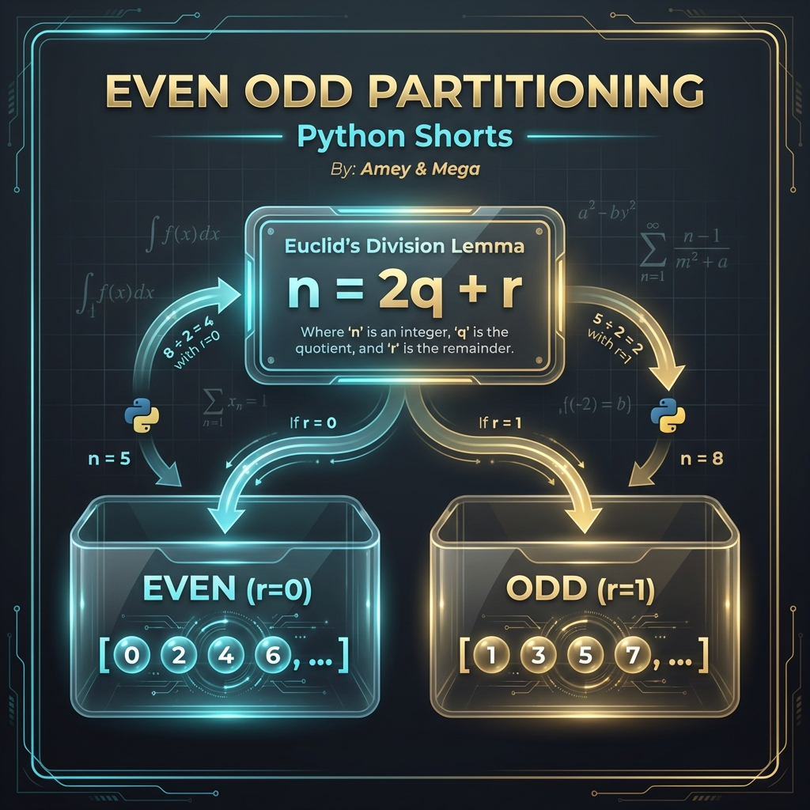
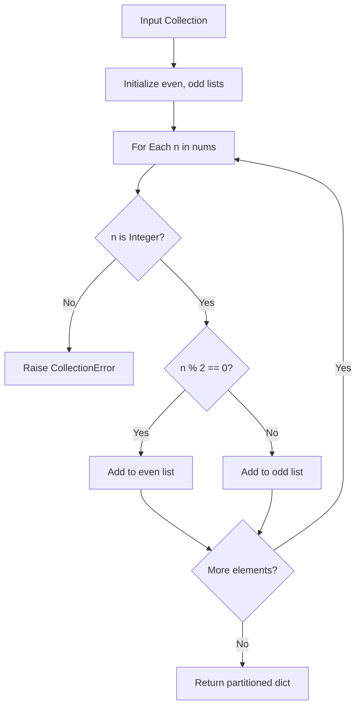

# Even Odd (Parity Partitioning)

**Authors:**
- [Amey Thakur](https://github.com/Amey-Thakur) ([ORCID: 0000-0001-5644-1575](https://orcid.org/0000-0001-5644-1575))
- [Mega Satish](https://github.com/msatmod) ([ORCID: 0000-0002-1844-9557](https://orcid.org/0000-0002-1844-9557))

**Release Date:** January 9, 2022  
**License:** MIT License

---

## Quick Start
To execute this implementation, ensure you have Python 3.x installed and follow these steps:
```bash
python EvenOdd.py
```

## 1. Definition
**Even/Odd Partitioning** is the process of segregating a collection of integers into two disjoint subsets based on their parity. This fundamental discrete operation is a building block for more complex number theory algorithms and data analysis workflows.

## 2. Mathematical Explanation
According to **Euclid's Division Lemma**, for every integer $n$ and divisor $d=2$, there exist unique integers $q$ (quotient) and $r$ (remainder) such that:

$$
n = 2q + r, \quad 0 \leq r < 2
$$

The value of $r$ defines the **Parity Class** of $n$ in the ring of integers modulo 2 ($\mathbb{Z}/2\mathbb{Z}$):
1. If $r = 0$, $n$ is **Even** ($n \in \{2k \mid k \in \mathbb{Z}\}$).
2. If $r = 1$, $n$ is **Odd** ($n \in \{2k + 1 \mid k \in \mathbb{Z}\}$).

## 3. Computer Science Theory
- **Categorization Logic**: The algorithm employs a single-pass linear scan to evaluate the modular property of each element, making it highly efficient for static collections.
- **Bitwise Optimization**: While the modulo operator is mathematically intuitive, low-level implementations often use a bitwise AND with 1 (`n & 1`) for faster parity detection.
- **Complexity**:
    - **Time Complexity**: $O(N)$, where $N$ is the number of integers in the input collection.
    - **Space Complexity**: $O(N)$, as the output requires storing the partitioned elements in two separate structures.

## 4. Python Implementation Logic
- **Robust Type Verification**: Specifically handles non-integer elements to prevent runtime arithmetic failures, ensuring data integrity across heterogeneous inputs.
- **Structured Return**: Returns a dictionary-based payload for easy access to partitioned subsets, facilitating integration into downstream analytics.

## 5. Visual Representation

### Parity Partitioning & Logic Verification



