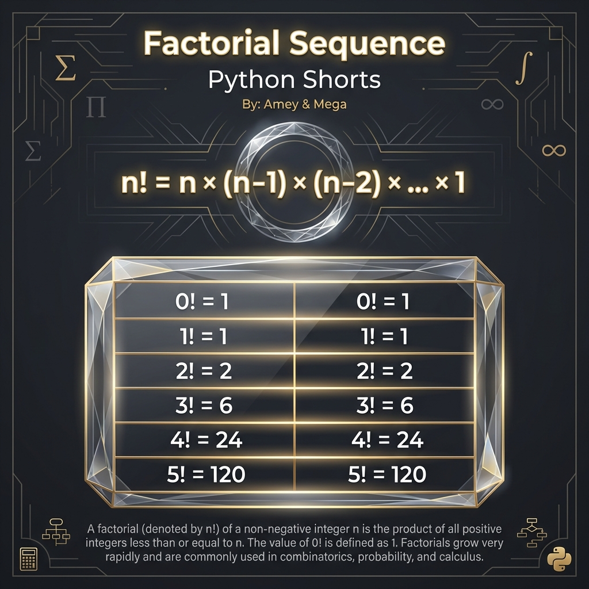

# Factorial Sequence (Combinatorial Progressions)

**Authors:**
- [Amey Thakur](https://github.com/Amey-Thakur) ([ORCID: 0000-0001-5644-1575](https://orcid.org/0000-0001-5644-1575))
- [Mega Satish](https://github.com/msatmod) ([ORCID: 0000-0002-1844-9557](https://orcid.org/0000-0002-1844-9557))

**Release Date:** January 9, 2022  
**License:** MIT License

---

## Quick Start
To execute this implementation, ensure you have Python 3.x installed and follow these steps:
```bash
python FactorialSequence.py
```

## 1. Definition
The **Factorial Sequence** is a series of numbers where each term $a_n$ represents the factorial of the index $n$ ($n \geq 0$). Factorials are fundamental in combinatorics, representing the number of ways to arrange $n$ distinct objects.

## 2. Mathematical Explanation
The factorial of a non-negative integer $n$, denoted by $n!$, is defined by the recursive relation:

$$
n! = 
\begin{cases} 
1 & \text{if } n = 0 \\
n \times (n-1)! & \text{if } n > 0 
\end{cases}
$$

Equivalently, it is the product of all positive integers from 1 up to $n$:

$$
n! = \prod_{k=1}^{n} k = 1 \cdot 2 \cdot 3 \cdots n
$$

For large $n$, the value can be approximated using **Stirling's Approximation**:
$n! \approx \sqrt{2\pi n} \left(\frac{n}{e}\right)^n$.

## 3. Computer Science Theory
- **Iterative vs Recursive**: While factorials are often used to teach recursion, this implementation uses an iterative generator to avoid stack overflow for large $n$ and minimize memory overhead.
- **Large Integer Handling**: Python natively supports arbitrary-precision integers, allowing the calculation of large factorial values that would overflow a standard 64-bit integer.
- **Complexity**:
    - **Time Complexity**: $O(n^2)$ total for the sequence up to $n$, as each multiplication takes $O(\text{bits})$ time and the number of bits grows.
    - **Space Complexity**: $O(1)$ auxiliary space (excluding the output), as the generator yields values one by one.

## 4. Python Implementation Logic
- **Memory-Efficient Generation**: Employs the `yield` keyword to provide values lazily, which is critical when processing the rapidly growing terms of the sequence.
- **Input Validation**: Strictly enforces non-negative integer constraints to ensure mathematical correctness.

## 5. Visual Representation

### Combinatorial Logic & Sequence Verification


```mermaid
flowchart TD
    A[Start: n] --> B[Initialize acc = 1]
    B --> C[Yield acc (0!)]
    C --> D[For i from 1 to n]
    D --> E[acc = acc * i]
    E --> F[Yield acc (i!)]
    F --> G{i < n?}
    G -- Yes --> D
    G -- No --> H[End]
```
