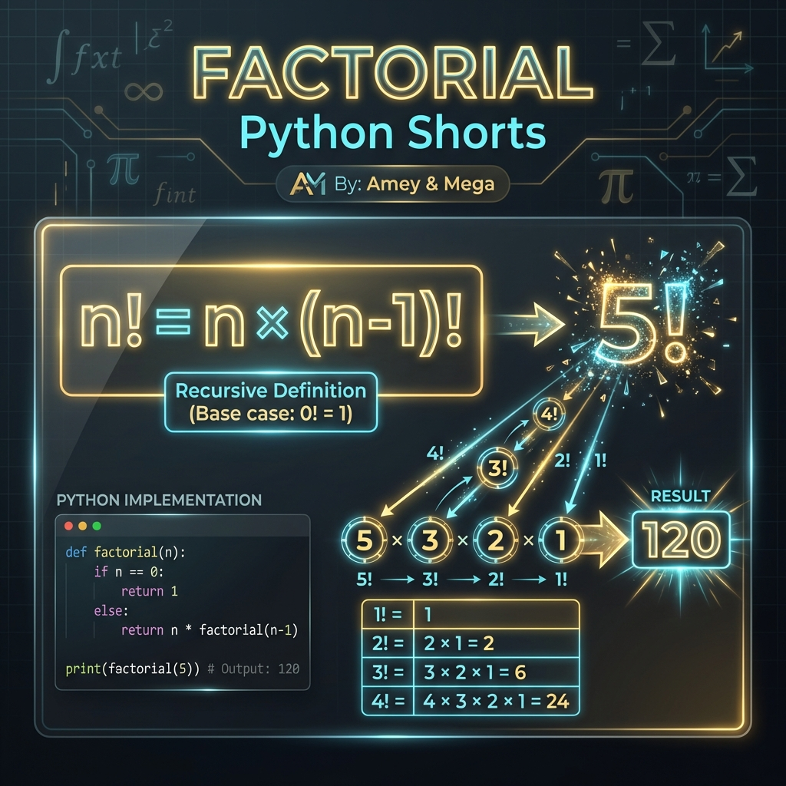
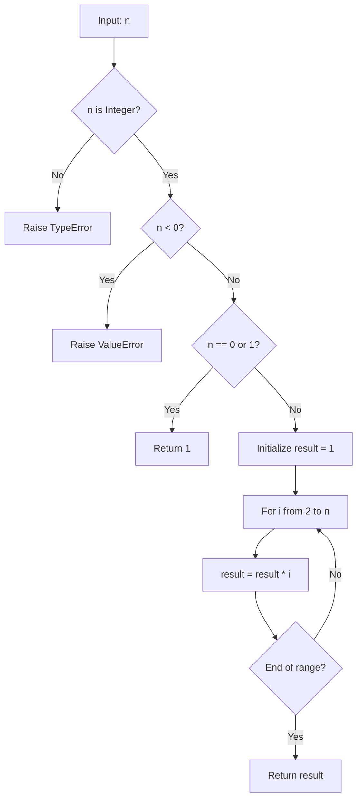
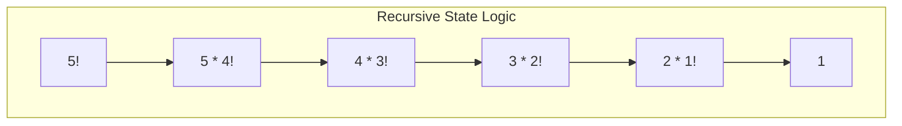

# Factorial (Recursive Function Theory)

**Authors:**
- [Amey Thakur](https://github.com/Amey-Thakur) ([ORCID: 0000-0001-5644-1575](https://orcid.org/0000-0001-5644-1575))
- [Mega Satish](https://github.com/msatmod) ([ORCID: 0000-0002-1844-9557](https://orcid.org/0000-0002-1844-9557))

**Release Date:** January 9, 2022  
**License:** MIT License

---

## Quick Start
To execute this implementation, ensure you have Python 3.x installed and follow these steps:
```bash
python Factorial.py
```

## 1. Definition
The **Factorial** of a non-negative integer $n$ is the product of all positive integers less than or equal to $n$. It is a core operator in discrete mathematics, probability theory, and combinatorial analysis.

## 2. Mathematical Explanation
Mathematically, the factorial operation is defined as:

$$
n! = \prod_{k=1}^{n} k \quad \forall n \in \mathbb{N}_0
$$

### Recursive Definition
The operation is uniquely suited for recursive modeling:
1. **Base Case**: $0! = 1$
2. **Recursive Step**: $n! = n \times (n-1)!$

### Extension: The Gamma Function
For non-integers, the factorial is generalized by the **Gamma Function** $\Gamma(z)$:

$$
\Gamma(n) = (n-1)! \quad \text{for } n \in \mathbb{Z}^+
$$

## 3. Computer Science Theory
- **Implementation Paradigms**: While recursion is elegant, iterative implementations are often preferred in Python to avoid `RecursionError` and minimize stack frame consumption.
- **Arbitrary Precision**: This implementation leverages Python's capability to handle integers of arbitrary size, essential as factorials grow super-exponentially.
- **Complexity**:
    - **Time Complexity**: $O(n)$ multiplications.
    - **Space Complexity**: $O(1)$ for iterative logic, $O(n)$ for naive recursive stacks.

## 4. Python Implementation Logic
- **Iterative Optimization**: Uses a single accumulation loop to calculate the final product safely.
- **Strict Parity & Domain Checks**: Validates that $n$ is a non-negative integer, adhering to the mathematical definition and preventing erroneous results.

## 5. Visual Representation

### Factorial Recursion & Logic Verification





