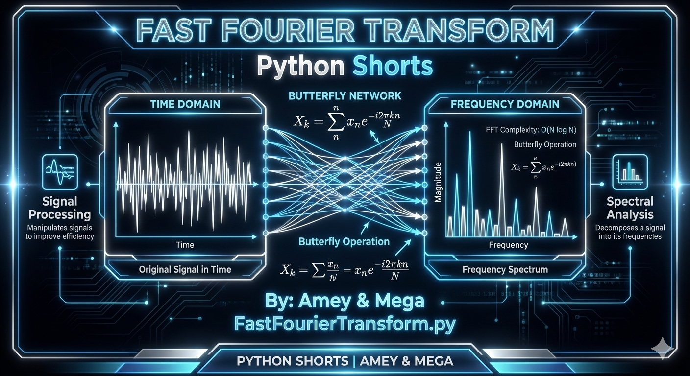
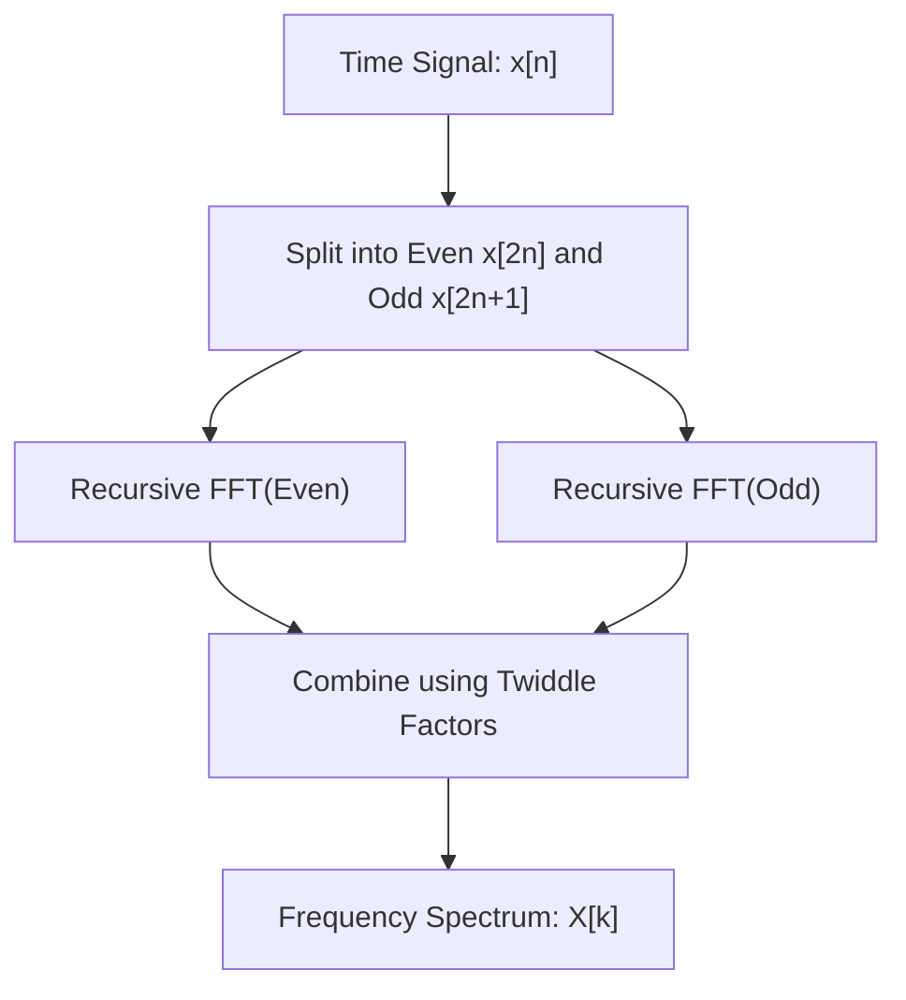
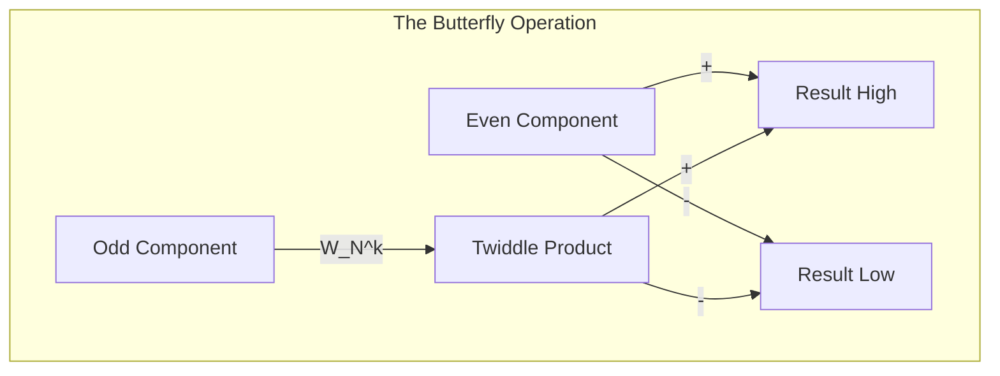

# Fast Fourier Transform (Frequency Domain Analysis & Cooley-Tukey)

**Authors:**
- [Amey Thakur](https://github.com/Amey-Thakur) ([ORCID: 0000-0001-5644-1575](https://orcid.org/0000-0001-5644-1575))
- [Mega Satish](https://github.com/msatmod) ([ORCID: 0000-0002-1844-9557](https://orcid.org/0000-0002-1844-9557))

**Release Date:** January 9, 2022  
**License:** MIT License

---

## Quick Start
To execute this implementation, ensure you have Python 3.x installed and follow these steps:
```bash
python FastFourierTransform.py
```

## 1. Definition
The **Fast Fourier Transform (FFT)** is an algorithm that computes the Discrete Fourier Transform (DFT) of a sequence, or its inverse. It converts a signal from its original domain (often time or space) to a representation in the frequency domain and vice versa. It is widely considered one of the most important algorithms of the 20th century.

## 2. Mathematical Explanation
The Discrete Fourier Transform is defined by the formula:

$$
X_k = \sum_{n=0}^{N-1} x_n \cdot e^{-i 2\pi k n / N}
$$

The FFT reduces the complexity of this computation from $O(N^2)$ to $O(N \log N)$ by using the **Cooley-Tukey algorithm**. This is achieved through the use of **Twiddle Factors** ($W_N^k = e^{-i 2\pi k / N}$) and a recursive divide-and-conquer strategy:

$$
X_k = E_k + W_N^k \cdot O_k
$$

Where $E_k$ and $O_k$ are the transforms of the even and odd indexed elements of the input, respectively.

## 3. Computer Science Theory
- **Divide and Conquer**: Breaking the problem of size $N$ into two subproblems of size $N/2$.
- **Bit-Reversal Permutation**: Iterative versions of FFT often reorder data using bit-reversal to minimize memory overhead.
- **Signal Processing**: Essential for filtering, data compression (MP3, JPEG), and spectral analysis.
- **Complex Roots of Unity**: Points on the unit circle in the complex plane that form the basis of the transform matrix.

## 4. Python Implementation Logic
- **`FFTService`**: A scholarly service implementation using the recursive Cooley-Tukey approach.
- **cmath Integration**: Leverages Python's `cmath` module for robust handling of complex exponentials ($e^{i\theta}$).
- **Recursive Decomposition**: Implements the butterfly operation where results from sub-transforms are recombined.
- **Padding**: Ensures the input signal length is a power of 2 by appending zeros, which is a requirement for the standard Cooley-Tukey recursion.

## 5. Visual Representation

### Time-Frequency Duality & Spectrum Analysis





