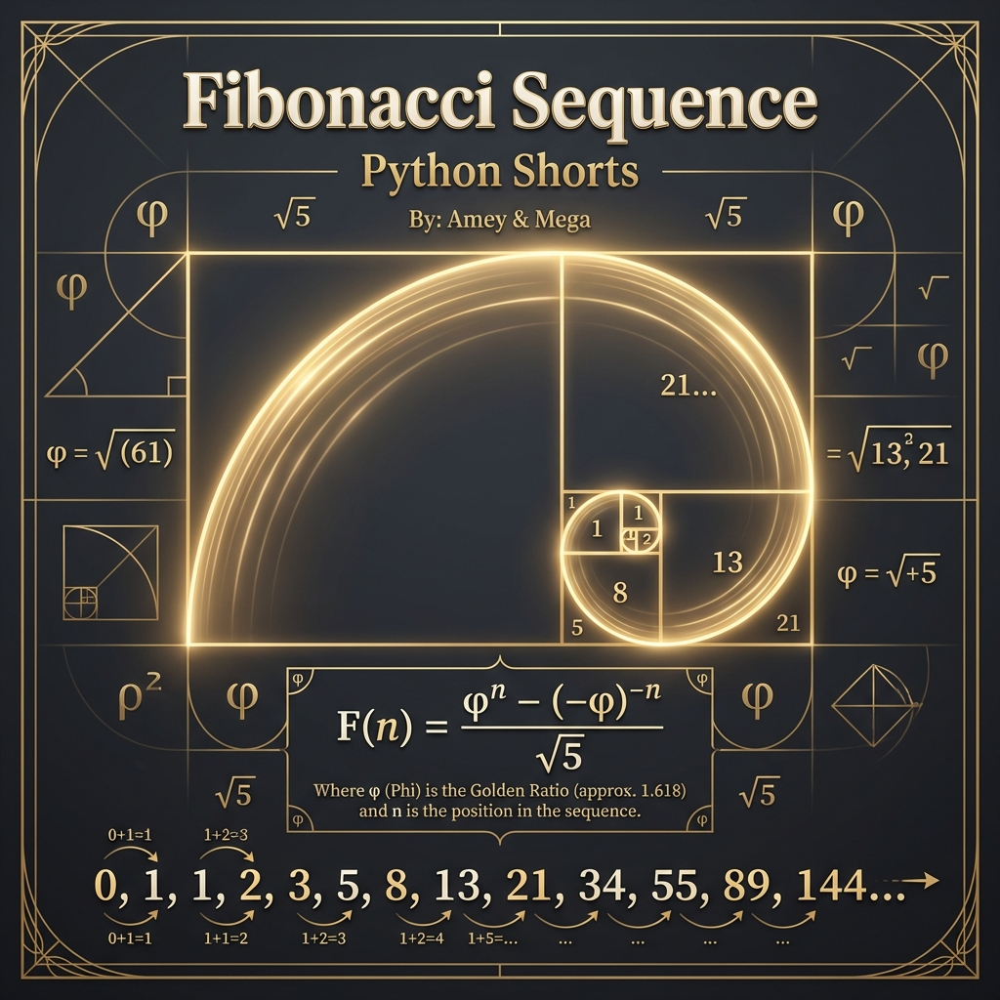

# Fibonacci Sequence (Linear Recurrence Relations)

**Authors:**
- [Amey Thakur](https://github.com/Amey-Thakur) ([ORCID: 0000-0001-5644-1575](https://orcid.org/0000-0001-5644-1575))
- [Mega Satish](https://github.com/msatmod) ([ORCID: 0000-0002-1844-9557](https://orcid.org/0000-0002-1844-9557))

**Release Date:** January 9, 2022  
**License:** MIT License

---

## Quick Start
To execute this implementation, ensure you have Python 3.x installed and follow these steps:
```bash
python FibbonacciSequence.py
```

## 1. Definition
The **Fibonacci Sequence** is a sequence of integers where each term is the sum of the two preceding ones, starting from 0 and 1. This sequence appears frequently in nature, mathematics, and computer science algorithms.

## 2. Mathematical Explanation
The sequence $\{F_n\}$ is defined by the **Linear Recurrence Relation**:

$$
F_n = F_{n-1} + F_{n-2}, \quad F_0 = 0, \ F_1 = 1
$$

### Binet's Formula
The $n$-th Fibonacci number can be calculated directly using **Binet's Formula**, which relates the sequence to the **Golden Ratio** ($\phi$):

$$
F_n = \frac{\phi^n - \psi^n}{\sqrt{5}}
$$

Where $\phi = \frac{1 + \sqrt{5}}{2} \approx 1.618$ and $\psi = \frac{1 - \sqrt{5}}{2}$.

## 3. Computer Science Theory
- **Generator Pattern**: This implementation uses a stateful generator (`yield`), which allows for the iteration of the sequence without pre-allocating memory for all terms, maintaining $O(1)$ auxiliary space.
- **Asymptotic Growth**: The Fibonacci sequence grows exponentially, with its terms approaching a geometric progression with common ratio $\phi$.
- **Complexity**:
    - **Time Complexity**: $O(n)$ to generate the first $n$ terms.
    - **Space Complexity**: $O(1)$ auxiliary space (excluding storage for the output sequence).

## 4. Python Implementation Logic
- **Efficient State Management**: Uses tuple unpacking (`a, b = b, a + b`) for atomic state updates, ensuring the sequence logic remains clean and performant.
- **Parametric Control**: Supports generating any number of terms through a controlled generation interface, with robust validation for non-negative inputs.

## 5. Visual Representation

### Fibonacci Growth & Logic Verification

