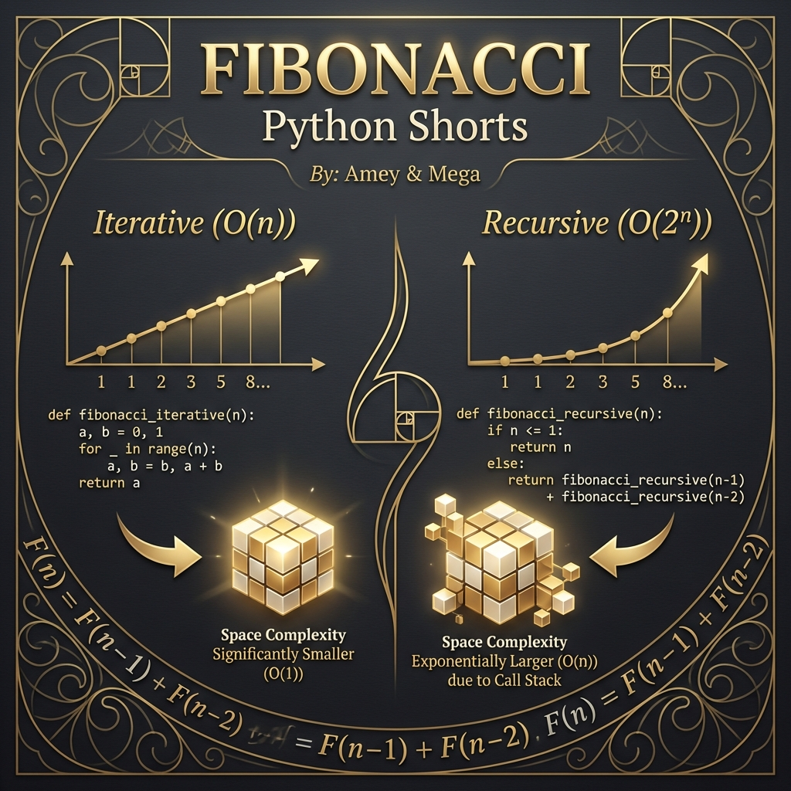
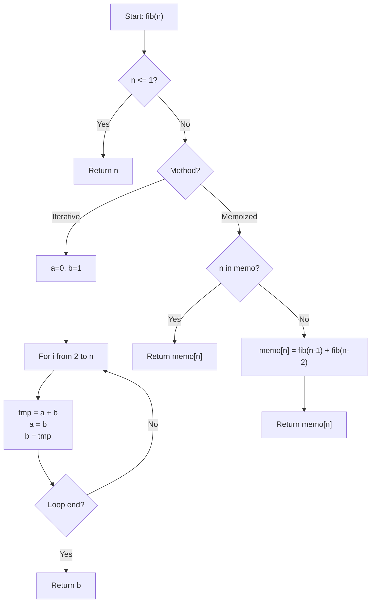
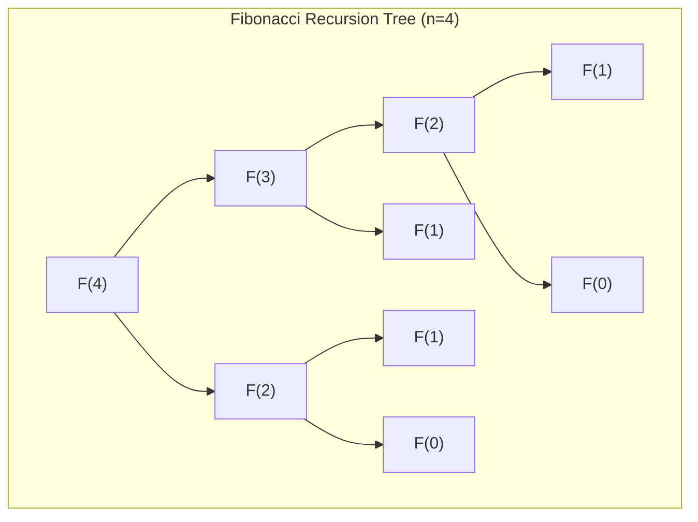

# Fibonacci (Computational Recurrence Relations)

**Authors:**
- [Amey Thakur](https://github.com/Amey-Thakur) ([ORCID: 0000-0001-5644-1575](https://orcid.org/0000-0001-5644-1575))
- [Mega Satish](https://github.com/msatmod) ([ORCID: 0000-0002-1844-9557](https://orcid.org/0000-0002-1844-9557))

**Release Date:** January 9, 2022  
**License:** MIT License

---

## Quick Start
To execute this implementation, ensure you have Python 3.x installed and follow these steps:
```bash
python Fibonacci.py
```

## 1. Definition
The **Fibonacci** number $F_n$ is a term in the Fibonacci sequence where each number is the sum of the two preceding ones. This module focuses on the computational aspects of calculating individual terms efficiently.

## 2. Mathematical Explanation
The sequence is governed by the second-order linear homogeneous recurrence relation:

$$
F_n = F_{n-1} + F_{n-2}
$$

With boundary conditions:
- $F_0 = 0$
- $F_1 = 1$

### Matrix Representation
The sequence can also be solved using matrix exponentiation, allowing for $O(\log n)$ computation:

$$
\begin{pmatrix} F_{n+1} \\ F_n \end{pmatrix} = \begin{pmatrix} 1 & 1 \\ 1 & 0 \end{pmatrix}^n \begin{pmatrix} F_1 \\ F_0 \end{pmatrix}
$$

## 3. Computer Science Theory
- **Algorithmic Efficiency**: Naive recursion results in $O(2^n)$ time complexity due to redundant calculations. This implementation provides an $O(n)$ iterative approach and a memoized recursive approach to show how caching optimizes performance.
- **Space Management**: Iterative logic uses $O(1)$ auxiliary space by only maintaining the last two terms, whereas recursion (even memoized) requires $O(n)$ space for the call stack or cache.
- **Complexity**:
    - **Time Complexity**: $O(n)$
    - **Space Complexity**: $O(1)$ (Iterative) / $O(n)$ (Memoized)

## 4. Python Implementation Logic
- **Atomic State Transitions**: Utilizing Python's tuple unpacking to swap values in a single statement, ensuring the state remains consistent during the iterative loop.
- **Memoization Interface**: Demonstrates a functional approach to dynamic programming by caching intermediate results in a dictionary.

## 5. Visual Representation

### Algorithmic Comparison & Logic Verification





