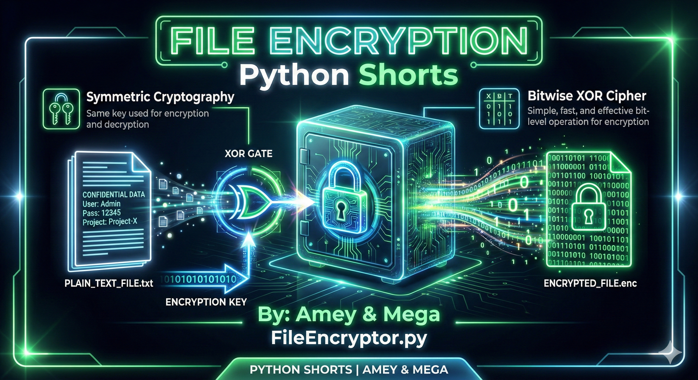
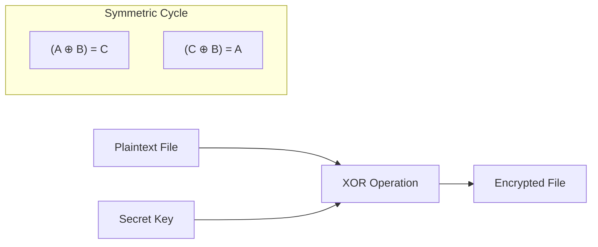
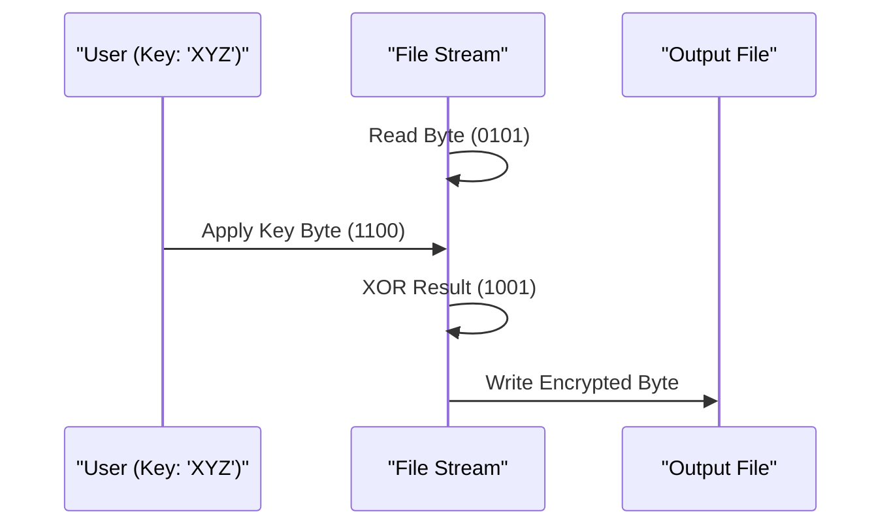

# File Encryptor (Symmetric Cryptography & XOR Cipher)

**Authors:**
- [Amey Thakur](https://github.com/Amey-Thakur) ([ORCID: 0000-0001-5644-1575](https://orcid.org/0000-0001-5644-1575))
- [Mega Satish](https://github.com/msatmod) ([ORCID: 0000-0002-1844-9557](https://orcid.org/0000-0002-1844-9557))

**Release Date:** January 9, 2022  
**License:** MIT License

---

## Quick Start
To execute this implementation, ensure you have Python 3.x installed and follow these steps:
```bash
python FileEncryptor.py
```

## 1. Definition
**File Encryption** is the process of encoding digital information to make it unreadable to unauthorized parties. This implementation utilizes a **Symmetric XOR Cipher**, which is a type of additive cipher that relies on the bitwise eXclusive OR (XOR) operation to obfuscate data.

## 2. Mathematical Explanation
The XOR operation ($\oplus$) is the mathematical foundation of this encryption. It has a unique property where applying the same key twice restores the original value.

For a plaintext bit $P$ and a key bit $K$:
1.  **Encryption**: $C = P \oplus K$
2.  **Decryption**: $C \oplus K = (P \oplus K) \oplus K = P$

**XOR Truth Table:**
| P | K | P ⊕ K (Ciphertext) |
|---|---|---|
| 0 | 0 | 0 |
| 0 | 1 | 1 |
| 1 | 0 | 1 |
| 1 | 1 | 0 |

## 3. Computer Science Theory
- **Symmetric Cryptography**: Uses the same secret key for both encryption of plaintext and decryption of ciphertext.
- **Steam Ciphers**: XOR encryption is a fundamental building block for stream ciphers, where a pseudo-random key-stream is generated and combined with the plaintext.
- **Key Strength**: The security of an XOR cipher is entirely dependent on the length and randomness of the key. A key as long as the message (One-Time Pad) is theoretically unbreakable.
- **Buffer Processing**: Files are processed in byte-chunks to minimize memory overhead, allowing for the encryption of files much larger than the available RAM.

## 4. Python Implementation Logic
- **`FileEncryptorService`**: A scholarly service that manages key encoding and file buffer manipulation.
- **Byte-wise XOR**: Uses Python's `byte ^ key_byte` syntax to perform bitwise operations on the binary file stream.
- **Cyclic Key Application**: Uses the modulo operator (`i % key_length`) to repeat the encryption key across the entire file length.
- **Binary I/O**: Opens files in `'rb'` (Read Binary) and `'wb'` (Write Binary) modes to preserve structural integrity for non-text files (images, executables, etc.).

## 5. Visual Representation

### Bitwise Obfuscation & Key Alignment





