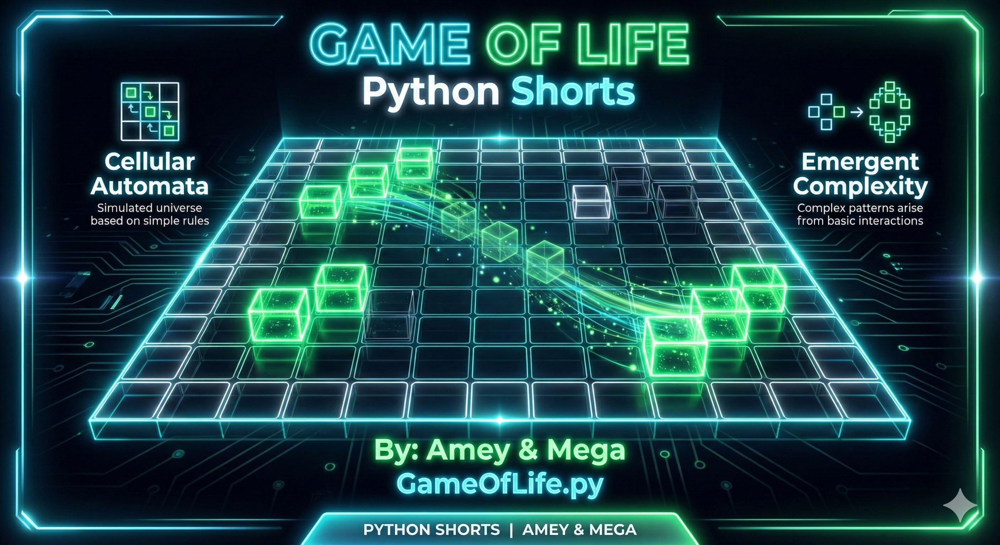
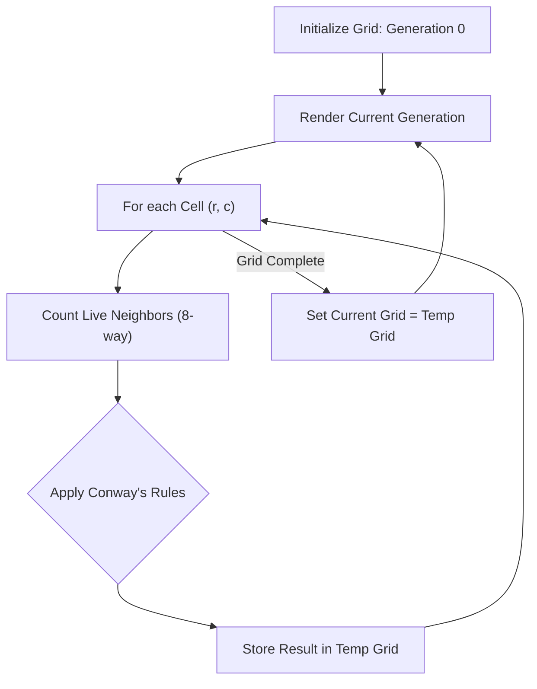
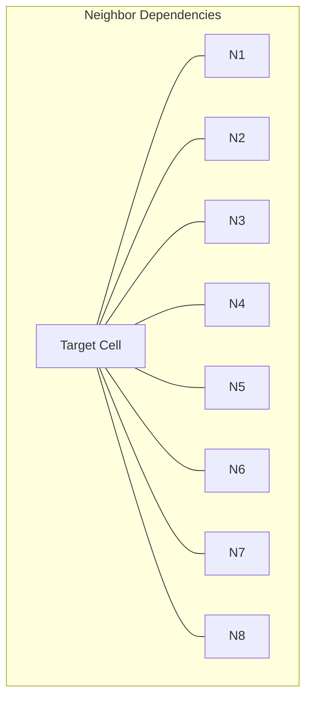

# Conway's Game of Life (Cellular Automata & Emergent Complexity)

**Authors:**
- [Amey Thakur](https://github.com/Amey-Thakur) ([ORCID: 0000-0001-5644-1575](https://orcid.org/0000-0001-5644-1575))
- [Mega Satish](https://github.com/msatmod) ([ORCID: 0000-0002-1844-9557](https://orcid.org/0000-0002-1844-9557))

**Release Date:** January 9, 2022  
**License:** MIT License

---

## Quick Start
To execute this implementation, ensure you have Python 3.x installed and follow these steps:
```bash
python GameOfLife.py
```

## 1. Definition
**Conway's Game of Life** is a zero-player game, meaning that its evolution is determined by its initial state, requiring no further input. One interacts with the Game of Life by creating an initial configuration and observing how it evolves. It is the best-known example of a **Cellular Automaton**.

## 2. Mathematical Explanation
The universe of the Game of Life is an infinite, two-dimensional orthogonal grid of square cells, each of which is in one of two possible states, **live** or **dead**. Every cell interacts with its eight neighbors, which are the cells that are horizontally, vertically, or diagonally adjacent.

At each step in time, the following transitions occur:
1.  **Underpopulation**: Any live cell with fewer than two live neighbors dies.
2.  **Stasis**: Any live cell with two or three live neighbors lives on to the next generation.
3.  **Overpopulation**: Any live cell with more than three live neighbors dies.
4.  **Reproduction**: Any dead cell with exactly three live neighbors becomes a live cell.

Mathematically, if $S_{t}(x,y)$ is the state of cell $(x,y)$ at time $t$, and $N_{t}(x,y)$ is the count of live neighbors:

$$
S_{t+1}(x,y) = \begin{cases} 
1 & \text{if } (S_{t}=1 \text{ and } N_{t} \in \{2,3\}) \text{ or } (S_{t}=0 \text{ and } N_{t}=3) \\
0 & \text{otherwise}
\end{cases}
$$

## 3. Computer Science Theory
- **Turing Completeness**: Remarkably, the Game of Life is Turing complete; it can simulate any computer algorithm, including itself.
- **Local Rules, Global Behavior**: Demonstrates how complex patterns (gliders, pulsars, spaceships) emerge from extremely simple local constraints.
- **Grid Computing**: A precursor to modern parallel processing and multi-agent system simulations.
- **Steady States**: Identifies patterns that remain constant or cycle periodically through specific phases.

## 4. Python Implementation Logic
- **`GameOfLifeService`**: Manages the grid state and encapsulates the neighbor-counting and evolution logic.
- **Double Buffering**: Using a secondary grid to compute the state of $t+1$ based on $t$ without interference from partially updated cells.
- **Boundary Handling**: Implements 2D array bounds checking to ensure neighbor counts are accurate at the edges of the simulation.
- **Pattern Initialization**: Demonstrates "Glider" and "Blinker" structures to showcase movement and periodicity.

## 5. Visual Representation

### Emergent Patterns & Evolutionary Logic





