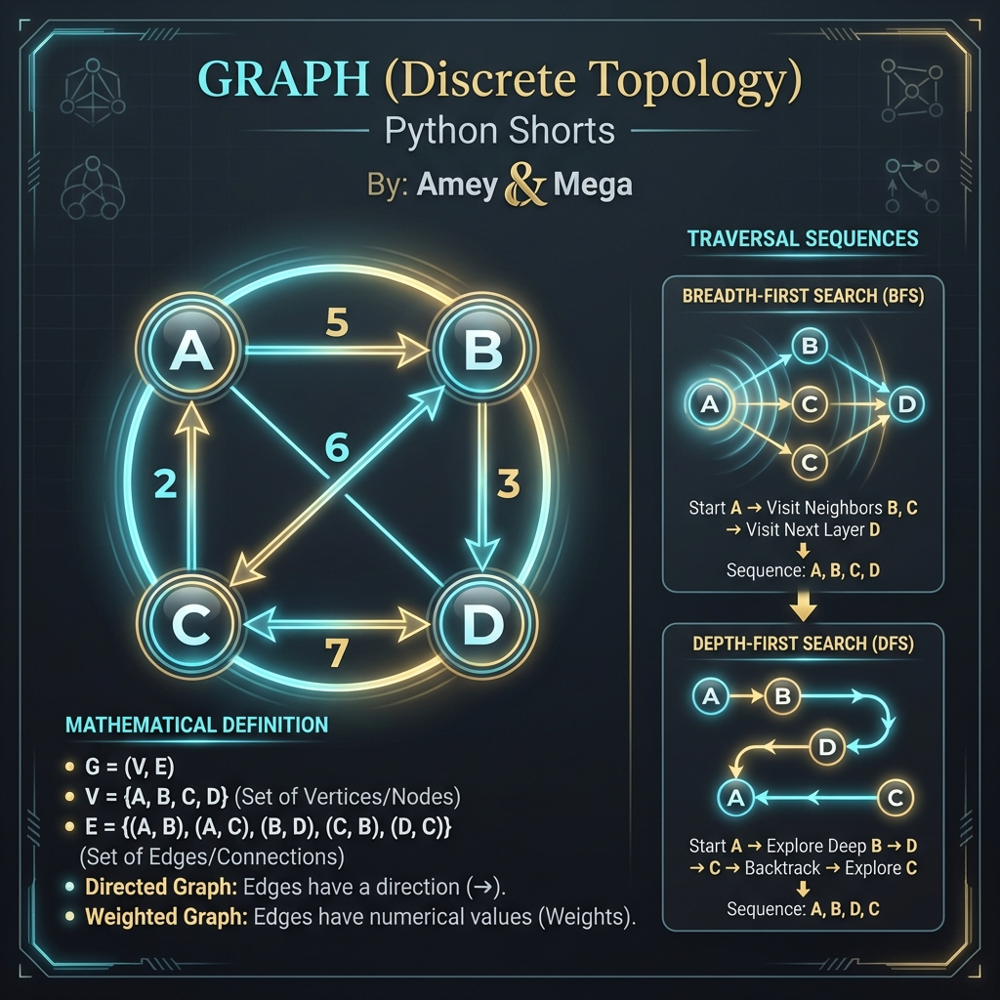
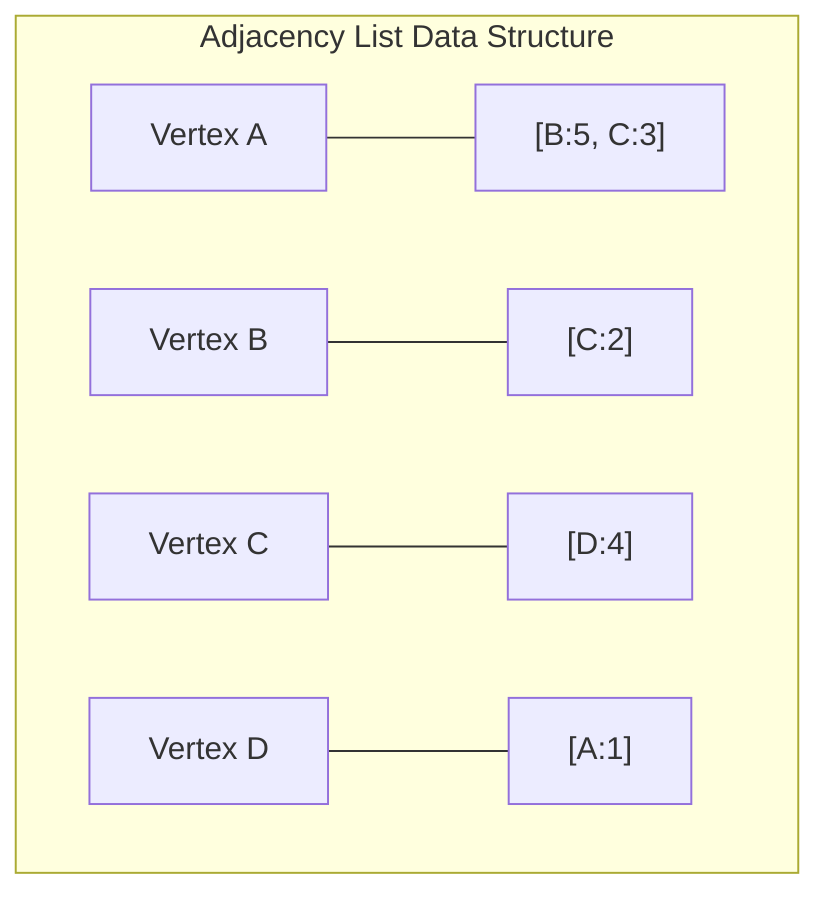
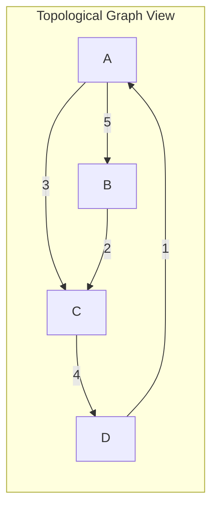
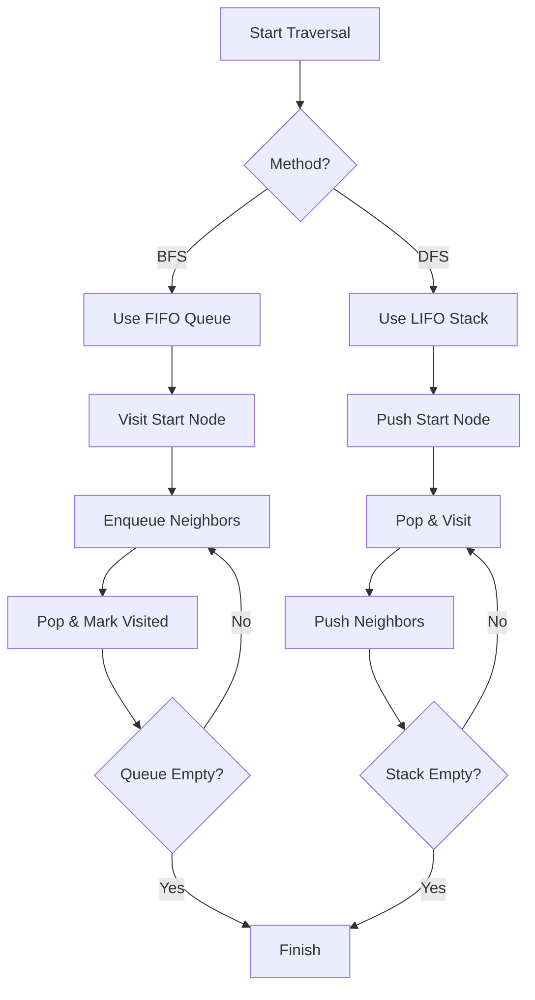

# Graph (Discrete Topology)

**Authors:**
- [Amey Thakur](https://github.com/Amey-Thakur) ([ORCID: 0000-0001-5644-1575](https://orcid.org/0000-0001-5644-1575))
- [Mega Satish](https://github.com/msatmod) ([ORCID: 0000-0002-1844-9557](https://orcid.org/0000-0002-1844-9557))

**Release Date:** January 9, 2022  
**License:** MIT License

---

## Quick Start
To execute this implementation, ensure you have Python 3.x installed and follow these steps:
```bash
python Graph.py
```

## 1. Definition
A **Graph** is a non-linear data structure consisting of a set of vertices (or nodes) $V$ and a set of edges $E$ that connect pairs of vertices. This scholarly implementation utilizes **Adjacency Lists** to represent the topological relationships, providing efficiency for sparse graphs.

## 2. Mathematical Explanation
A graph $G$ is formally defined as an ordered pair:

$$
G = (V, E)
$$

Where:
- $V = \{v_1, v_2, \dots, v_n\}$ is the set of **Vertices**.
- $E \subseteq \{(u, v) \mid u, v \in V\}$ is the set of **Edges**.

### Weighted Directed Graphs
In this implementation, edges can be **Directed** (one-way) or **Undirected** (two-way), and may carry a scalar **Weight** $w(u, v)$ representing distance, cost, or capacity.

## 3. Computer Science Theory
- **Adjacency List Representation**: Stores each vertex as a key mapped to a list of its neighbors. This optimizes space for graphs where $|E| \ll |V|^2$.
- **Traversal Algorithms**:
    - **BFS (Breadth-First Search)**: Explores nodes layer by layer using a FIFO queue, guaranteed to find the shortest path in unweighted graphs.
    - **DFS (Depth-First Search)**: Explores as far as possible along each branch before backtracking, utilizing a LIFO stack.
- **Complexity**:
    - **Time Complexity**: $O(V + E)$ for both BFS and DFS.
    - **Space Complexity**: $O(V + E)$ to store the adjacency list and traversal state.

## 4. Python Implementation Logic
- **Object-Oriented Design**: Encapsulates $Vertex$ and $Graph$ as discrete entities, allowing for easy expansion (e.g., adding Dijkstra's or A* algorithms).
- **Atomic Operations**: Supports dynamic vertex and edge insertion with automatic handling of boundary conditions.

## 5. Visual Representation

### Topological Mapping & Logic Verification







