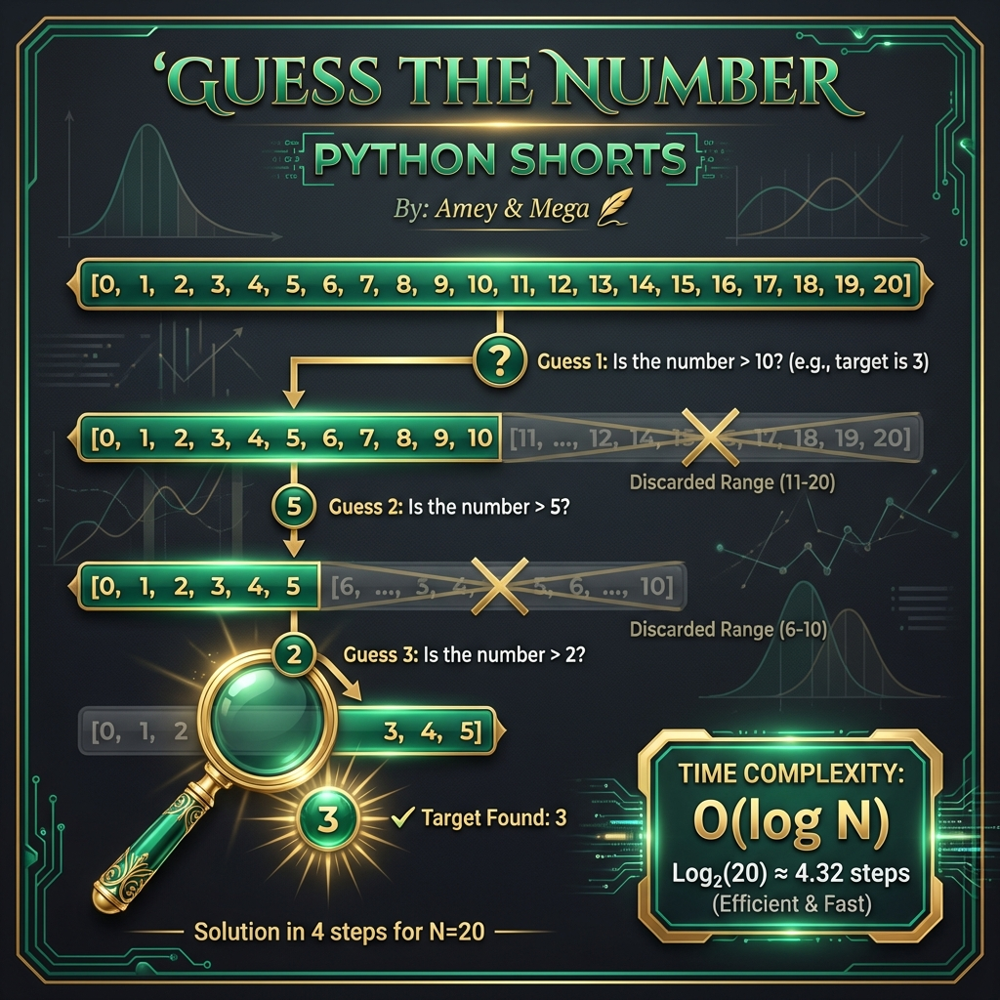
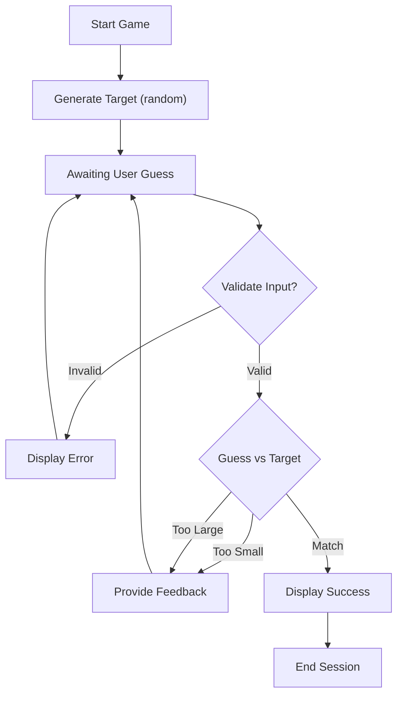

# Guess The Number (Search Space Optimization)

**Authors:**
- [Amey Thakur](https://github.com/Amey-Thakur) ([ORCID: 0000-0001-5644-1575](https://orcid.org/0000-0001-5644-1575))
- [Mega Satish](https://github.com/msatmod) ([ORCID: 0000-0002-1844-9557](https://orcid.org/0000-0002-1844-9557))

**Release Date:** January 9, 2022  
**License:** MIT License

---

## Quick Start
To execute this implementation, ensure you have Python 3.x installed and follow these steps:
```bash
python GuessTheNumber.py
```

## 1. Definition
**Guess The Number** is a discrete search-space problem where an agent must identify a hidden target value $x$ within a known range $[L, U]$ using minimal feedback-based iterations. It serves as a practical demonstration of **Binary Search** principles.

## 2. Mathematical Explanation
The efficiency of the game is determined by the reduction of the **Search Space**. If $N = U - L + 1$ is the number of possible values, each "Too Small" or "Too Large" feedback effectively bisects the remaining possibilities.

### Logarithmic Complexity
The maximum number of attempts required to guarantee success is given by:

$$
T_{max} = \lceil \log_2(N) \rceil
$$

For a range of $[0, 20]$, $N = 21$, so $T_{max} = \lceil 4.39 \rceil = 5$ attempts, provided the optimal strategy is used.

### Information Entropy
Each guess provides a certain amount of information (in bits). An optimal guess at the midpoint reduces the **Shannon Entropy** of the unknown target by a maximum amount per iteration.

## 3. Computer Science Theory
- **Binary Search Paradigm**: By selecting the midpoint of the current active range, the algorithm eliminates 50% of the remaining search space regardless of the result.
- **Input Validation**: Robust systems must handle non-integer exceptions and boundary violations to maintain the integrity of the state machine.
- **Complexity**:
    - **Best Case**: $O(1)$ (Correct on first iteration).
    - **Worst Case**: $O(\log N)$ (Standard binary reduction).

## 4. Python Implementation Logic
- **Encapsulated Engine**: The `GuessGame` class manages state (target, bounds, attempts) independently from the interface.
- **Simulation Mode**: Includes a `--sim` flag to execute deterministic search patterns for verification and logging purposes, bypassing interactive blocking.

## 5. Visual Representation

### Search Convergence & Logic Verification




