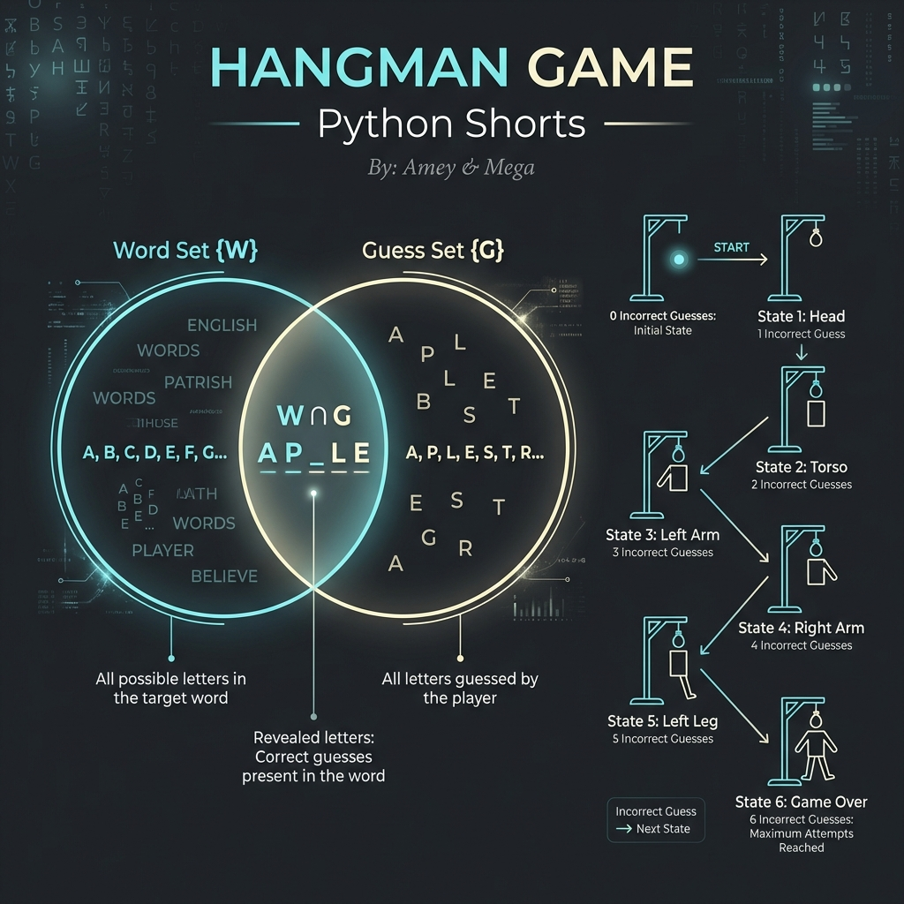

# Hangman Game (Set Theory & Lexical States)

**Authors:**
- [Amey Thakur](https://github.com/Amey-Thakur) ([ORCID: 0000-0001-5644-1575](https://orcid.org/0000-0001-5644-1575))
- [Mega Satish](https://github.com/msatmod) ([ORCID: 0000-0002-1844-9557](https://orcid.org/0000-0002-1844-9557))

**Release Date:** January 9, 2022  
**License:** MIT License

---

## Quick Start
To execute this implementation, ensure you have Python 3.x installed and follow these steps:
```bash
python HangmanGame.py
```

## 1. Definition
**Hangman** is a lexical deduction game where an agent must reconstruct a hidden word $W$ by identifying its component characters through discrete guesses. This implementation models the game as a series of **Set Operations** over the English alphabet.

## 2. Mathematical Explanation
The state of the game can be rigorously defined using **Set Theory**.

### Set Definitions
- Let $\Sigma$ be the set of lowercase English characters $\{a, b, \dots, z\}$.
- Let $W \subset \Sigma$ be the set of unique characters in the target word.
- Let $G \subseteq \Sigma$ be the set of characters guessed by the user.

### State Transitions
The revealed portion of the word is defined by the intersection:
$$
\text{Revealed} = G \cap W
$$

The set of undetected characters is the relative complement:
$$
\text{Hidden} = W \setminus G
$$

The game concludes in a "Win" state when:
$$
W \setminus G = \emptyset \quad \iff \quad W \subseteq G
$$

## 3. Computer Science Theory
- **Dictionary-Based Sampling**: The target word is selected through a uniform random distribution from a predefined vocabulary set.
- **State Persistence**: The `HangmanEngine` class maintains the internal state of the sets, ensuring $O(1)$ verification for each character guess.
- **Complexity**:
    - **Time Complexity**: $O(1)$ per guess (using hash-sets), total $O(N + K)$ where $N$ is word length and $K$ is total guesses.
    - **Space Complexity**: $O(N + K)$ to store the sets and word structure.

## 4. Python Implementation Logic
- **Set Operations**: Utilizes Python's native `set` data structure for efficient membership testing and subset verification.
- **Deterministic Simulation**: Includes a `--sim` flag to verify game logic through a pre-defined sequence of guesses, facilitating automated output logging without blocking IO.

## 5. Visual Representation

### Set Intersection & Lexical Convergence

