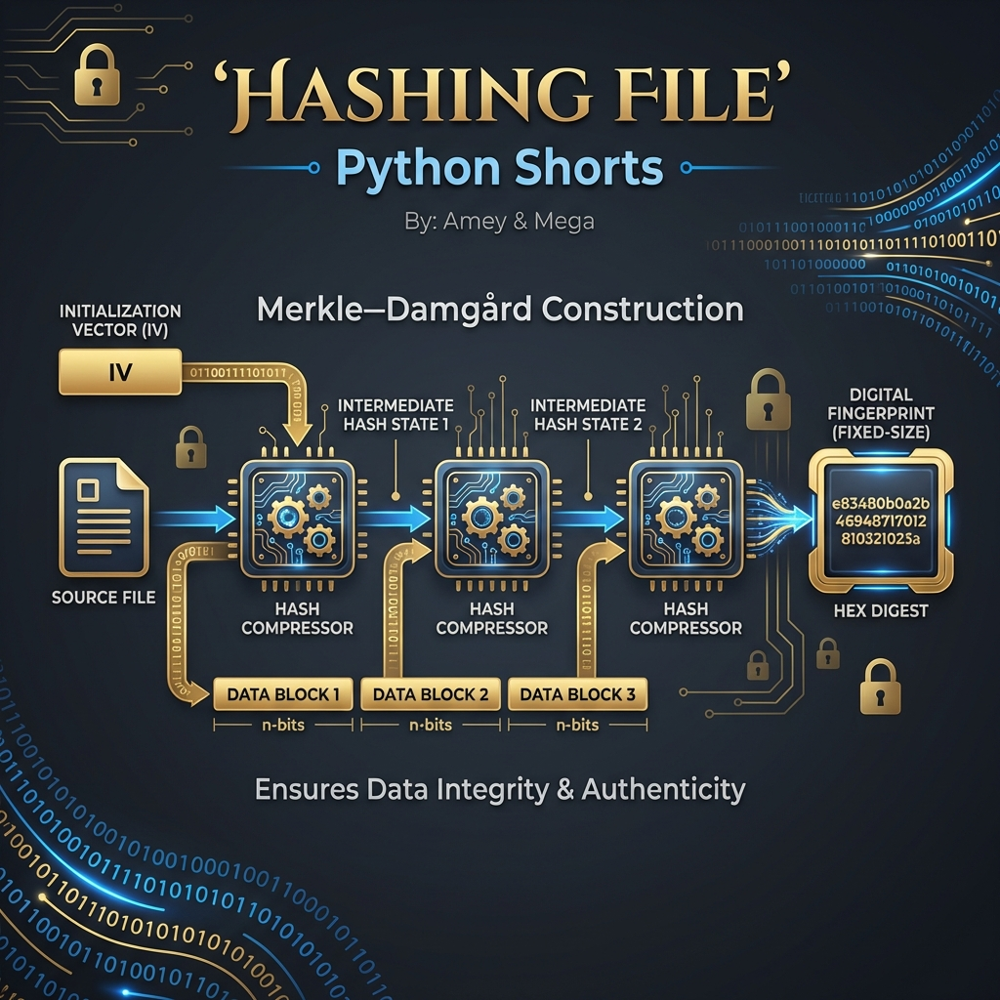
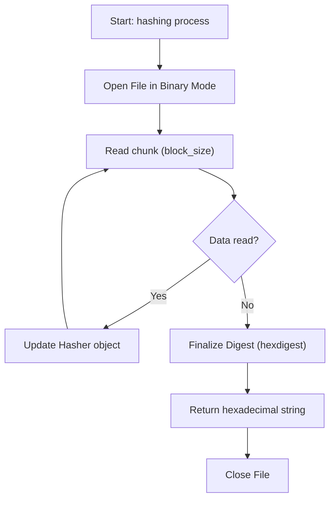
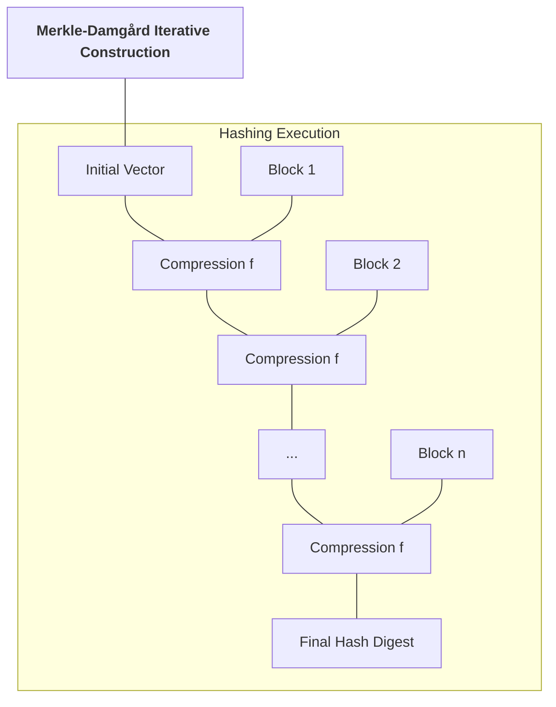

# Hashing File (Cryptographic Integrity Verification)

**Authors:**
- [Amey Thakur](https://github.com/Amey-Thakur) ([ORCID: 0000-0001-5644-1575](https://orcid.org/0000-0001-5644-1575))
- [Mega Satish](https://github.com/msatmod) ([ORCID: 0000-0002-1844-9557](https://orcid.org/0000-0002-1844-9557))

**Release Date:** January 9, 2022  
**License:** MIT License

---

## Quick Start
To execute this implementation, ensure you have Python 3.x installed and follow these steps:
```bash
python HashingFile.py
```

## 1. Definition
**File Hashing** is the process of generating a fixed-size numerical representation (a digest) from an arbitrary-sized file. It is a fundamental technique for verifying **Data Integrity**, ensuring that a file has not been altered or corrupted during transmission or storage.

## 2. Mathematical Explanation
A cryptographic hash function $H$ satisfies three primary properties:
1. **Pre-image Resistance**: Given a hash $h$, it is computationally infeasible to find $x$ such that $H(x) = h$.
2. **Second Pre-image Resistance**: Given $x$, it is infeasible to find $y \neq x$ such that $H(x) = H(y)$.
3. **Collision Resistance**: It is infeasible to find any two distinct inputs $x, y$ such that $H(x) = H(y)$.

### Merkle–Damgård Construction
This implementation processes files in discrete blocks $B_i$. The final hash is computed iteratively:

$$
h_i = f(h_{i-1}, B_i)
$$

Where $f$ is a compression function and $h_0$ is an initial vector.

## 3. Computer Science Theory
- **Streaming Buffer Logic**: By reading the file in chunks (e.g., 64KB), the algorithm can hash files significantly larger than the available RAM, maintaining $O(1)$ memory complexity.
- **Determinism**: The same file will always produce the identical hash sum under the same algorithm, making it a reliable "Digital Fingerprint".
- **Complexity**:
    - **Time Complexity**: $O(N)$ where $N$ is the file size in bytes.
    - **Space Complexity**: $O(B)$ where $B$ is the block size (auxiliary space).

## 4. Python Implementation Logic
- **Hashlib Abstraction**: Leverages Python's `hashlib` library, which provides a thread-safe interface to highly optimized C implementations of SHA-2 and MD5.
- **Binary I/O**: Files are accessed in `rb` mode to ensure cross-platform consistency of byte streams, regardless of text encoding or newline conventions.

## 5. Visual Representation

### Cryptographic Workflow & Digest Verification






