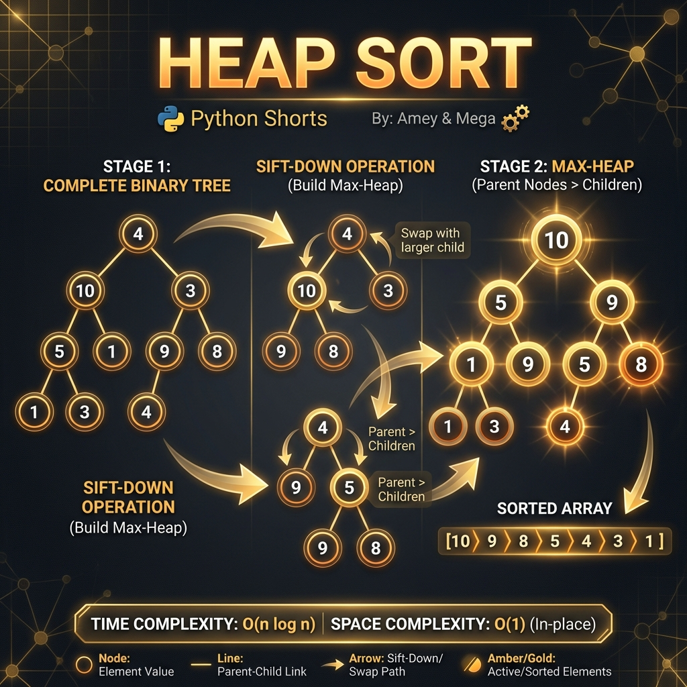

# Heap Sort (Binary Heaps & Total Order)

**Authors:**
- [Amey Thakur](https://github.com/Amey-Thakur) ([ORCID: 0000-0001-5644-1575](https://orcid.org/0000-0001-5644-1575))
- [Mega Satish](https://github.com/msatmod) ([ORCID: 0000-0002-1844-9557](https://orcid.org/0000-0002-1844-9557))

**Release Date:** January 9, 2022  
**License:** MIT License

---

## Quick Start
To execute this implementation, ensure you have Python 3.x installed and follow these steps:
```bash
python HeapSort.py
```

## 1. Definition
**Heap Sort** is a comparison-based sorting algorithm that organizes a dataset into a **Max-Heap** (a complete binary tree where each node is greater than or equal to its children) to efficiently extract elements in descending order. It is an in-place algorithm with no auxiliary memory requirements proportional to the dataset size.

## 2. Mathematical Explanation
The efficiency of Heap Sort is derived from the properties of a **Complete Binary Tree**.

### Heap Property
For an array $A$ representing a heap, the relationship between a node at index $i$ and its children follows:

$$
A[i] \geq A[2i + 1] \quad \text{and} \quad A[i] \geq A[2i + 2]
$$

### Asymptotic Complexity
Building a heap from an unsorted array takes $O(n)$ time. Each of the $n$ extractions requires a partial "sift-down" operation of height $\lceil \log_2 n \rceil$. Thus, the total complexity is:

$$
T(n) = O(n) + O(n \log n) = O(n \log n)
$$

## 3. Computer Science Theory
- **In-place Sorting**: Unlike Merge Sort, Heap Sort does not require $O(n)$ extra space, making it highly memory-efficient for large embedded systems.
- **Unstable Algorithm**: Duplicate elements may not preserve their relative positions due to the structural swaps during heapification.
- **Priority Queue Foundation**: The underlying heap structure is the foundational basis for efficient Priority Queues.

## 4. Python Implementation Logic
- **Recursive Depth**: Utilizes a recursive `_sift_down` method to restore the heap property, ensuring elegant and mathematically direct logic.
- **Zero-Based Indexing**: Correctly maps the binary tree structure to standard Python list indices ($2i+1$ for left, $2i+2$ for right).

## 5. Visual Representation

### Binary Heap Structure & Sorting Convergence

