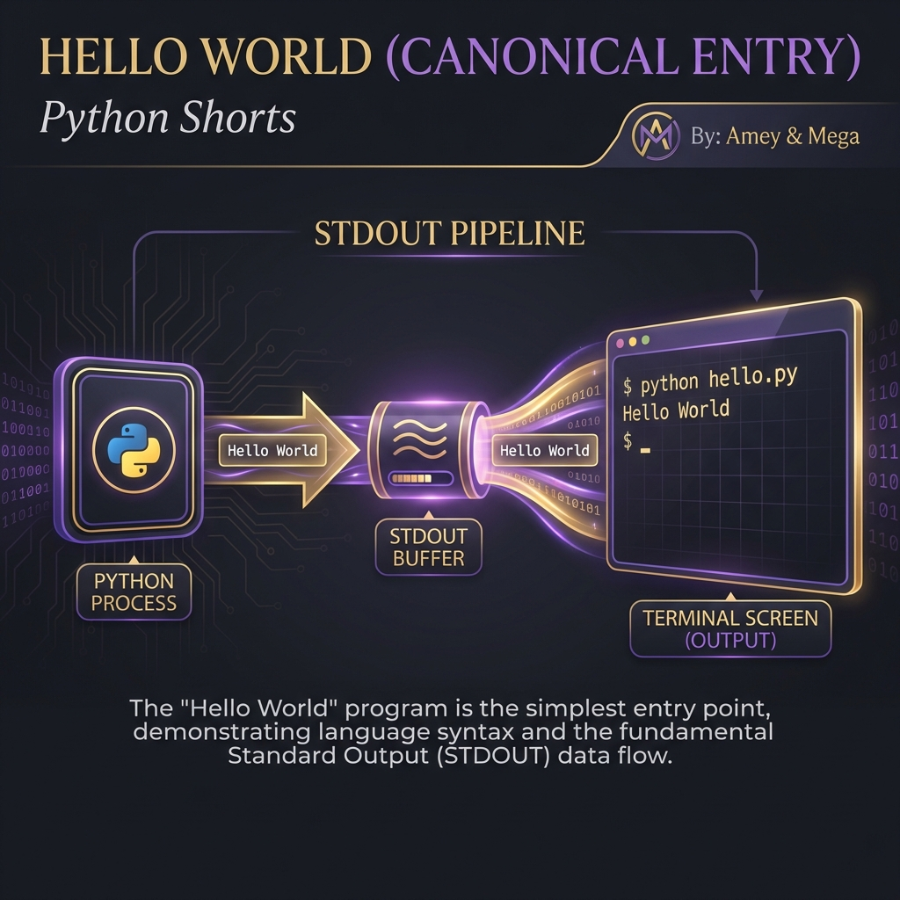

# Hello World (Canonical Initialization)

**Authors:**
- [Amey Thakur](https://github.com/Amey-Thakur) ([ORCID: 0000-0001-5644-1575](https://orcid.org/0000-0001-5644-1575))
- [Mega Satish](https://github.com/msatmod) ([ORCID: 0000-0002-1844-9557](https://orcid.org/0000-0002-1844-9557))

**Release Date:** January 9, 2022  
**License:** MIT License

---

## Quick Start
To execute this implementation, ensure you have Python 3.x installed and follow these steps:
```bash
python Hello_World.py
```

## 1. Definition
**Hello World** is the canonical program used to verify the successful initialization of a programming environment and to demonstrate the basic syntax for outputting data to the console. It serves as an atomic proof-of-concept for the execution environment.

## 2. Technical Explanation
The program logic centers on the concept of **Standard Streams**, specifically STDOUT.

### Standard Output (STDOUT)
In computer programming, STDOUT is the default file descriptor where a process writes its output data. In most modern environments, this stream is buffered and directed to the terminal emulator.

### Canonical Program Entry
The use of the `if __name__ == "__main__":` guard ensures that the initialization logic executes only when the script is invoked directly, adhering to modular software design principles:

$$
\text{Execution} \iff \text{Entry Point} = \text{Main Module}
$$

## 3. Computer Science Theory
- **Buffer Serialization**: Character data is encoded (typically via UTF-8) and written to a buffer before being flushed to the hardware display interface.
- **Atomicity**: The program performs a singular, atomic task, displaying a message, making it the fundamental unit of verification in systems engineering.
- **Complexity**:
    - **Time Complexity**: $O(n)$ where $n$ is the number of characters to be printed.
    - **Space Complexity**: $O(1)$ (auxiliary space).

## 4. Python Implementation Logic
- **Structured Printing**: Encapsulates the printing logic within a `CanonicalPrinter` class to promote object-oriented discipline even in fundamental tasks.
- **Sys-Safe Execution**: Follows standard Python conventions for stream management and module-level execution guards.

## 5. Visual Representation

### STDOUT Pipeline & Canonical Entry Verified

