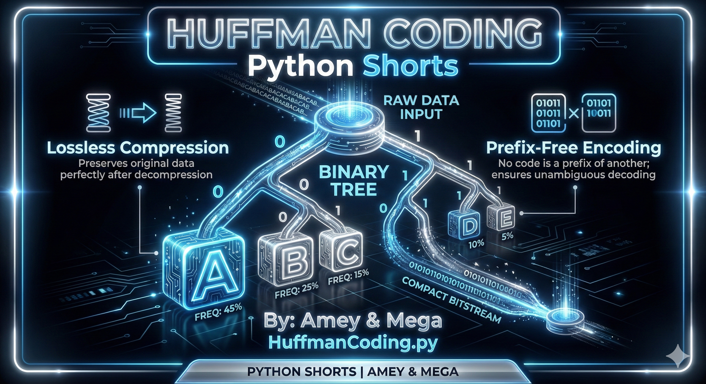
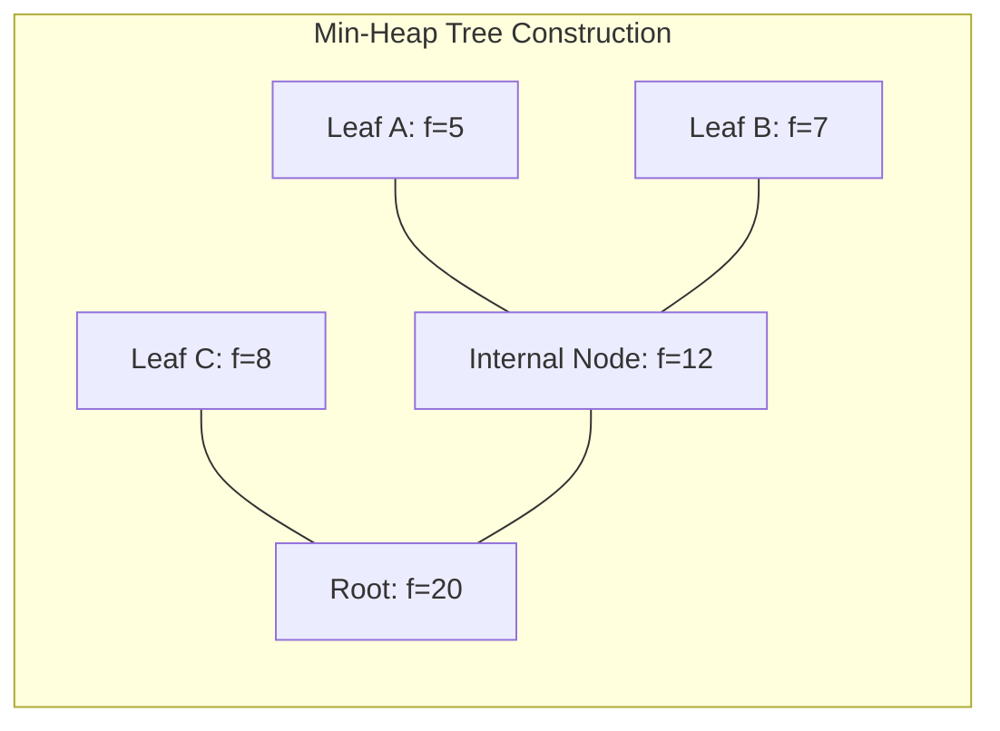
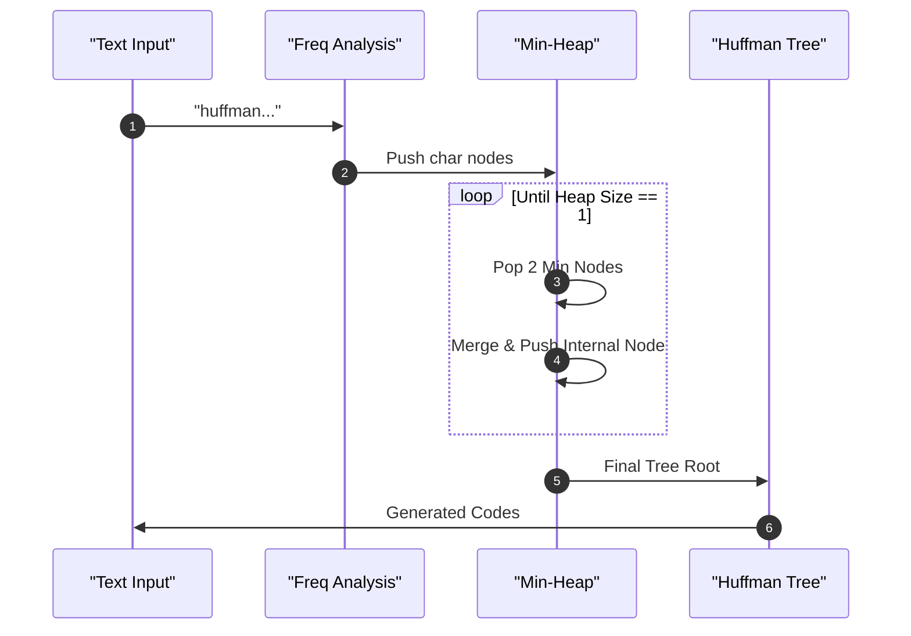

# Huffman Coding (Lossless Data Compression)

**Authors:**
- [Amey Thakur](https://github.com/Amey-Thakur) ([ORCID: 0000-0001-5644-1575](https://orcid.org/0000-0001-5644-1575))
- [Mega Satish](https://github.com/msatmod) ([ORCID: 0000-0002-1844-9557](https://orcid.org/0000-0002-1844-9557))

**Release Date:** January 9, 2022  
**License:** MIT License

---

## Quick Start
To execute this implementation, ensure you have Python 3.x installed and follow these steps:
```bash
python HuffmanCoding.py
```

## 1. Definition
**Huffman Coding** is a statistically based compression algorithm that assigns binary codes to symbols. The length of each code is determined by the frequency of the corresponding symbol. It is a **prefix-free** code, meaning no code is a prefix of any other, which allows for unambiguous decoding without delimiters.

## 2. Mathematical Explanation
Given a set of symbols $S = \{s_1, s_2, \dots, s_n\}$ and their frequencies $F = \{f_1, f_2, \dots, f_n\}$, Huffman coding finds a set of binary strings $C = \{c_1, c_2, \dots, c_n\}$ such that the weighted path length is minimized:

$$
L(C) = \sum_{i=1}^n f_i \cdot \text{length}(c_i)
$$

The entropy $H(S)$ provides the theoretical lower bound for compression. Huffman coding produces an optimal prefix code that approaches this bound.

## 3. Computer Science Theory
- **Greedy Strategy**: Always combines the two nodes with the lowest frequencies to build the tree from the leaves up.
- **Prefix Property**: Ensures that no sequence of bits representing one character is the beginning of a sequence representing another.
- **Min-Heap (Priority Queue)**: Provides efficient extraction of the minimum elements in $O(\log N)$ time.
- **Binary Tree**: The internal nodes represent the merging of frequencies, while leaf nodes contain the original symbols.

## 4. Python Implementation Logic
- **`HuffmanNode` Class**: Encapsulates character, frequency, and child linkages.
- **`HuffmanCodingService`**: Manages frequency analysis, tree construction, and recursive code generation.
- **Heapq Integration**: Uses the standard `heapq` module to maintain the greedy property during tree construction.
- **Bidirectional Mapping**: Stores both `char -> code` for encoding and `code -> char` for decoding efficiency.

## 5. Visual Representation

### Greedy Tree Construction & Binary Encoding






---

> [!NOTE]
> Huffman Coding is still widely used today as part of larger compression formats such as **ZIP**, **GZIP**, and **JPEG**.
