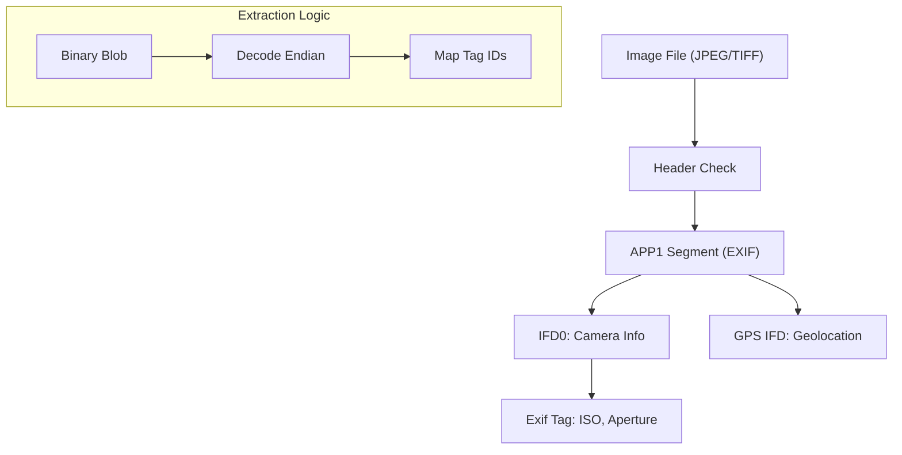
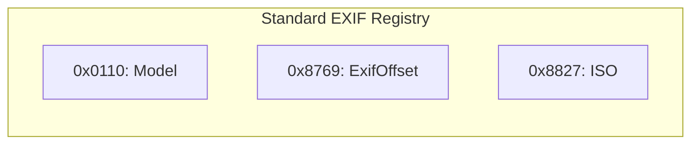

# Image Metadata Extractor (EXIF & Forensic Header Analysis)

**Authors:**
- [Amey Thakur](https://github.com/Amey-Thakur) ([ORCID: 0000-0001-5644-1575](https://orcid.org/0000-0001-5644-1575))
- [Mega Satish](https://github.com/msatmod) ([ORCID: 0000-0002-1844-9557](https://orcid.org/0000-0002-1844-9557))

**Release Date:** January 9, 2022  
**License:** MIT License

---

## Quick Start
To execute this implementation, install the required dependency and run:
```bash
pip install -r requirements.txt
python ImageMetadataExtractor.py
```

## 1. Definition
**Image Metadata Extraction** is the recovery of non-visual data embedded within an image file. The most common standard is **EXIF (Exchangeable Image File Format)**, which stores technical details about the capture conditions, hardware specifications, and geolocation.

## 2. Technical Explanation
An image file (e.g., JPEG) is divided into **Segments** marked by **Markers** (2-byte hex codes). EXIF data is typically stored in the `APP1` segment (Marker `0xFFE1`).

### IFD (Image File Directory) Structure
EXIF data follows a TIFF-like structure consisting of directories:
- **IFD0**: Main image data (Make, Model).
- **Exif IFD**: Specific capture data (Shutter speed, Aperture).
- **GPS IFD**: Geodesic coordinates and timestamps.
- **Interoperability IFD**: Compatibility data.

The data is organized into **Tags**, where each tag is an 12-byte entry:
$$
TagID (2B) + Type (2B) + Count (4B) + Value/Offset (4B)
$$

## 3. Computer Science Theory
- **Forensics**: Metadata is critical in digital forensics to verify the authenticity of a document or photo.
- **Privacy (Stamping)**: Geotagging (GPS tags) can expose precise locations, making metadata removal a key privacy practice.
- **Endianness**: EXIF headers specify byte order: `49 49` (Intel: Little Endian) or `4D 4D` (Motorola: Big Endian). The parser must respect this bit-order during decoding.
- **Rational Numbers**: Fractional values (like Exposure Time) are stored as two 32-bit integers (Numerator/Denominator) to maintain high precision without floating-point errors.

## 4. Python Implementation Logic
- **`ImageMetadataService`**: Utilizes `Pillow's` `_getexif()` to bypass low-level binary parsing and directly access tag dictionaries.
- **Tag Translation**: Uses constant maps (`TAGS` and `GPSTAGS`) to translate cryptic ID codes into human-readable strings.
- **Lazy Loading**: The script reads only the necessary header segments without fully decoding the massive pixel arrays, ensuring high performance.
- **GPS Normalization**: Recursively decodes nested IFDs within the `GPSInfo` tag to provide a structured map of spatial data.

## 5. Visual Representation

### EXIF Segment Anatomy & Hiearchy





