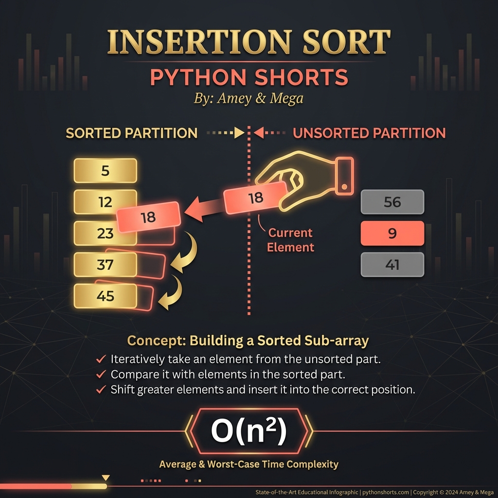

# Insertion Sort (Incremental Sorting & Invariants)

**Authors:**
- [Amey Thakur](https://github.com/Amey-Thakur) ([ORCID: 0000-0001-5644-1575](https://orcid.org/0000-0001-5644-1575))
- [Mega Satish](https://github.com/msatmod) ([ORCID: 0000-0002-1844-9557](https://orcid.org/0000-0002-1844-9557))

**Release Date:** January 9, 2022  
**License:** MIT License

---

## Quick Start
To execute this implementation, ensure you have Python 3.x installed and follow these steps:
```bash
python InsertionSort.py
```

## 1. Definition
**Insertion Sort** is a comparison-based algorithm that builds the final sorted array one element at a time. It functions by iteratively taking an element from the unsorted partition and "inserting" it into its correct relative position within the sorted partition.

## 2. Mathematical Explanation
The algorithm maintains a **Loop Invariant**: at each iteration $i$, the sub-array $A[0 \dots i-1]$ contains the same elements as the original $A[0 \dots i-1]$ but in sorted order.

### Asymptotic Complexity
The performance of Insertion Sort depends on the number of **Inversions** $I$ in the dataset.

- **Best Case** (Already Sorted): $O(n)$
- **Average/Worst Case**: $O(n^2)$

The total number of comparisons is bounded by:

$$
T(n) = \sum_{i=1}^{n-1} i = \frac{n(n-1)}{2} = O(n^2)
$$

## 3. Computer Science Theory
- **Stability**: Insertion Sort is a **Stable** sorting algorithm, meaning it preserves the relative order of equal elements.
- **Online Processing**: It can sort a list as it receives it, making it suitable for streaming data.
- **In-place Sorting**: Requires only $O(1)$ auxiliary memory.
- **Hybrid Applications**: Often used as the base case for more complex algorithms like Timsort (used in Python's `sort()`) due to its efficiency on small datasets.

## 4. Python Implementation Logic
- **Iterative Partitioning**: Uses two nested loops – the outer loop marks the unsorted element, and the inner loop performs the shifting logic.
- **Efficient Shifting**: Rather than multiple swaps, it shifts elements to the right to create an opening for the 'key' element, minimizing write operations.

## 5. Visual Representation

### Incremental Partitioning & Sorting Convergence

