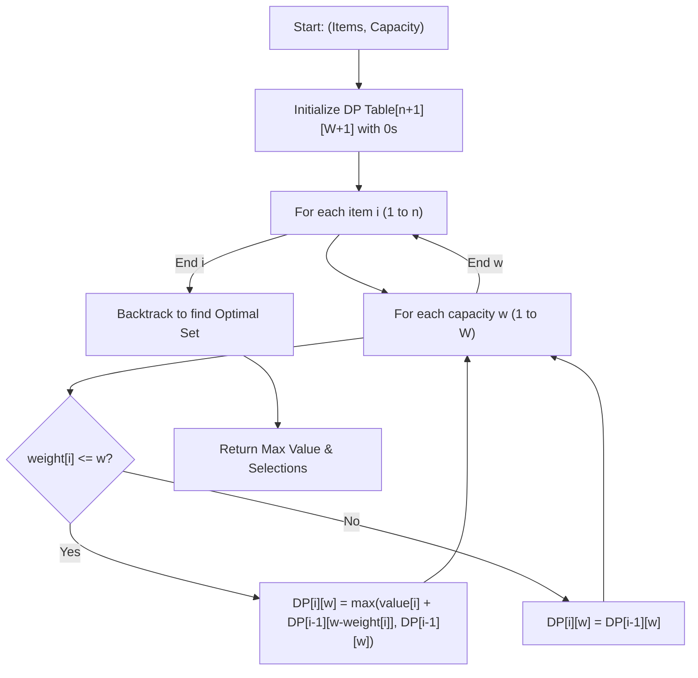
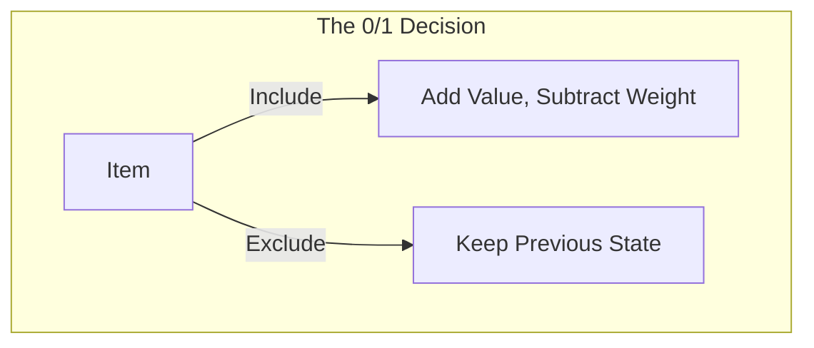

# 0/1 Knapsack Problem (Dynamic Programming & Optimization)

**Authors:**
- [Amey Thakur](https://github.com/Amey-Thakur) ([ORCID: 0000-0001-5644-1575](https://orcid.org/0000-0001-5644-1575))
- [Mega Satish](https://github.com/msatmod) ([ORCID: 0000-0002-1844-9557](https://orcid.org/0000-0002-1844-9557))

**Release Date:** January 9, 2022  
**License:** MIT License

---

## Quick Start
To execute this implementation, ensure you have Python 3.x installed and follow these steps:
```bash
python KnapsackProblem.py
```

## 1. Definition
The **0/1 Knapsack Problem** is a classic combinatorial optimization problem. Given a set of items, each with a weight and a value, the goal is to determine the number of each item to include in a collection such that the total weight is less than or equal to a given limit and the total value is as large as possible. The "0/1" refers to the constraint that each item must be either completely included or excluded.

## 2. Mathematical Explanation
Let $n$ be the number of items and $W$ be the maximum capacity. Each item $i$ has value $v_i$ and weight $w_i$. The recurrence relation for the DP state $dp[i][j]$ (max value using first $i$ items with capacity $j$) is:

$$
dp[i][w] = \begin{cases} 
\max(v_i + dp[i-1][w-w_i], dp[i-1][w]) & \text{if } w_i \leq w \\
dp[i-1][w] & \text{if } w_i > w 
\end{cases}
$$

The base cases are $dp[0][w] = 0$ and $dp[i][0] = 0$.

## 3. Computer Science Theory
- **Dynamic Programming (DP)**: Solving complex problems by breaking them down into simpler subproblems and storing their solutions (memoization or tabling).
- **Overlapping Subproblems**: The property where the same subproblems are solved multiple times; DP optimizes this by computing once.
- **Optimal Substructure**: The optimal solution to the problem can be constructed from the optimal solutions of its subproblems.
- **Complexity**: The pseudo-polynomial time complexity is $O(n \times W)$, indicating it is sensitive to the range of input values.

## 4. Python Implementation Logic
- **Service Pattern**: `KnapsackService` implements the bottom-up DP table filling algorithm.
- **Backtracking**: After filling the table, the service traverses back to identify which specific items contributed to the optimal value.
- **Dictionary Result**: Returns a structured report including max value, total weight, and indices of selected items.

## 5. Visual Representation

### Dynamic Programming State Transition





