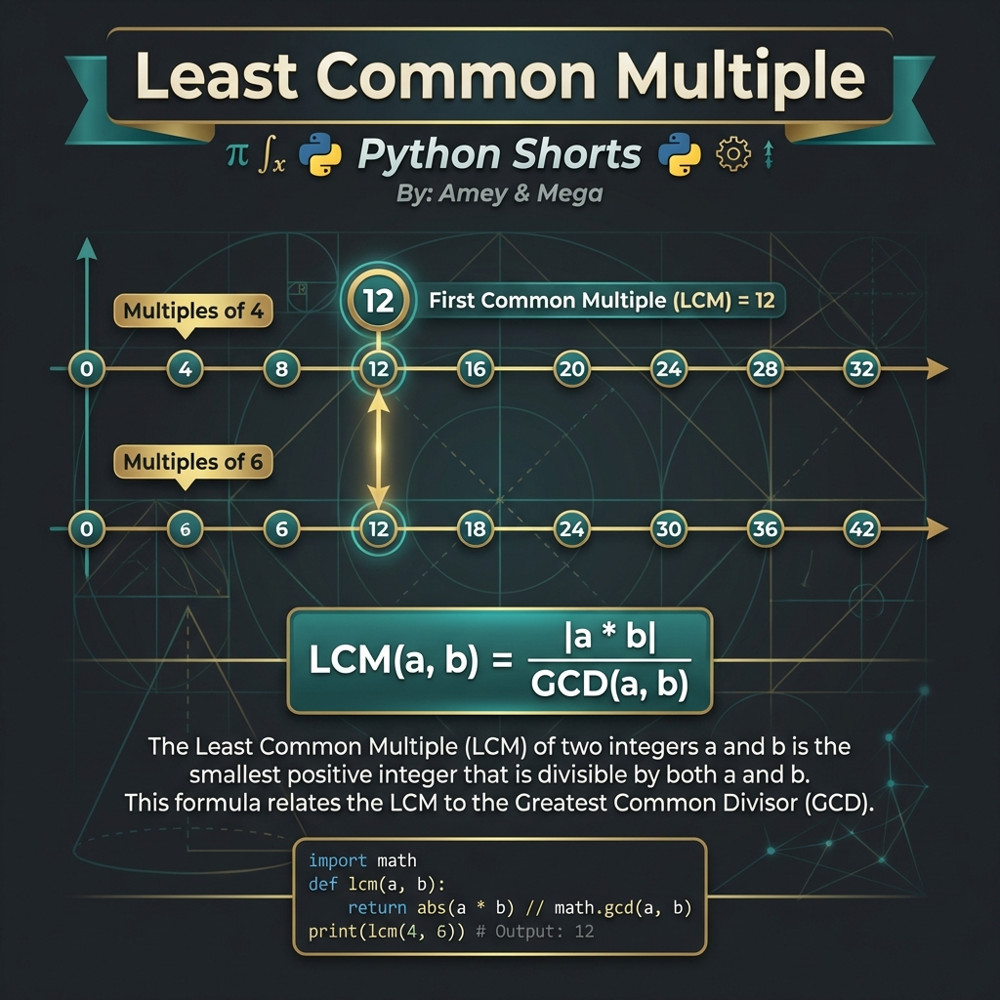
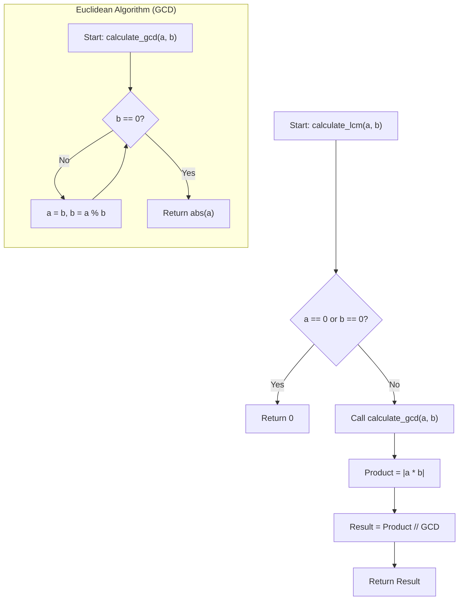
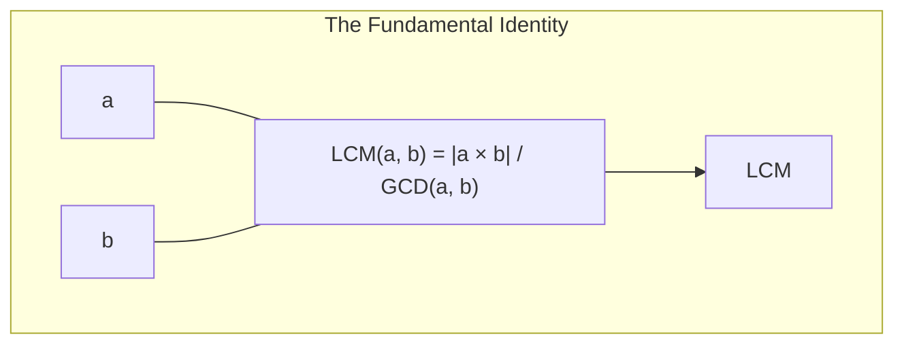

# Least Common Multiple (Number Theory & GCD Relations)

**Authors:**
- [Amey Thakur](https://github.com/Amey-Thakur) ([ORCID: 0000-0001-5644-1575](https://orcid.org/0000-0001-5644-1575))
- [Mega Satish](https://github.com/msatmod) ([ORCID: 0000-0002-1844-9557](https://orcid.org/0000-0002-1844-9557))

**Release Date:** January 9, 2022  
**License:** MIT License

---

## Quick Start
To execute this implementation, ensure you have Python 3.x installed and follow these steps:
```bash
python LeastCommonMultiple.py
```

## 1. Definition
The **Least Common Multiple (LCM)** of two integers $a$ and $b$ is the smallest positive integer that is divisible by both $a$ and $b$. It fundamental to fraction arithmetic, periodic systems, and divisibility theory.

## 2. Mathematical Explanation
This implementation leverages the fundamental relationship between the LCM and the **Greatest Common Divisor (GCD)**.

### The Fundamental Identity
For any two integers $a$ and $b$, the product of their magnitudes is equal to the product of their GCD and LCM:

$$
|a \cdot b| = \text{GCD}(a, b) \cdot \text{LCM}(a, b)
$$

Rearranging for LCM gives the calculation used in this module:

$$
\text{LCM}(a, b) = \frac{|a \cdot b|}{\text{GCD}(a, b)}
$$

### Euclidean Algorithm for GCD
The GCD is calculated using the Euclidean algorithm, which relies on the principle that the GCD of two numbers also divides their remainder:

$$
\text{GCD}(a, b) = \text{GCD}(b, a \mod b)
$$

## 3. Computer Science Theory
- **Efficiency**: While brute-force search (checking multiples) has unknown complexity depending on the magnitude of the LCM, the GCD-based approach is $O(\log(\min(a, b)))$, following Lame's Theorem.
- **Overflow Prevention**: In languages with fixed-width integers, $|a \cdot b|$ might overflow before the division. In Python, integers have arbitrary precision, allowing this direct identity without risk of overflow.
- **Complexity**:
    - **Time Complexity**: $O(\log(\min(a, b)))$.
    - **Space Complexity**: $O(1)$ (iterative GCD) or $O(\log n)$ (recursive GCD stack).

## 4. Python Implementation Logic
- **Iterative Euclidean Algorithm**: Implemented in `calculate_gcd` to ensure maximum performance and zero stack overhead.
- **Integer Division**: Uses the `//` operator to maintain integer types, ensuring the result is consistent with discrete mathematics.

## 5. Visual Representation

### Multiple Convergence & GCD Identity Verified






