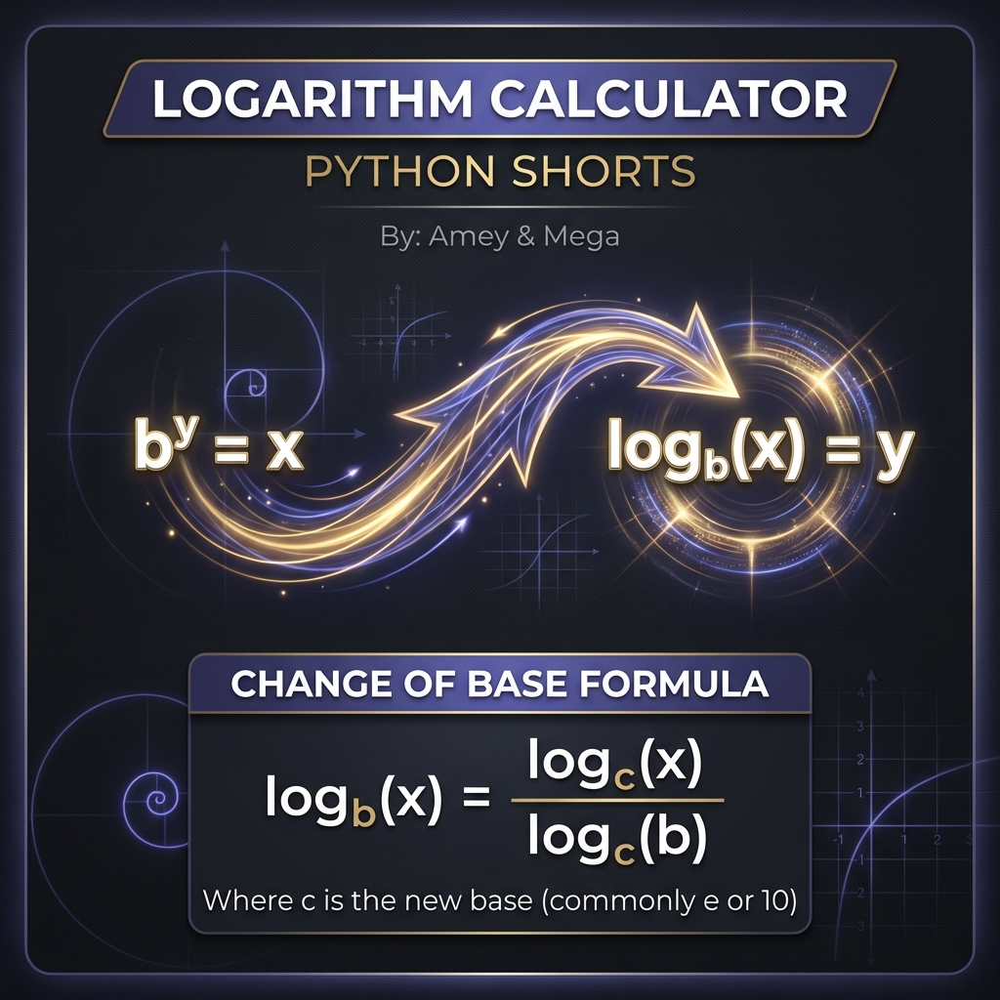

# Logarithm Calculator (Transcendental Functions & Base Relations)

**Authors:**
- [Amey Thakur](https://github.com/Amey-Thakur) ([ORCID: 0000-0001-5644-1575](https://orcid.org/0000-0001-5644-1575))
- [Mega Satish](https://github.com/msatmod) ([ORCID: 0000-0002-1844-9557](https://orcid.org/0000-0002-1844-9557))

**Release Date:** January 9, 2022  
**License:** MIT License

---

## Quick Start
To execute this implementation, ensure you have Python 3.x installed and follow these steps:
```bash
python LogarithmCalculator.py
```

## 1. Definition
A **Logarithm** is the inverse function to exponentiation. The logarithm of a number $x$ to a base $b$ is the exponent to which $b$ must be raised to produce $x$. This implementation provides a robust service for calculating logarithms across any valid domain.

## 2. Mathematical Explanation
The core logic relies on the properties of **Transcendental Functions**.

### Change of Base Formula
Most computational libraries provide optimized functions for the natural logarithm (base $e$, $\ln$) and common logarithm (base 10, $\log_{10}$). For an arbitrary base $b$, the value is computed using the identity:

$$
\log_b(x) = \frac{\ln(x)}{\ln(b)}
$$

### Domain Constraints
Logarithms are defined only for positive values and positive bases unequal to one:
1. $x > 0$
2. $b > 0$
3. $b \neq 1$

## 3. Computer Science Theory
- **Numerical Precision**: The implementation utilizes Python's `math.log` which is backed by the IEEE 754 floating-point standard, ensuring high precision for scientific computations.
- **Asymptotic Complexity**: 
    - **Time Complexity**: $O(1)$ for the computation (assuming hardware acceleration for transcendental functions).
    - **Space Complexity**: $O(1)$.
- **Error Propagation**: Small variations in input can lead to significant changes in logarithmic output, a property managed through rigorous boundary validation.

## 4. Python Implementation Logic
- **Math Module Abstraction**: Leverages the optimized C-based `math` module for high-speed calculation.
- **Optional Argument Handling**: Implements a flexible API that defaults to natural logarithms unless a specific base is provided by the user.

## 5. Visual Representation

### Logarithmic Identities & Inverse Exponentiation

