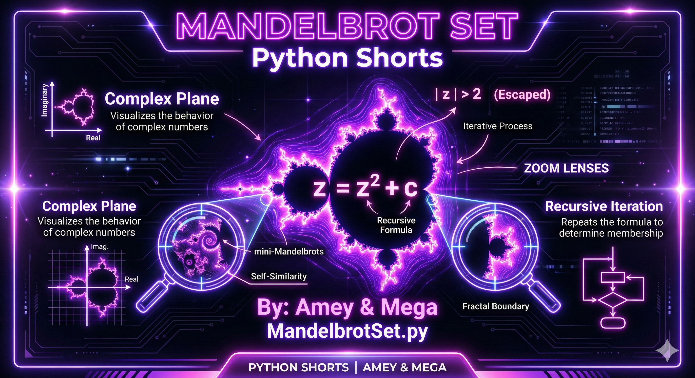
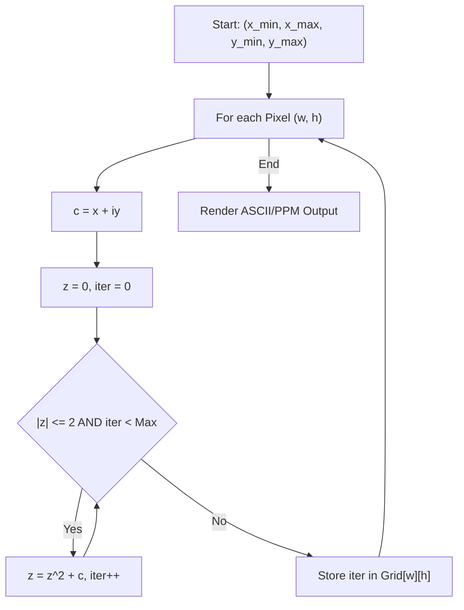
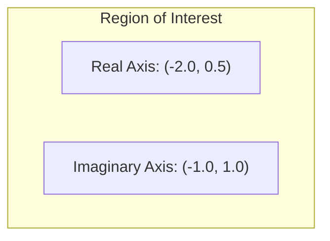

# Mandelbrot Set (Complex Iteration & Fractal Geometry)

**Authors:**
- [Amey Thakur](https://github.com/Amey-Thakur) ([ORCID: 0000-0001-5644-1575](https://orcid.org/0000-0001-5644-1575))
- [Mega Satish](https://github.com/msatmod) ([ORCID: 0000-0002-1844-9557](https://orcid.org/0000-0002-1844-9557))

**Release Date:** January 9, 2022  
**License:** MIT License

---

## Quick Start
To execute this implementation, ensure you have Python 3.x installed and follow these steps:
```bash
python MandelbrotSet.py
```

## 1. Definition
The **Mandelbrot Set** is the set of complex numbers $c$ for which the function $f_c(z) = z^2 + c$ does not diverge to infinity when iterated from $z = 0$, i.e., for which the sequence $z_0 = 0, z_{n+1} = z_n^2 + c$ remains bounded in absolute value. It is one of the most famous examples of fractal geometry, exhibiting infinite complexity at all scales.

## 2. Mathematical Explanation
The membership of a point $c$ in the Mandelbrot set is determined by the behavior of the sequence:

$$
z_{n+1} = z_n^2 + c
$$

If the magnitude $|z_n|$ ever exceeds 2, it is mathematically proven that the sequence will diverge to infinity. Points that do not diverge remain within the set. In practice, we use a **Maximum Iteration Count** ($N$) to approximate the boundary.

## 3. Computer Science Theory
- **Escape-Time Algorithm**: The most common method for calculating fractals. For each pixel, we compute the number of iterations required to "escape" a radius of 2.
- **Complex Number Arithmetic**: Representing numbers of the form $a + bi$. Python's native `complex` type provides efficient operations for this.
- **Floating Point Precision**: The depth of zoom in fractals is limited by the precision of the processor's floating-point unit (usually 64-bit doubles).
- **Chaos Theory**: Demonstrates how simple iterative rules can lead to deterministic yet highly complex and non-repeating patterns.

## 4. Python Implementation Logic
- **`MandelbrotService`**: Encapsulates the iterative complex operations and grid mapping logic.
- **Complex Mapping**: Translates pixel coordinates $(i, j)$ into complex plane coordinates $(x, y)$.
- **ASCII Rendering**: Uses a character map to represent different "escape-time" densities, providing a visual in the terminal without external image libraries.

## 5. Visual Representation

### Fractal Boundary & Complex Iteration





