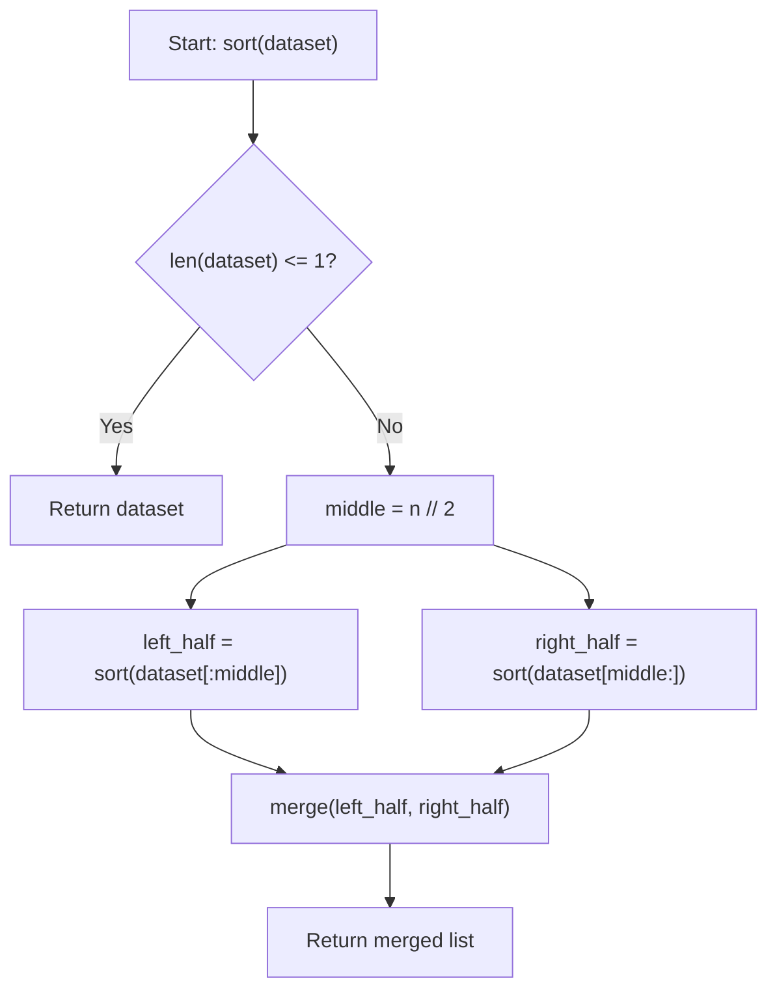
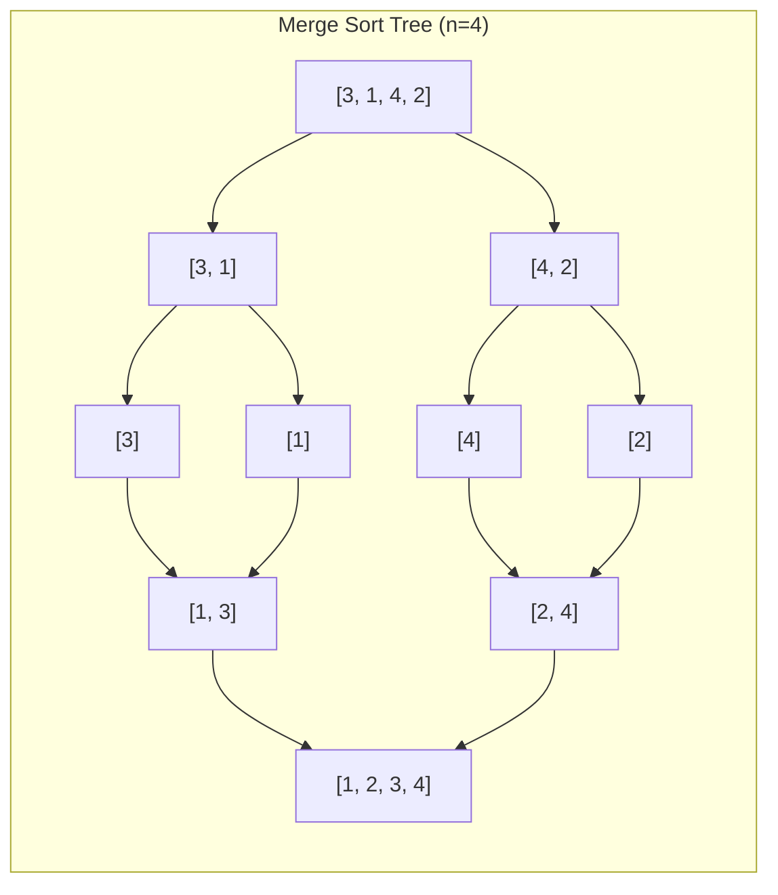

# Merge Sort (Divide and Conquer & Stable Sorting)

**Authors:**
- [Amey Thakur](https://github.com/Amey-Thakur) ([ORCID: 0000-0001-5644-1575](https://orcid.org/0000-0001-5644-1575))
- [Mega Satish](https://github.com/msatmod) ([ORCID: 0000-0002-1844-9557](https://orcid.org/0000-0002-1844-9557))

**Release Date:** January 9, 2022  
**License:** MIT License

---

## Quick Start
To execute this implementation, ensure you have Python 3.x installed and follow these steps:
```bash
python MergeSort.py
```

## 1. Definition
**Merge Sort** is an efficient, stable, comparison-based sorting algorithm. Most implementations produce a stable sort, meaning that the relative order of equal elements is preserved in the sorted output. It is a quintessential example of the **Divide and Conquer** algorithmic paradigm.

## 2. Mathematical Explanation
Merge Sort relies on the recursive decomposition of a problem into smaller instances of the same problem.

### Recurrence Relation
For an input of size $n$, the time complexity $T(n)$ is defined as:

$$
T(n) = 2T(n/2) + O(n)
$$

By the **Master Theorem**, this recurrence belongs to Case 2, where $a=2, b=2, d=1$. Since $a=b^d$, the total complexity is:

$$
O(n \log n)
$$

### Stability and Merging
The stability is guaranteed in the merging step. When two equal elements are compared (one from the left sub-array and one from the right), the implementation prioritizes the element from the left sub-array:
`if left[i] <= right[j]: ...`

## 3. Computer Science Theory
- **Auxiliary Space**: Unlike Heap Sort or Quick Sort, standard Merge Sort requires $O(n)$ auxiliary space to store the merged sub-arrays.
- **Cache Local Performance**: Merge Sort has excellent cache locality during the sequential merge process, making it suitable for external sorting (large datasets stored on disk).
- **Complexity**:
    - **Time Complexity**: $O(n \log n)$ (Best, Average, and Worst case).
    - **Space Complexity**: $O(n)$.

## 4. Python Implementation Logic
- **Recursive Splitting**: Uses Python's slice notation `[:middle]` and `[middle:]` for clear sub-array creation.
- **Pointer-Based Merging**: Avoids $O(n)$ list removals by maintaining index pointers, ensuring the merge step remains strictly linear.

## 5. Visual Representation

### Divide and Conquer Flow


### Recursion Tree Representation

