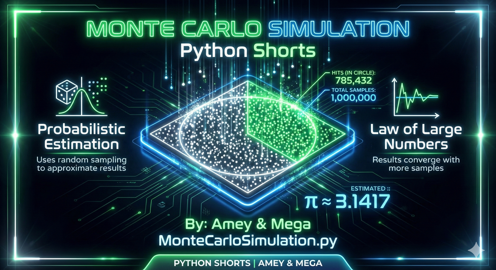
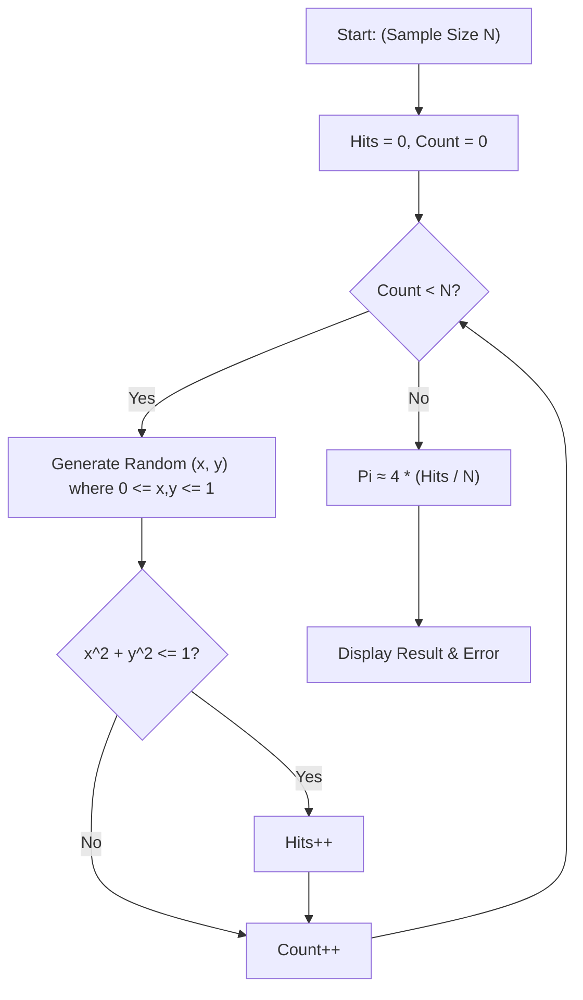
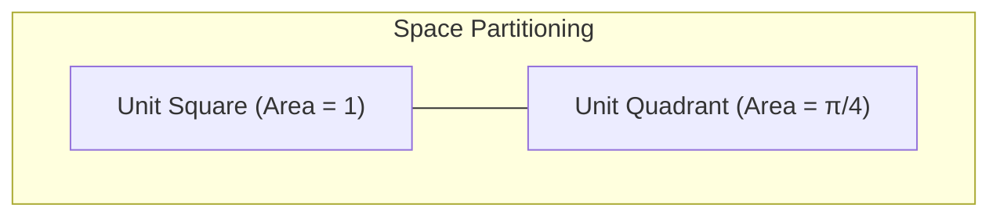

# Monte Carlo Simulation (Probabilistic Estimation & Modeling)

**Authors:**
- [Amey Thakur](https://github.com/Amey-Thakur) ([ORCID: 0000-0001-5644-1575](https://orcid.org/0000-0001-5644-1575))
- [Mega Satish](https://github.com/msatmod) ([ORCID: 0000-0002-1844-9557](https://orcid.org/0000-0002-1844-9557))

**Release Date:** January 9, 2022  
**License:** MIT License

---

## Quick Start
To execute this implementation, ensure you have Python 3.x installed and follow these steps:
```bash
python MonteCarloSimulation.py
```

## 1. Definition
**Monte Carlo Simulation** is a broad class of computational algorithms that rely on repeated random sampling to obtain numerical results. It is used to model the probability of different outcomes in a process that cannot easily be predicted due to the intervention of random variables.

## 2. Mathematical Explanation
To estimate the value of $\pi$, we consider a circle with radius $r = 1$ inscribed in a square with side length $s = 2$. The area of the circle is $\pi r^2 = \pi$, and the area of the square is $s^2 = 4$.

The ratio of their areas is:

$$
\frac{Area_{Circle}}{Area_{Square}} = \frac{\pi}{4}
$$

By randomly generating points within the square and counting how many fall inside the circle, we can estimate $\pi$:

$$
\pi \approx 4 \times \frac{\text{Points Inside Circle}}{\text{Total Points}}
$$

## 3. Computer Science Theory
- **Law of Large Numbers**: As the number of trials increases, the experimental results will converge to the theoretical expected value.
- **Pseudo-Random Number Generation (PRNG)**: Computers generate sequences of numbers that approximate the properties of random numbers (using Python's `random` module).
- **Stochastic Modeling**: Using randomness to simulate complex systems that are deterministic in theory but too difficult to solve analytically.
- **Error Convergence**: The error in Monte Carlo simulations typically decreases at a rate of $O(1/\sqrt{N})$, where $N$ is the number of samples.

## 4. Python Implementation Logic
- **`MonteCarloPiService`**: Encapsulates the logic for uniform random sampling and distance calculations.
- **Uniform Projection**: Uses `random.uniform(0, 1)` to generate coordinates within a unit square.
- **Batch Processing**: Demonstrates how accuracy improves across different orders of magnitude (from $10^3$ to $10^6$ samples).
- **Error Tracking**: Compares the estimated result against the mathematical constant `math.pi`.

## 5. Visual Representation

### Probabilistic Sampling & Geometry





