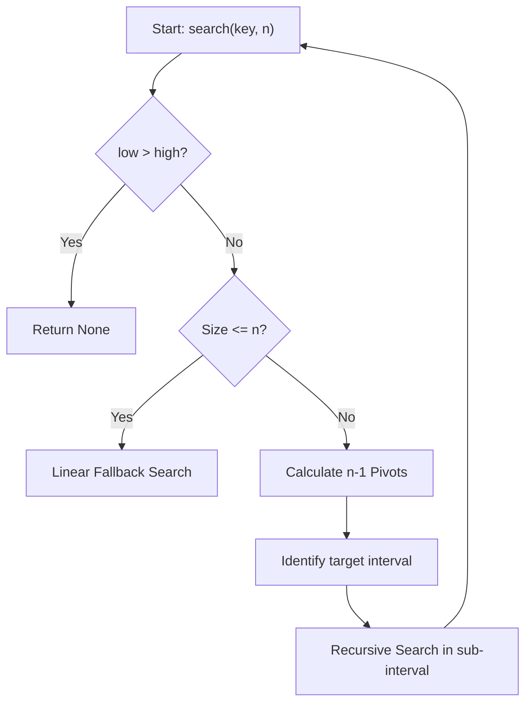
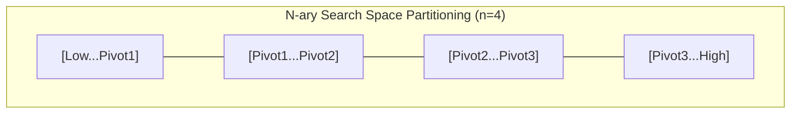

# N-ary Search (Generalization of Binary Search & Divide and Conquer)

**Authors:**
- [Amey Thakur](https://github.com/Amey-Thakur) ([ORCID: 0000-0001-5644-1575](https://orcid.org/0000-0001-5644-1575))
- [Mega Satish](https://github.com/msatmod) ([ORCID: 0000-0002-1844-9557](https://orcid.org/0000-0002-1844-9557))

**Release Date:** January 9, 2022  
**License:** MIT License

---

## Quick Start
To execute this implementation, ensure you have Python 3.x installed and follow these steps:
```bash
python NarySearch.py
```

## 1. Definition
**N-ary Search** is a search algorithm that finds the position of a target value within a sorted array. Unlike Binary Search, which divides the array into two halves ($n=2$), N-ary Search divides the search space into $n$ equivalent sub-intervals using $n-1$ pivots.

## 2. Mathematical Explanation
N-ary search is a classic example of the **Divide and Conquer** paradigm.

### Recurrence Relation
The time complexity $T(N)$ for an array of size $N$ with $n$ partitions can be expressed as:

$$
T(N) = T(N/n) + O(n)
$$

Where $O(n)$ represents the cost of comparing the key against the $n-1$ pivots.

### Asymptotic Complexity
Applying the Master Theorem, the complexity is derived as:

$$
O(n \cdot \log_n N)
$$

While increasing $n$ reduces the depth of the recursion tree ($\log_n N$), it increases the work per node ($n$). In most practical computational environments, $n=2$ (Binary Search) or $n=3$ (Ternary Search) are theoretically optimal depending on the hardware architecture and cache line sizes.

## 3. Computer Science Theory
- **Search Space Partitioning**: The algorithm relies on the precondition that the dataset is monotonically sorted.
- **Pivot Selection**: Pivots are calculated as $low + i \cdot \frac{high - low + 1}{n}$, ensuring uniform distribution of the search load.
- **Cache Locality**: Higher values of $n$ can sometimes improve cache performance in specific database indexing structures like B-Trees.

## 4. Python Implementation Logic
- **Recursive Decomposition**: The `_recursive_search` method handles the interval narrowing logic.
- **Fallback Mechanism**: For intervals smaller than the partition count, the algorithm falls back to a linear scan to avoid unnecessary pivot calculations.

## 5. Visual Representation

### Search Space Partitioning & Convergence





